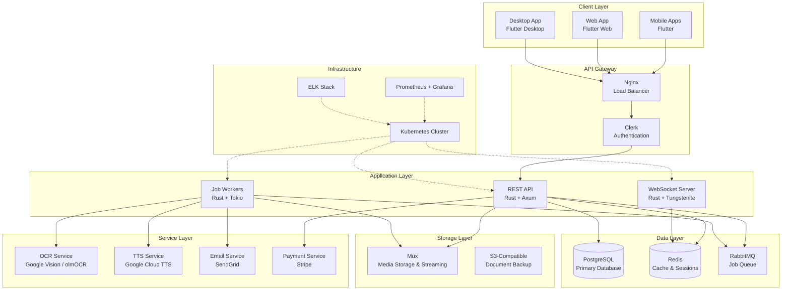
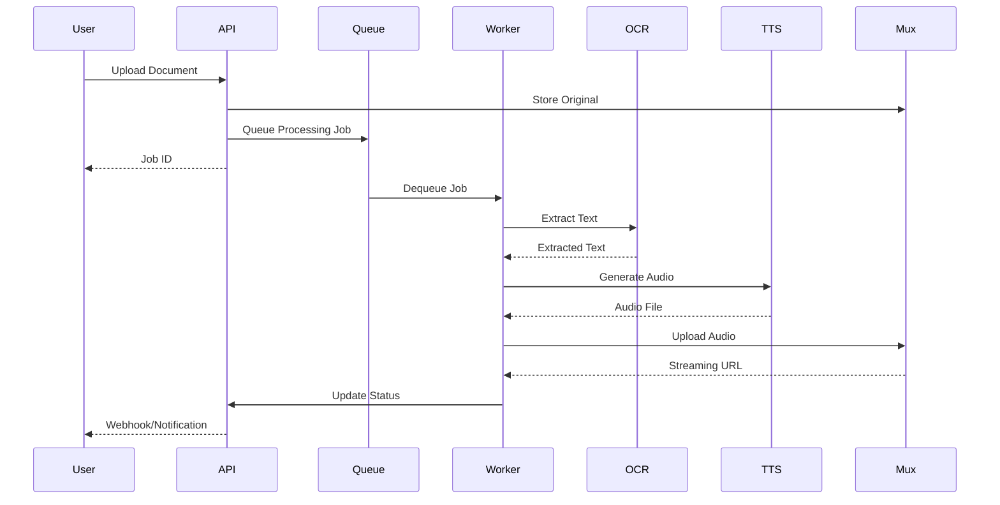
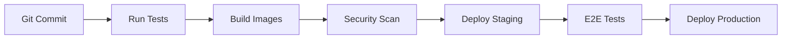

# FamilyTales System Architecture

## Overview

FamilyTales is a modern, scalable platform for preserving family memories through document digitization and audio generation. The architecture prioritizes performance, security, and user experience while maintaining cost efficiency.

## System Architecture Diagram



## Technology Stack

### Frontend
- **Framework**: Flutter 3.x
  - Single codebase for iOS, Android, Web, and Desktop
  - Native performance with platform-specific optimizations
  - Rich widget library for consistent UI/UX

- **State Management**: Riverpod 2.0
  - Compile-time safety
  - Efficient rebuilds
  - Testable architecture

- **Key Libraries**:
  - `just_audio`: HLS streaming with native performance
  - `camera`: Document capture with image enhancement
  - `go_router`: Declarative navigation
  - `flutter_secure_storage`: Secure credential storage

### Backend
- **API Server**: Rust with Axum
  - Sub-millisecond response times
  - Memory-safe concurrent processing
  - Native async/await support

- **Architecture Pattern**: Clean Architecture
  ```
  src/
  ├── domain/       # Business logic & entities
  ├── application/  # Use cases & services
  ├── infrastructure/ # External services & DB
  └── presentation/ # HTTP handlers & DTOs
  ```

- **Key Dependencies**:
  - `tokio`: Async runtime
  - `sqlx`: Compile-time checked SQL
  - `serde`: Serialization/deserialization
  - `tower`: Middleware stack
  - `tracing`: Structured logging

### Database Design

#### PostgreSQL (Primary Database)
- **Version**: 16 with TimescaleDB
- **Extensions**: 
  - `uuid-ossp`: UUID generation
  - `pgvector`: Future ML features
  - `pg_stat_statements`: Query optimization

#### Redis (Cache & Sessions)
- **Version**: 7.x
- **Usage**:
  - Session storage
  - API response caching
  - Real-time presence
  - Rate limiting

#### Data Models
```rust
// Core entities
pub struct User {
    pub id: Uuid,
    pub clerk_id: String,
    pub email: String,
    pub subscription_tier: SubscriptionTier,
}

pub struct Family {
    pub id: Uuid,
    pub name: String,
    pub owner_id: Uuid,
    pub subscription_id: Option<Uuid>,
}

pub struct MemoryBook {
    pub id: Uuid,
    pub family_id: Uuid,
    pub title: String,
    pub threads: Vec<Thread>,
}

pub struct Document {
    pub id: Uuid,
    pub memory_book_id: Uuid,
    pub original_url: String,
    pub extracted_text: String,
    pub audio_url: Option<String>,
    pub status: ProcessingStatus,
}
```

### Media Processing Pipeline



### Security Architecture

#### Authentication & Authorization
- **Provider**: Clerk
  - JWT-based authentication
  - Multi-factor authentication
  - Social login support
  - Passwordless options

- **Authorization Model**:
  ```rust
  pub enum FamilyRole {
      Owner,      // Full control
      Admin,      // Manage members & content
      Member,     // Upload & view content
      ViewOnly,   // Read-only access
  }
  ```

#### Data Security
- **Encryption**:
  - At-rest: AES-256 for database
  - In-transit: TLS 1.3 minimum
  - Client storage: Platform-specific secure storage

- **Privacy**:
  - GDPR compliant data handling
  - User-controlled data deletion
  - Audit trails for data access

### Scalability Considerations

#### Horizontal Scaling
- **API Servers**: Stateless design allows linear scaling
- **Workers**: Queue-based processing scales with demand
- **Database**: Read replicas for query distribution

#### Performance Optimization
- **Caching Strategy**:
  ```rust
  // Multi-layer caching
  pub enum CacheLayer {
      EdgeCDN,      // Static assets
      Redis,        // API responses
      Application,  // In-memory LRU
      Database,     // Query result cache
  }
  ```

- **Query Optimization**:
  - Indexed foreign keys
  - Materialized views for analytics
  - Connection pooling
  - Query result caching

#### Load Handling
- **Expected Load**:
  - 100K daily active users
  - 1M documents processed/month
  - 10TB media storage
  - 99.9% uptime SLA

### Infrastructure

#### Kubernetes Architecture
```yaml
apiVersion: apps/v1
kind: Deployment
metadata:
  name: familytales-api
spec:
  replicas: 3
  selector:
    matchLabels:
      app: api
  template:
    spec:
      containers:
      - name: api
        image: familytales/api:latest
        resources:
          requests:
            memory: "256Mi"
            cpu: "250m"
          limits:
            memory: "512Mi"
            cpu: "500m"
        env:
        - name: DATABASE_URL
          valueFrom:
            secretKeyRef:
              name: db-secret
              key: url
```

#### Service Mesh
- **Istio** for:
  - Traffic management
  - Security policies
  - Observability
  - Circuit breaking

### Monitoring & Observability

#### Metrics (Prometheus)
- API response times
- Queue depth
- Processing success rate
- Resource utilization

#### Logging (ELK Stack)
- Structured JSON logs
- Correlation IDs
- User activity tracking
- Error aggregation

#### Tracing (Jaeger)
- Distributed request tracing
- Performance bottleneck identification
- Service dependency mapping

### Development Workflow

#### CI/CD Pipeline


#### Environment Management
- **Local**: Docker Compose
- **Staging**: Kubernetes namespace
- **Production**: Multi-region deployment

### Cost Optimization

#### Resource Allocation
- **Compute**: Auto-scaling with spot instances
- **Storage**: Tiered storage with lifecycle policies
- **Bandwidth**: CDN for static assets

#### Service Selection
- **Mux**: Pay-per-use media processing
- **SendGrid**: Tiered email pricing
- **Stripe**: Standard processing fees

### Future Architecture Considerations

#### Phase 2: Local Processing
- Desktop worker applications
- Hybrid cloud/local OCR
- P2P document sharing

#### Phase 3: ML Enhancement
- Custom OCR models
- Voice cloning
- Smart content organization

#### Phase 4: Global Scale
- Multi-region deployment
- Edge computing
- Offline-first architecture

## Architecture Decisions

### Why Rust + Axum?
- **Performance**: 10x faster than Node.js
- **Memory Safety**: No null pointer exceptions
- **Concurrency**: Fearless concurrency model
- **Type Safety**: Catch errors at compile time

### Why Flutter?
- **Single Codebase**: Maintain one codebase for all platforms
- **Native Performance**: Compiled to native code
- **Hot Reload**: Rapid development iteration
- **Rich Ecosystem**: Extensive package library

### Why PostgreSQL?
- **ACID Compliance**: Data integrity for family memories
- **Complex Queries**: Rich querying capabilities
- **Extensions**: TimescaleDB, pgvector for future features
- **Maturity**: Battle-tested in production

### Why Mux?
- **Zero Complexity**: Automatic HLS streaming
- **Global CDN**: Instant playback worldwide
- **API-First**: Easy integration
- **Cost Effective**: Pay only for usage

## Security Best Practices

1. **Input Validation**: Validate all inputs at API boundary
2. **SQL Injection**: Use parameterized queries exclusively
3. **XSS Prevention**: Sanitize all user-generated content
4. **CSRF Protection**: Token-based request validation
5. **Rate Limiting**: Prevent abuse and DDoS
6. **Audit Logging**: Track all data access

## Performance Guidelines

1. **Database Queries**: Keep under 100ms
2. **API Response**: Target 200ms p95
3. **Page Load**: Under 3 seconds on 3G
4. **Audio Start**: Under 1 second
5. **Upload Progress**: Real-time feedback

## Disaster Recovery

1. **Backups**: Daily automated backups
2. **Replication**: Multi-region database replication
3. **Failover**: Automatic failover with health checks
4. **Recovery Time**: RTO < 1 hour, RPO < 5 minutes
5. **Testing**: Quarterly disaster recovery drills