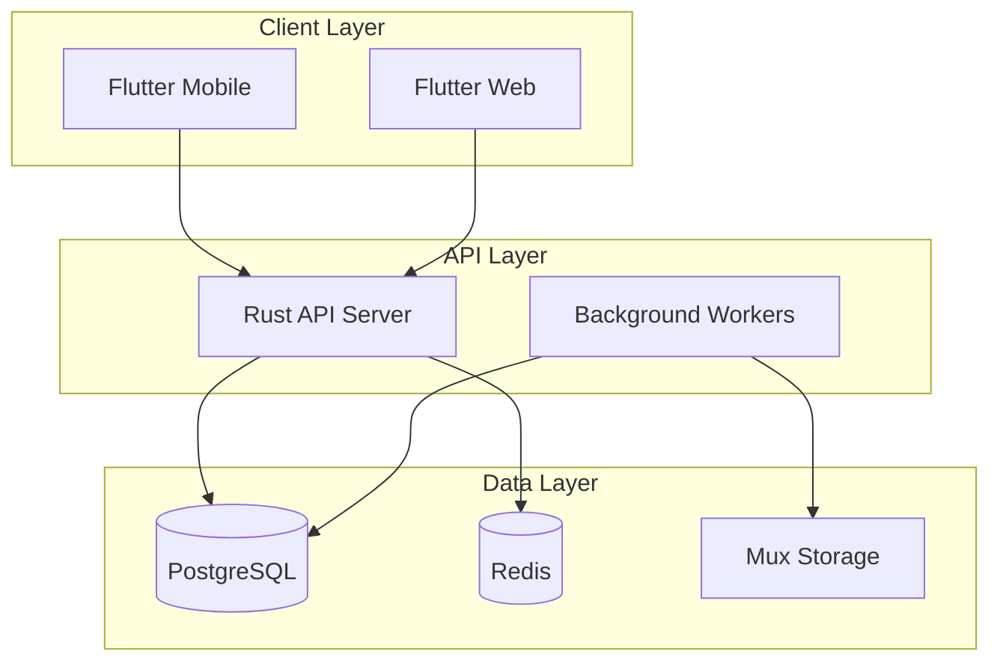

# FamilyTales Documentation

Welcome to the comprehensive documentation for FamilyTales - the platform that transforms precious family documents into living memories through audio.

## 📚 Documentation Index

### Getting Started
- **[Setup Guide](SETUP.md)** - Complete development environment setup
- **[Architecture Overview](ARCHITECTURE.md)** - High-level system architecture and design decisions
- **[API Documentation](API.md)** - Complete REST API reference with examples

### Development
- **[Frontend Architecture](specs/FRONTEND_ARCHITECTURE.md)** - Flutter app structure and patterns
- **[Database Schema](specs/DATABASE_SCHEMA.md)** - Complete database design and relationships
- **[Authentication System](specs/AUTHENTICATION.md)** - Clerk integration and security model
- **[Testing Guide](TESTING.md)** - Unit, integration, and end-to-end testing strategies

### Operations & Deployment
- **[Deployment Guide](DEPLOYMENT.md)** - Production deployment on Kubernetes
- **[Monitoring](ops/MONITORING.md)** - Observability, metrics, and alerting
- **[Security](ops/SECURITY.md)** - Security best practices and compliance
- **[Backup & Recovery](ops/BACKUP_RECOVERY.md)** - Data protection and disaster recovery
- **[Scaling](ops/SCALING.md)** - Horizontal and vertical scaling strategies

### Feature Specifications
- **[Audio Processing](specs/AUDIO_PROCESSING.md)** - OCR and TTS pipeline
- **[Payment System](specs/PAYMENT_SYSTEM.md)** - Stripe integration and subscription management
- **[Email Integration](specs/EMAIL_INTEGRATION.md)** - SendGrid templates and automation
- **[Background Jobs](specs/BACKGROUND_JOBS.md)** - RabbitMQ queue processing
- **[Admin Panel](specs/ADMIN_PANEL.md)** - Administrative interface specification

### Development Workflow
- **[Debugging](DEBUGGING.md)** - Troubleshooting common issues
- **[Logging & Linting](LOGGING_AND_LINTING.md)** - Code quality and monitoring

## 🏗️ Project Structure

```
FamilyTales/
├── docs/                    # Documentation (you are here)
│   ├── specs/              # Feature specifications
│   ├── ops/                # Operations documentation
│   └── development/        # Development guides
├── src/                    # Rust backend source
│   ├── api/               # REST API server
│   ├── worker/            # Background job processor
│   ├── domain/            # Business logic
│   └── infrastructure/    # External integrations
├── mobile/                # Flutter mobile app
│   ├── lib/              # Dart source code
│   └── test/             # Flutter tests
├── web/                  # Flutter web app (future)
├── kubernetes/           # K8s deployment manifests
├── docker/              # Docker configurations
└── scripts/             # Automation scripts
```

## 🎯 Architecture Overview

FamilyTales follows a clean architecture pattern with clear separation of concerns:



### Key Design Principles

1. **Family-First**: Everything is designed around family sharing and collaboration
2. **Privacy-Focused**: Documents are processed securely with end-to-end encryption
3. **Performance**: Sub-second audio streaming globally via Mux CDN
4. **Scalability**: Microservices architecture with horizontal scaling
5. **Cost-Effective**: Rust backend provides excellent performance per dollar

## 📱 Core Features

### Document Processing Pipeline
1. **📸 Capture** - Mobile camera with auto-enhancement
2. **🔍 OCR** - Google Vision API for text extraction
3. **✏️ Correction** - Family collaborative text editing
4. **🎙️ Audio** - Natural TTS with multiple voice options
5. **📤 Distribution** - Instant family sharing with HLS streaming

### Family Management
- **Multi-Family Support** - Users can belong to multiple families
- **Role-Based Permissions** - Owners, admins, members, and view-only
- **Invitation System** - Beautiful email invites and QR codes
- **Memory Books** - Organized collections with threading

### Subscription Model
- **Free Tier** - 3 documents/month, basic voices
- **Family Plan** - $14.99/month, unlimited family members
- **Legacy Plan** - $29.99/month, voice cloning and premium features

## 🔧 Development Guidelines

### Code Style
- **Rust**: Follow `rustfmt` and `clippy` recommendations
- **Flutter**: Use `dart format` and `flutter analyze`
- **Commits**: Conventional commits with clear descriptions
- **Testing**: Maintain >80% code coverage

### API Design
- **RESTful**: Standard HTTP methods and status codes
- **Versioned**: All endpoints under `/v1/`
- **Documented**: OpenAPI/Swagger specifications
- **Consistent**: Standard response format across all endpoints

### Security
- **Authentication**: Clerk JWT tokens for all requests
- **Authorization**: Role-based access control
- **Encryption**: TLS 1.3+ for all communications
- **Audit**: All data access is logged

## 🏃‍♂️ Development Workflow

### Feature Development
1. **Research** - Understand existing codebase patterns
2. **Plan** - Create detailed implementation plan
3. **Implement** - Write code with tests
4. **Review** - Peer review with security focus
5. **Deploy** - Automated CI/CD pipeline

### Code Quality Gates
```bash
# Run before committing
make fmt      # Format code
make test     # Run all tests
make lint     # Static analysis
make audit    # Security audit
```

### Branch Strategy
- `main` - Production-ready code
- `develop` - Integration branch
- `feature/*` - Individual features
- `hotfix/*` - Critical production fixes

## 📊 Monitoring & Observability

### Metrics (Prometheus)
- API response times and error rates
- Document processing success rates
- User engagement metrics
- Resource utilization

### Logging (Structured JSON)
- Request/response correlation
- Business event tracking
- Error aggregation and alerting
- Performance monitoring

### Tracing (Jaeger)
- Distributed request tracing
- Performance bottleneck identification
- Service dependency mapping

## 🔍 Troubleshooting

### Common Issues

#### Development Environment
```bash
# Database connection issues
docker-compose down && docker-compose up -d postgres

# Rust compilation errors
cargo clean && cargo build

# Flutter hot reload not working
flutter clean && flutter pub get
```

#### Production Issues
```bash
# Check API health
curl https://api.familytales.app/health

# View logs
kubectl logs -n familytales deployment/familytales-api

# Check database connections
kubectl exec -n familytales postgres-0 -- psql -c "SELECT count(*) FROM pg_stat_activity;"
```

## 🤝 Contributing

### Getting Help
- **Slack**: #familytales-dev
- **Email**: dev@familytales.app
- **Issues**: GitHub Issues for bug reports
- **Discussions**: GitHub Discussions for questions

### Pull Request Process
1. Fork the repository
2. Create a feature branch
3. Write tests for new functionality
4. Ensure all quality gates pass
5. Submit PR with clear description
6. Address review feedback
7. Merge after approval

### Code Review Checklist
- [ ] Tests cover new functionality
- [ ] Documentation updated
- [ ] Security considerations addressed
- [ ] Performance impact evaluated
- [ ] Breaking changes documented

## 📈 Roadmap

### Q1 2025 - MVP Launch
- [ ] Core document processing
- [ ] Family management
- [ ] Basic subscription system
- [ ] Mobile app (iOS/Android)

### Q2 2025 - Growth Features
- [ ] Web application
- [ ] Bulk upload
- [ ] Premium voice options
- [ ] Analytics dashboard

### Q3 2025 - Scale & Polish
- [ ] Voice cloning
- [ ] Multi-language support
- [ ] Advanced search
- [ ] Print-on-demand books

### Q4 2025 - Enterprise
- [ ] White-label solutions
- [ ] API marketplace
- [ ] Advanced analytics
- [ ] International expansion

## 📄 License

This project is proprietary software. All rights reserved by FamilyTales Inc.

For licensing inquiries: legal@familytales.app

## 📞 Support

### Technical Support
- **Documentation**: This repository
- **API Issues**: api-support@familytales.app
- **Mobile App**: mobile-support@familytales.app

### Business Inquiries
- **Partnerships**: partnerships@familytales.app
- **Investment**: investors@familytales.app
- **Press**: press@familytales.app

---

*Last updated: January 29, 2025*

**Happy coding! 🚀**