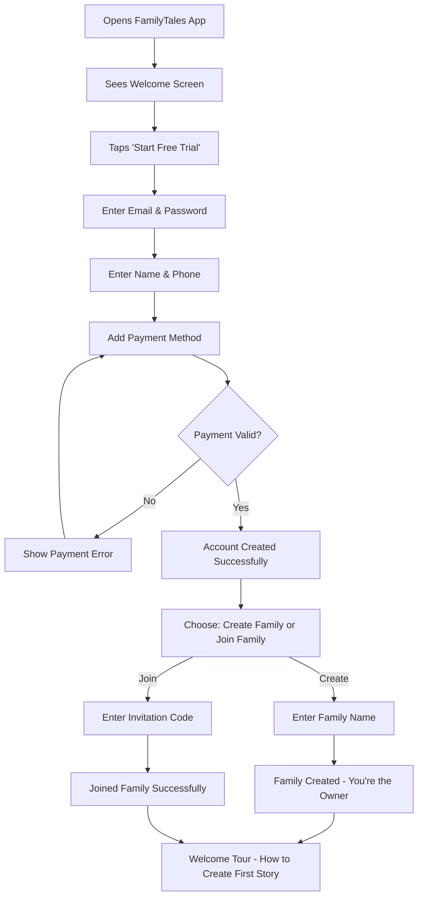
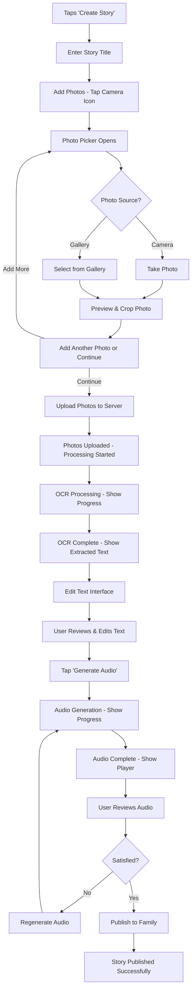
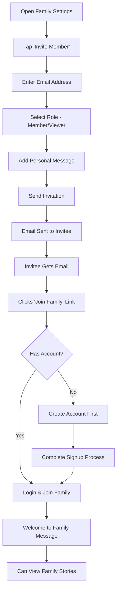
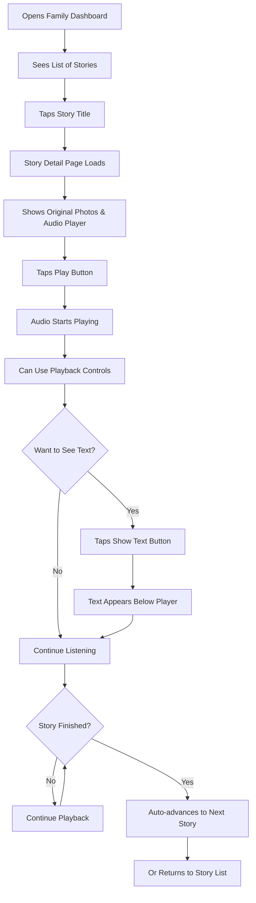
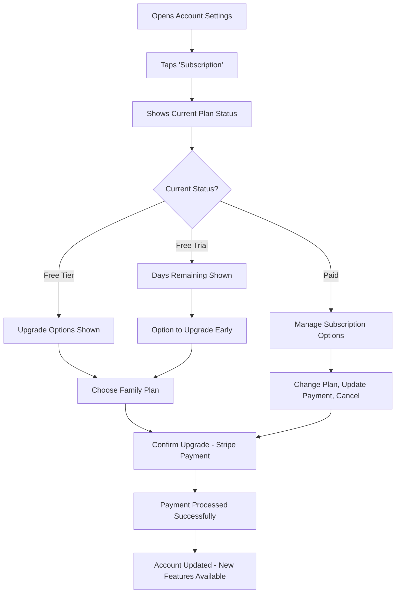
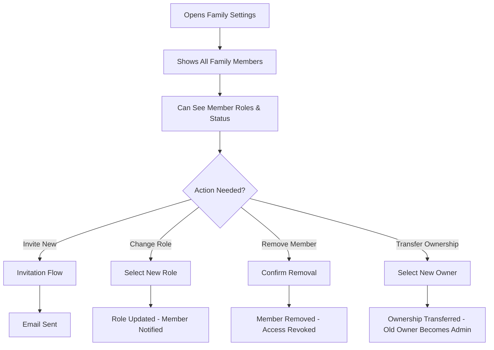
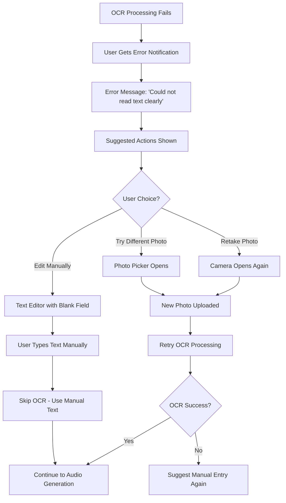
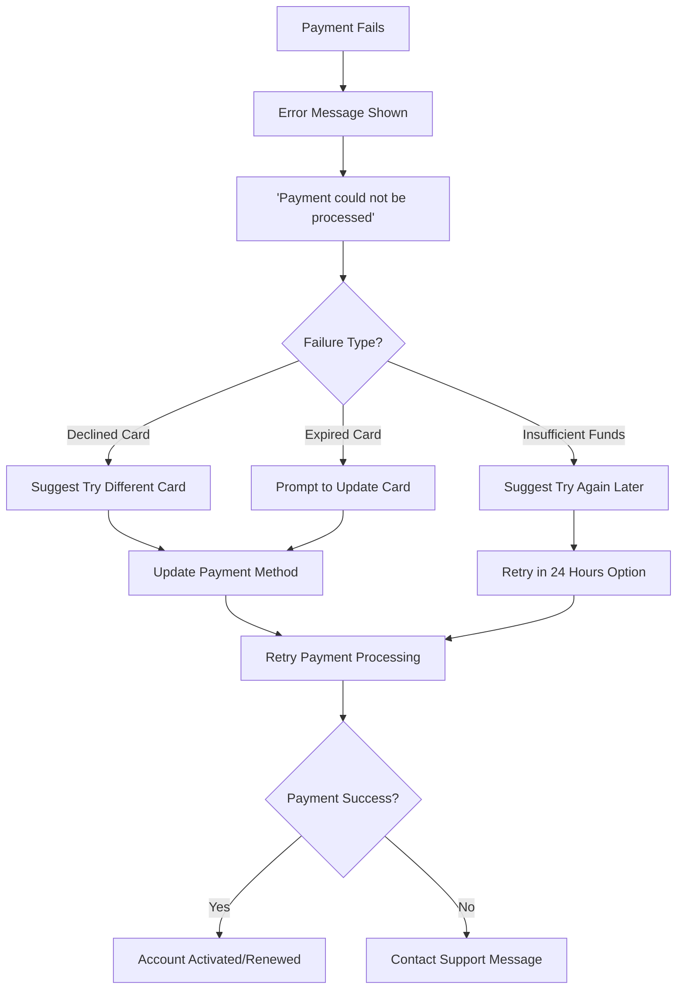
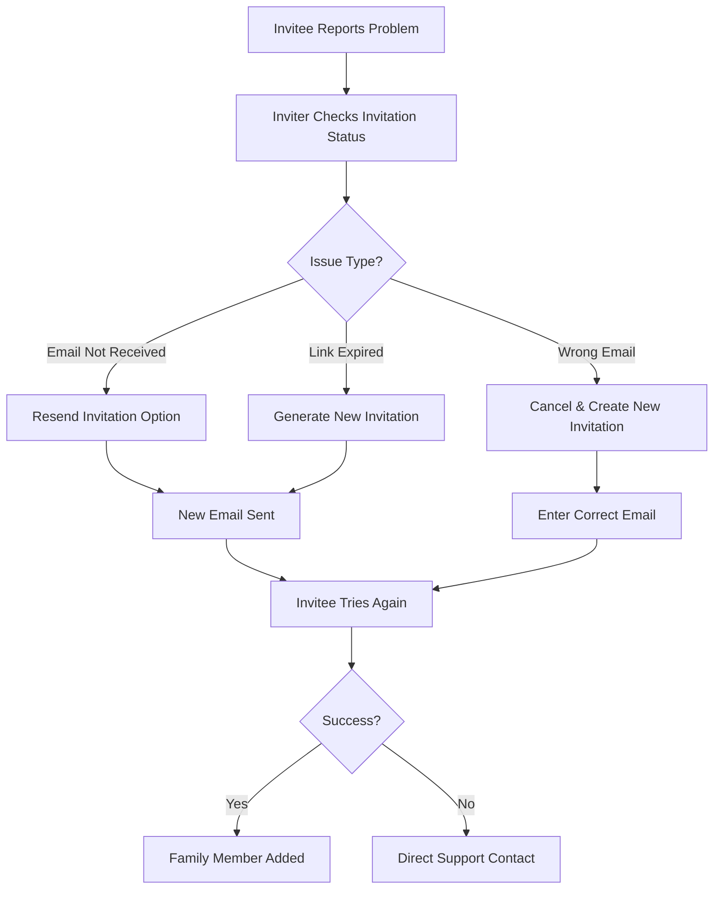

# User Flows - MVP

This document outlines the complete user journeys for all core MVP features. Each flow includes step-by-step actions, system responses, and error handling.

## Table of Contents
- [Primary User Flows](#primary-user-flows)
- [Secondary Flows](#secondary-flows)
- [Error Recovery Flows](#error-recovery-flows)
- [Cross-Platform Considerations](#cross-platform-considerations)

## Primary User Flows

### 1. New User Onboarding & Trial Signup

**Persona**: Sarah (55), wants to preserve her mother's letters for the family

**Entry Point**: Heard about FamilyTales from friend, downloads app

**Detailed Steps**:

1. **App Launch**
   - User downloads from App Store/Play Store/Web
   - Opens app, sees branded welcome screen
   - CTA: "Start Your 14-Day Free Trial"

2. **Account Creation**
   - Email address (primary identifier)
   - Password (min 8 characters)
   - Full name
   - Optional: Phone number for account recovery

3. **Payment Setup**
   - "We need a payment method for after your free trial"
   - Credit card details via Stripe
   - Clear messaging: "You won't be charged for 14 days"
   - Option to cancel anytime

4. **Family Setup**
   - **Create Family**: Enter family name (e.g., "The Johnson Family")
   - **Join Family**: Enter 6-digit invitation code
   - If creating: Automatically becomes Family Owner
   - If joining: Becomes Family Member

5. **Welcome Experience**
   - Brief tutorial: "Let's create your first story"
   - Shows upload button and explains process
   - Option to skip tutorial

**Success State**: User has active trial, belongs to family, understands next steps

**Time to Complete**: 3-5 minutes

### 2. Story Creation Flow (Core MVP Feature)

**Persona**: Margaret (68), has box of father's WWII letters

**Goal**: Convert handwritten letters to audio stories for grandchildren

**Detailed Steps**:

1. **Story Initiation**
   - From family dashboard, tap "+" or "Create Story"
   - Enter story title (required): "Dad's Letters from France"
   - Optional: Brief description

2. **Photo Upload (1-5 photos)**
   - Tap camera icon to add photos
   - Options: Take photo, Choose from gallery
   - Photo requirements: Max 10MB, common formats
   - Can add multiple photos (up to 5 for MVP)
   - Photos shown as thumbnails with order numbers

3. **Processing Phase**
   - Upload progress bar for photos
   - "Processing your story..." with estimated time
   - OCR runs on each photo via Google Vision API
   - User can close app - will get notification when complete

4. **Text Editing**
   - Shows original photos alongside extracted text
   - Split screen: photo on left, text on right
   - Text editor with basic formatting
   - Page navigation if multiple photos
   - Save button saves draft, Continue button proceeds

5. **Audio Generation**
   - Review final text before audio generation
   - Tap "Generate Audio" button
   - Shows progress: "Creating your story's voice..."
   - Preview player appears when complete

6. **Review & Publish**
   - Audio player with basic controls
   - Option to regenerate if unsatisfied
   - "Publish to Family" shares with all family members
   - Success message confirms publication

**Success State**: Story is published, family can access and listen

**Time to Complete**: 15-30 minutes (depending on editing)

### 3. Family Invitation Flow

**Persona**: Robert (72), wants to invite his daughter to see family stories

**Goal**: Add family member so they can view stories

**Detailed Steps**:

1. **Invitation Creation**
   - Family Owner/Admin opens family settings
   - Taps "Invite Family Member"
   - Enters invitee's email address
   - Selects role: Member (can upload) or Viewer (view only)
   - Optional: Personal message

2. **Email Invitation**
   - Automated email with family name and inviter
   - Clear CTA button: "Join The Johnson Family"
   - Explains what FamilyTales is
   - Shows sample story thumbnail

3. **Invitation Acceptance**
   - Invitee clicks link, opens app or web
   - If no account: Goes through signup flow
   - If has account: Logs in and joins family
   - Confirmation: "You've joined [Family Name]!"

4. **Welcome Experience**
   - Shows family dashboard with existing stories
   - Notification to other family members: "John joined the family"
   - New member can immediately start browsing stories

**Success State**: New member can access family stories based on their role

**Time to Complete**: 2-3 minutes for inviter, 5-10 minutes for invitee

### 4. Story Consumption Flow

**Persona**: Lisa (45), wants to listen to grandfather's stories during commute

**Goal**: Browse and listen to family stories

**Detailed Steps**:

1. **Story Discovery**
   - Family dashboard shows stories chronologically
   - Each story shows: Title, creator, date, duration
   - Thumbnail from first photo
   - Play button overlay on hover/tap

2. **Story Detail View**
   - Large audio player at top
   - Original document photos below
   - Story metadata (creator, date, duration)
   - Basic sharing options (copy link)

3. **Audio Playback**
   - Large, elder-friendly play/pause button
   - Scrub bar with current time and total duration
   - Volume control
   - Speed control (1x for MVP)
   - Auto-play next story option

4. **Enhanced Experience**
   - Can view original photos while listening
   - Optional: Show text transcript alongside audio
   - Photos highlight relevant sections as audio plays

**Success State**: User has listened to story and can easily find more

**Time to Complete**: Variable (story length), typically 2-15 minutes

## Secondary Flows

### 5. Subscription Management Flow

**Entry Point**: User wants to upgrade from free tier or manage billing

**Key Features**:
- Clear trial countdown
- Easy upgrade path
- Cancel anytime with confirmation
- Billing history access
- Failed payment recovery

### 6. Family Management Flow

**Entry Point**: Family Owner needs to manage family members

**Key Features**:
- View all family members and their roles
- Change member permissions
- Remove members (with confirmation)
- Transfer family ownership
- Audit trail of family changes

## Error Recovery Flows

### OCR Processing Failures

**Scenario**: OCR cannot extract readable text from photos

**User-Friendly Error Messages**:
- "We couldn't read the handwriting clearly. Would you like to type it yourself?"
- "This photo might be too blurry. Try taking a clearer photo."
- "The text is very faint. You can type what you see to help us."

### Payment Processing Failures

**Scenario**: Credit card is declined during signup or renewal

**Grace Period Handling**:
- 3-day grace period for failed renewals
- Account remains active during grace period
- Daily retry attempts with user notification
- Clear messaging about account status

### Family Invitation Failures

**Scenario**: Invitation email not received or link doesn't work

**Prevention Measures**:
- Invitations valid for 7 days
- Clear email subject lines
- Alternative: Manual invitation codes
- Resend option always available

## Cross-Platform Considerations

### Platform-Specific Behaviors

**iOS App**:
- Native photo picker integration
- Background audio playback capability
- Share sheet integration for story sharing
- Native accessibility features (VoiceOver)

**Android App**:
- Android photo picker integration
- Background playback with notification controls
- Share intent handling
- TalkBack accessibility support

**Web App (PWA)**:
- File upload drag-and-drop
- Keyboard navigation for all controls
- Browser audio controls integration
- Responsive design for tablets

**Desktop Apps**:
- File system access for bulk uploads
- Keyboard shortcuts for power users
- Multiple window support
- Native menu bar integration

### Responsive Design Considerations

**Mobile (Portrait)**:
- Single column layout
- Large touch targets (minimum 44px)
- Bottom navigation for primary actions
- Swipe gestures for story navigation

**Tablet (Landscape)**:
- Two-column layout (story list + detail)
- Sidebar navigation
- Enhanced photo viewing experience
- Split-screen multitasking support

**Desktop**:
- Multi-column dashboard
- Hover states for interactions
- Right-click context menus
- Drag-and-drop photo uploads

### Accessibility Across Platforms

**Visual Accessibility**:
- High contrast mode support
- Text scaling up to 200%
- Focus indicators for keyboard navigation
- Screen reader optimization

**Motor Accessibility**:
- Large touch targets (60px minimum for elders)
- Reduced motion options
- Voice control support where available
- Switch control compatibility

**Cognitive Accessibility**:
- Simple, consistent navigation
- Clear progress indicators
- Undo actions where possible
- Help text and tooltips

This comprehensive user flow documentation ensures that all team members and AI agents understand the complete user experience across all platforms and scenarios.