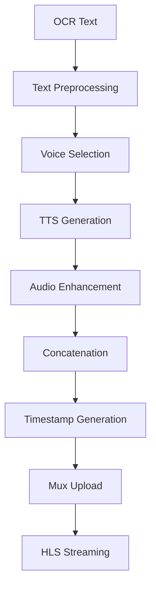

# FamilyTales Audio Processing Pipeline Specification

## Overview

The FamilyTales audio processing pipeline transforms text from scanned documents into high-quality, natural-sounding audio narrations. The system supports multiple TTS providers, voice customization, audio concatenation for multi-document threads, and efficient streaming via Mux's HLS infrastructure.

## Table of Contents

1. [Architecture Overview](#architecture-overview)
2. [Text-to-Speech Integration](#text-to-speech-integration)
3. [Voice Selection System](#voice-selection-system)
4. [Audio Processing Pipeline](#audio-processing-pipeline)
5. [Multi-Document Concatenation](#multi-document-concatenation)
6. [Timestamp Generation](#timestamp-generation)
7. [Mux Integration](#mux-integration)
8. [Quality & Optimization](#quality--optimization)
9. [Implementation Details](#implementation-details)

## Architecture Overview

### System Components

```rust
pub struct AudioProcessingPipeline {
    tts_providers: HashMap<String, Box<dyn TtsProvider>>,
    audio_processor: AudioProcessor,
    concatenator: AudioConcatenator,
    timestamp_generator: TimestampGenerator,
    mux_client: MuxClient,
    cache: AudioCache,
}

pub trait TtsProvider: Send + Sync {
    async fn generate_speech(
        &self,
        text: &str,
        voice_settings: &VoiceSettings,
    ) -> Result<AudioSegment>;
    
    async fn list_voices(&self) -> Result<Vec<Voice>>;
    
    fn estimate_cost(&self, text: &str) -> Cost;
}

pub struct AudioSegment {
    pub data: Vec<u8>,
    pub format: AudioFormat,
    pub duration_ms: u32,
    pub sample_rate: u32,
    pub word_timings: Option<Vec<WordTiming>>,
}
```

### Processing Flow



## Text-to-Speech Integration

### Google Cloud Text-to-Speech

```rust
pub struct GoogleTtsProvider {
    client: GoogleTtsClient,
    config: GoogleTtsConfig,
}

impl GoogleTtsProvider {
    pub async fn new(credentials: ServiceAccountKey) -> Result<Self> {
        let client = GoogleTtsClient::new(credentials).await?;
        
        Ok(Self {
            client,
            config: GoogleTtsConfig {
                audio_encoding: AudioEncoding::Mp3,
                speaking_rate: 1.0,
                pitch: 0.0,
                volume_gain_db: 0.0,
                sample_rate_hertz: 24000,
            },
        })
    }
}

impl TtsProvider for GoogleTtsProvider {
    async fn generate_speech(
        &self,
        text: &str,
        voice_settings: &VoiceSettings,
    ) -> Result<AudioSegment> {
        // Prepare SSML for enhanced speech
        let ssml = self.prepare_ssml(text, voice_settings)?;
        
        let request = SynthesizeSpeechRequest {
            input: SynthesisInput::Ssml(ssml),
            voice: VoiceSelectionParams {
                language_code: voice_settings.language_code.clone(),
                name: voice_settings.voice_id.clone(),
                ssml_gender: voice_settings.gender.clone(),
            },
            audio_config: AudioConfig {
                audio_encoding: self.config.audio_encoding,
                speaking_rate: voice_settings.speed,
                pitch: voice_settings.pitch,
                volume_gain_db: self.config.volume_gain_db,
                sample_rate_hertz: self.config.sample_rate_hertz,
            },
        };
        
        let response = self.client.synthesize_speech(request).await?;
        
        Ok(AudioSegment {
            data: response.audio_content,
            format: AudioFormat::Mp3,
            duration_ms: self.calculate_duration(&response.audio_content)?,
            sample_rate: self.config.sample_rate_hertz,
            word_timings: self.extract_word_timings(&response),
        })
    }
    
    fn prepare_ssml(&self, text: &str, settings: &VoiceSettings) -> Result<String> {
        let mut ssml = String::from("<speak>");
        
        // Add document-specific prosody
        if settings.document_type == DocumentType::Letter {
            ssml.push_str("<prosody rate=\"95%\" pitch=\"+1st\">");
        } else if settings.document_type == DocumentType::Recipe {
            ssml.push_str("<prosody rate=\"85%\">");
        }
        
        // Process text with intelligent breaks
        let processed = self.add_intelligent_breaks(text)?;
        ssml.push_str(&processed);
        
        if settings.document_type != DocumentType::Standard {
            ssml.push_str("</prosody>");
        }
        
        ssml.push_str("</speak>");
        
        Ok(ssml)
    }
}
```

### Amazon Polly Integration

```rust
pub struct PollyProvider {
    client: PollyClient,
    s3_client: S3Client,
    config: PollyConfig,
}

impl TtsProvider for PollyProvider {
    async fn generate_speech(
        &self,
        text: &str,
        voice_settings: &VoiceSettings,
    ) -> Result<AudioSegment> {
        // For long texts, use async synthesis
        if text.len() > POLLY_SYNC_LIMIT {
            return self.generate_async(text, voice_settings).await;
        }
        
        let request = SynthesizeSpeechRequest {
            text: Some(text.to_string()),
            voice_id: voice_settings.voice_id.clone(),
            output_format: OutputFormat::Mp3,
            sample_rate: Some("24000".to_string()),
            engine: if voice_settings.use_neural {
                Some(Engine::Neural)
            } else {
                Some(Engine::Standard)
            },
            speech_mark_types: Some(vec![
                SpeechMarkType::Word,
                SpeechMarkType::Sentence,
            ]),
            ..Default::default()
        };
        
        let response = self.client
            .synthesize_speech(request)
            .await?;
        
        let audio_data = response.audio_stream
            .collect()
            .await?
            .to_vec();
        
        Ok(AudioSegment {
            data: audio_data,
            format: AudioFormat::Mp3,
            duration_ms: self.calculate_duration(&audio_data)?,
            sample_rate: 24000,
            word_timings: self.parse_speech_marks(&response.speech_marks),
        })
    }
    
    async fn generate_async(
        &self,
        text: &str,
        voice_settings: &VoiceSettings,
    ) -> Result<AudioSegment> {
        // Start async synthesis task
        let task_request = StartSpeechSynthesisTaskRequest {
            text: text.to_string(),
            voice_id: voice_settings.voice_id.clone(),
            output_format: OutputFormat::Mp3,
            output_s3_bucket_name: self.config.s3_bucket.clone(),
            output_s3_key_prefix: Some(format!("polly-output/{}", Uuid::new_v4())),
            engine: Some(Engine::Neural),
            speech_mark_types: Some(vec![SpeechMarkType::Word]),
            ..Default::default()
        };
        
        let task = self.client
            .start_speech_synthesis_task(task_request)
            .await?
            .synthesis_task
            .ok_or_else(|| anyhow!("No synthesis task returned"))?;
        
        // Poll for completion
        let audio_url = self.wait_for_synthesis(&task.task_id).await?;
        
        // Download from S3
        let audio_data = self.download_from_s3(&audio_url).await?;
        
        Ok(AudioSegment {
            data: audio_data,
            format: AudioFormat::Mp3,
            duration_ms: task.request_characters as u32 * 60, // Rough estimate
            sample_rate: 24000,
            word_timings: None, // Process separately
        })
    }
}
```

### ElevenLabs Integration (Premium)

```rust
pub struct ElevenLabsProvider {
    client: ElevenLabsClient,
    config: ElevenLabsConfig,
}

impl TtsProvider for ElevenLabsProvider {
    async fn generate_speech(
        &self,
        text: &str,
        voice_settings: &VoiceSettings,
    ) -> Result<AudioSegment> {
        let request = TextToSpeechRequest {
            text: text.to_string(),
            model_id: if voice_settings.use_multilingual {
                "eleven_multilingual_v2"
            } else {
                "eleven_monolingual_v1"
            }.to_string(),
            voice_settings: VoiceSettingsRequest {
                stability: voice_settings.stability.unwrap_or(0.5),
                similarity_boost: voice_settings.similarity_boost.unwrap_or(0.75),
                style: voice_settings.style.unwrap_or(0.0),
                use_speaker_boost: voice_settings.use_speaker_boost.unwrap_or(true),
            },
        };
        
        let response = self.client
            .text_to_speech(&voice_settings.voice_id, request)
            .await?;
        
        Ok(AudioSegment {
            data: response.audio,
            format: AudioFormat::Mp3Hq,
            duration_ms: self.estimate_duration(text),
            sample_rate: 44100,
            word_timings: None, // ElevenLabs doesn't provide word timings
        })
    }
}
```

## Voice Selection System

### Voice Management

```rust
pub struct VoiceManager {
    providers: HashMap<String, Box<dyn TtsProvider>>,
    voice_cache: VoiceCache,
}

impl VoiceManager {
    pub async fn get_available_voices(
        &self,
        tier: SubscriptionTier,
    ) -> Result<Vec<AvailableVoice>> {
        let mut voices = Vec::new();
        
        // Basic voices for free tier
        if matches!(tier, SubscriptionTier::Free) {
            voices.push(AvailableVoice {
                id: "google-standard-female".to_string(),
                name: "Sarah (Standard)".to_string(),
                provider: "google".to_string(),
                gender: Gender::Female,
                language: "en-US".to_string(),
                preview_url: Some("/samples/sarah-standard.mp3".to_string()),
                tier_required: SubscriptionTier::Free,
            });
            
            voices.push(AvailableVoice {
                id: "google-standard-male".to_string(),
                name: "James (Standard)".to_string(),
                provider: "google".to_string(),
                gender: Gender::Male,
                language: "en-US".to_string(),
                preview_url: Some("/samples/james-standard.mp3".to_string()),
                tier_required: SubscriptionTier::Free,
            });
        } else {
            // Premium voices
            for (provider_name, provider) in &self.providers {
                let provider_voices = provider.list_voices().await?;
                
                for voice in provider_voices {
                    if voice.quality >= VoiceQuality::Premium {
                        voices.push(AvailableVoice {
                            id: format!("{}-{}", provider_name, voice.id),
                            name: voice.display_name,
                            provider: provider_name.clone(),
                            gender: voice.gender,
                            language: voice.language,
                            preview_url: voice.preview_url,
                            tier_required: SubscriptionTier::Premium,
                        });
                    }
                }
            }
        }
        
        Ok(voices)
    }
    
    pub async fn preview_voice(
        &self,
        voice_id: &str,
        sample_text: Option<&str>,
    ) -> Result<AudioSegment> {
        let default_sample = "Hello, this is a preview of how your family documents will sound with this voice. The actual audio will use the text from your precious memories.";
        
        let text = sample_text.unwrap_or(default_sample);
        
        // Use cached preview if available
        if let Some(cached) = self.voice_cache.get_preview(voice_id).await? {
            return Ok(cached);
        }
        
        // Generate preview
        let (provider_name, voice_id) = self.parse_voice_id(voice_id)?;
        let provider = self.providers
            .get(provider_name)
            .ok_or_else(|| anyhow!("Unknown provider"))?;
        
        let settings = VoiceSettings {
            voice_id: voice_id.to_string(),
            speed: 1.0,
            pitch: 0.0,
            ..Default::default()
        };
        
        let preview = provider.generate_speech(text, &settings).await?;
        
        // Cache for future use
        self.voice_cache.store_preview(voice_id, &preview).await?;
        
        Ok(preview)
    }
}
```

### Voice Selection UI Integration

```dart
class VoiceSelectionScreen extends StatefulWidget {
  final MemoryBook book;
  final Thread? thread;
  
  @override
  _VoiceSelectionScreenState createState() => _VoiceSelectionScreenState();
}

class _VoiceSelectionScreenState extends State<VoiceSelectionScreen> {
  String? selectedVoiceId;
  bool isPlaying = false;
  String? currentlyPlayingId;
  
  @override
  Widget build(BuildContext context) {
    return Scaffold(
      appBar: AppBar(
        title: Text('Choose a Voice'),
        subtitle: Text(widget.thread?.title ?? widget.book.title),
      ),
      body: FutureBuilder<List<AvailableVoice>>(
        future: audioService.getAvailableVoices(),
        builder: (context, snapshot) {
          if (!snapshot.hasData) {
            return Center(child: CircularProgressIndicator());
          }
          
          final voices = snapshot.data!;
          final groupedVoices = _groupVoicesByLanguage(voices);
          
          return Column(
            children: [
              // Preview text selector
              PreviewTextSelector(
                onTextSelected: (text) => _updatePreviewText(text),
                suggestions: [
                  'First paragraph of your document',
                  'Custom text...',
                  'Default preview',
                ],
              ),
              
              Expanded(
                child: ListView(
                  children: groupedVoices.entries.map((entry) {
                    return VoiceLanguageGroup(
                      language: entry.key,
                      voices: entry.value,
                      selectedVoiceId: selectedVoiceId,
                      onVoiceSelected: (voice) {
                        setState(() => selectedVoiceId = voice.id);
                      },
                      onPreviewTap: (voice) => _playPreview(voice),
                      isPlaying: currentlyPlayingId == voice.id,
                    );
                  }).toList(),
                ),
              ),
              
              // Bottom action bar
              Container(
                padding: EdgeInsets.all(16),
                decoration: BoxDecoration(
                  color: Theme.of(context).cardColor,
                  boxShadow: [
                    BoxShadow(
                      color: Colors.black12,
                      blurRadius: 4,
                      offset: Offset(0, -2),
                    ),
                  ],
                ),
                child: Row(
                  children: [
                    Expanded(
                      child: Text(
                        selectedVoiceId != null
                            ? 'Selected: ${_getVoiceName(selectedVoiceId!)}'
                            : 'No voice selected',
                      ),
                    ),
                    ElevatedButton(
                      onPressed: selectedVoiceId != null
                          ? () => _confirmSelection()
                          : null,
                      child: Text('Confirm Selection'),
                    ),
                  ],
                ),
              ),
            ],
          );
        },
      ),
    );
  }
  
  Future<void> _playPreview(AvailableVoice voice) async {
    setState(() {
      currentlyPlayingId = voice.id;
      isPlaying = true;
    });
    
    try {
      final preview = await audioService.previewVoice(
        voice.id,
        _getPreviewText(),
      );
      
      await audioPlayer.play(preview);
    } finally {
      setState(() {
        currentlyPlayingId = null;
        isPlaying = false;
      });
    }
  }
}
```

## Audio Processing Pipeline

### Text Preprocessing

```rust
pub struct TextPreprocessor {
    abbreviation_expander: AbbreviationExpander,
    number_formatter: NumberFormatter,
    punctuation_handler: PunctuationHandler,
}

impl TextPreprocessor {
    pub fn prepare_for_tts(&self, text: &str, context: &DocumentContext) -> Result<String> {
        let mut processed = text.to_string();
        
        // Expand common abbreviations
        processed = self.abbreviation_expander.expand(&processed, &context.language)?;
        
        // Format numbers for speech
        processed = self.number_formatter.format_for_speech(&processed)?;
        
        // Handle special punctuation
        processed = self.punctuation_handler.process(&processed)?;
        
        // Add pauses for better narration
        processed = self.add_natural_pauses(&processed, &context.document_type)?;
        
        Ok(processed)
    }
    
    fn add_natural_pauses(&self, text: &str, doc_type: &DocumentType) -> Result<String> {
        let mut result = String::new();
        
        for paragraph in text.split("\n\n") {
            // Add pause after paragraph
            result.push_str(paragraph);
            result.push_str(" <break time=\"500ms\"/> ");
            
            // Special handling for recipes
            if *doc_type == DocumentType::Recipe {
                // Add pauses after ingredient lines
                let lines: Vec<&str> = paragraph.lines().collect();
                for line in lines {
                    if self.looks_like_ingredient(line) {
                        result.push_str(line);
                        result.push_str(" <break time=\"300ms\"/> ");
                    } else {
                        result.push_str(line);
                        result.push_str(" ");
                    }
                }
            }
        }
        
        Ok(result)
    }
}

pub struct AbbreviationExpander {
    mappings: HashMap<String, String>,
}

impl AbbreviationExpander {
    pub fn expand(&self, text: &str, language: &str) -> Result<String> {
        let mut result = text.to_string();
        
        // Common abbreviations
        let expansions = match language {
            "en-US" | "en-GB" => vec![
                ("Mr.", "Mister"),
                ("Mrs.", "Missus"),
                ("Dr.", "Doctor"),
                ("St.", "Street"),
                ("Ave.", "Avenue"),
                ("etc.", "et cetera"),
                ("vs.", "versus"),
                ("lb.", "pound"),
                ("oz.", "ounce"),
            ],
            _ => vec![],
        };
        
        for (abbr, expansion) in expansions {
            result = result.replace(abbr, expansion);
        }
        
        Ok(result)
    }
}
```

### Audio Enhancement

```rust
pub struct AudioEnhancer {
    normalizer: AudioNormalizer,
    noise_reducer: NoiseReducer,
    eq: ParametricEQ,
}

impl AudioEnhancer {
    pub async fn enhance(&self, audio: AudioSegment) -> Result<AudioSegment> {
        // Convert to WAV for processing
        let wav_data = self.convert_to_wav(&audio)?;
        
        // Apply noise reduction
        let clean_audio = self.noise_reducer.process(&wav_data)?;
        
        // Normalize audio levels
        let normalized = self.normalizer.normalize(&clean_audio, -3.0)?; // -3dB target
        
        // Apply EQ for speech clarity
        let eq_settings = EqSettings {
            low_shelf: Some(ShelfFilter {
                frequency: 100.0,
                gain: -3.0, // Reduce low rumble
                q: 0.7,
            }),
            high_shelf: Some(ShelfFilter {
                frequency: 8000.0,
                gain: 2.0, // Boost clarity
                q: 0.7,
            }),
            presence_boost: Some(PeakFilter {
                frequency: 3000.0,
                gain: 1.5,
                q: 2.0,
            }),
        };
        
        let enhanced = self.eq.apply(&normalized, &eq_settings)?;
        
        // Convert back to original format
        let final_audio = self.convert_from_wav(&enhanced, audio.format)?;
        
        Ok(AudioSegment {
            data: final_audio,
            format: audio.format,
            duration_ms: audio.duration_ms,
            sample_rate: audio.sample_rate,
            word_timings: audio.word_timings,
        })
    }
}

pub struct AudioNormalizer {
    pub fn normalize(&self, audio: &WavData, target_db: f32) -> Result<WavData> {
        // Calculate current peak level
        let peak = self.find_peak_level(audio)?;
        let current_db = 20.0 * (peak.abs()).log10();
        
        // Calculate gain needed
        let gain_db = target_db - current_db;
        let gain_linear = 10.0_f32.powf(gain_db / 20.0);
        
        // Apply gain with limiting to prevent clipping
        let mut output = audio.clone();
        for sample in output.samples.iter_mut() {
            *sample = (*sample * gain_linear).clamp(-1.0, 1.0);
        }
        
        Ok(output)
    }
}
```

## Multi-Document Concatenation

### Thread Audio Assembly

```rust
pub struct AudioConcatenator {
    crossfader: Crossfader,
    silence_generator: SilenceGenerator,
}

impl AudioConcatenator {
    pub async fn create_thread_audio(
        &self,
        segments: Vec<ProcessedSegment>,
        thread_settings: &ThreadSettings,
    ) -> Result<ThreadAudio> {
        let mut combined_audio = Vec::new();
        let mut segment_boundaries = Vec::new();
        let mut current_position = 0.0;
        
        for (idx, segment) in segments.iter().enumerate() {
            // Add segment boundary marker
            segment_boundaries.push(SegmentBoundary {
                segment_id: segment.id,
                start_time: current_position,
                end_time: 0.0, // Will be updated
            });
            
            // Add pause before segment if not first
            if idx > 0 {
                let pause_duration = self.calculate_pause_duration(
                    &segments[idx - 1],
                    segment,
                    thread_settings,
                )?;
                
                let silence = self.silence_generator.generate(
                    pause_duration,
                    segment.audio.sample_rate,
                )?;
                
                combined_audio.extend_from_slice(&silence);
                current_position += pause_duration;
            }
            
            // Add transition if specified
            if thread_settings.use_transitions && idx > 0 {
                let transition = self.create_transition(
                    &segments[idx - 1].audio,
                    &segment.audio,
                    thread_settings.transition_type,
                )?;
                
                combined_audio.extend_from_slice(&transition);
                current_position += transition.duration_ms as f64 / 1000.0;
            }
            
            // Add the segment audio
            combined_audio.extend_from_slice(&segment.audio.data);
            let segment_duration = segment.audio.duration_ms as f64 / 1000.0;
            
            // Update boundary end time
            segment_boundaries.last_mut().unwrap().end_time = current_position + segment_duration;
            
            current_position += segment_duration;
        }
        
        Ok(ThreadAudio {
            data: combined_audio,
            duration_seconds: current_position,
            segment_boundaries,
            format: AudioFormat::Mp3,
            sample_rate: segments[0].audio.sample_rate,
        })
    }
    
    fn calculate_pause_duration(
        &self,
        prev_segment: &ProcessedSegment,
        next_segment: &ProcessedSegment,
        settings: &ThreadSettings,
    ) -> Result<f64> {
        // Base pause duration
        let mut pause = settings.base_pause_duration;
        
        // Adjust based on content type transition
        match (prev_segment.content_type, next_segment.content_type) {
            (ContentType::Letter, ContentType::Letter) => {
                // Same type, shorter pause
                pause *= 0.8;
            }
            (ContentType::Recipe, ContentType::Recipe) => {
                // Recipe steps need clear separation
                pause *= 1.2;
            }
            (_, ContentType::Photo) | (ContentType::Photo, _) => {
                // Photos need more context switching time
                pause *= 1.5;
            }
            _ => {} // Use default
        }
        
        // Adjust based on segment lengths
        if prev_segment.word_count > 500 || next_segment.word_count > 500 {
            // Longer segments need more breathing room
            pause *= 1.2;
        }
        
        Ok(pause)
    }
    
    fn create_transition(
        &self,
        from_audio: &AudioSegment,
        to_audio: &AudioSegment,
        transition_type: TransitionType,
    ) -> Result<TransitionAudio> {
        match transition_type {
            TransitionType::Crossfade => {
                self.crossfader.create_crossfade(
                    from_audio,
                    to_audio,
                    Duration::from_millis(500),
                )
            }
            TransitionType::FadeThrough => {
                // Fade out, silence, fade in
                let fade_out = self.create_fade(from_audio, FadeType::Out, 300)?;
                let silence = self.silence_generator.generate(0.2, from_audio.sample_rate)?;
                let fade_in = self.create_fade(to_audio, FadeType::In, 300)?;
                
                Ok(TransitionAudio {
                    data: [fade_out, silence, fade_in].concat(),
                    duration_ms: 800,
                })
            }
            TransitionType::None => {
                Ok(TransitionAudio {
                    data: vec![],
                    duration_ms: 0,
                })
            }
        }
    }
}
```

### Segment Processing

```rust
pub struct SegmentProcessor {
    pub async fn process_content_segment(
        &self,
        segment: &ContentSegment,
        voice_settings: &VoiceSettings,
        tts_provider: &dyn TtsProvider,
    ) -> Result<ProcessedSegment> {
        match segment.content_type {
            ContentType::HandwrittenDocument | ContentType::TypedDocument => {
                // Process text content
                let text = segment.ocr_text
                    .as_ref()
                    .ok_or_else(|| anyhow!("No text content"))?;
                
                // Preprocess text
                let processed_text = self.text_preprocessor
                    .prepare_for_tts(text, &segment.into())?;
                
                // Generate audio
                let audio = tts_provider
                    .generate_speech(&processed_text, voice_settings)
                    .await?;
                
                Ok(ProcessedSegment {
                    id: segment.id,
                    content_type: segment.content_type,
                    audio,
                    word_count: text.split_whitespace().count(),
                    original_text: text.clone(),
                })
            }
            
            ContentType::Photo => {
                // Handle photo with narration
                if let Some(narration) = &segment.narration {
                    let audio = tts_provider
                        .generate_speech(narration, voice_settings)
                        .await?;
                    
                    Ok(ProcessedSegment {
                        id: segment.id,
                        content_type: segment.content_type,
                        audio,
                        word_count: narration.split_whitespace().count(),
                        original_text: narration.clone(),
                    })
                } else {
                    // Generate default photo description
                    let description = format!(
                        "Photo from page {}",
                        segment.page_number.unwrap_or(0)
                    );
                    
                    let audio = tts_provider
                        .generate_speech(&description, voice_settings)
                        .await?;
                    
                    Ok(ProcessedSegment {
                        id: segment.id,
                        content_type: segment.content_type,
                        audio,
                        word_count: description.split_whitespace().count(),
                        original_text: description,
                    })
                }
            }
            
            ContentType::Recipe => {
                // Special handling for recipes
                let recipe_audio = self.process_recipe_segment(
                    segment,
                    voice_settings,
                    tts_provider,
                ).await?;
                
                Ok(recipe_audio)
            }
            
            _ => Err(anyhow!("Unsupported content type")),
        }
    }
    
    async fn process_recipe_segment(
        &self,
        segment: &ContentSegment,
        voice_settings: &VoiceSettings,
        tts_provider: &dyn TtsProvider,
    ) -> Result<ProcessedSegment> {
        let text = segment.ocr_text
            .as_ref()
            .ok_or_else(|| anyhow!("No recipe text"))?;
        
        // Parse recipe structure
        let recipe = self.recipe_parser.parse(text)?;
        
        // Format for optimal audio narration
        let formatted = self.format_recipe_for_speech(&recipe)?;
        
        // Use slower speed for ingredients
        let mut recipe_voice = voice_settings.clone();
        recipe_voice.speed = 0.85; // 15% slower
        
        let audio = tts_provider
            .generate_speech(&formatted, &recipe_voice)
            .await?;
        
        Ok(ProcessedSegment {
            id: segment.id,
            content_type: segment.content_type,
            audio,
            word_count: text.split_whitespace().count(),
            original_text: text.clone(),
        })
    }
}
```

## Timestamp Generation

### Word-Level Timing

```rust
pub struct TimestampGenerator {
    pub fn generate_timestamps(
        &self,
        thread_audio: &ThreadAudio,
        segments: &[ProcessedSegment],
    ) -> Result<Vec<TimestampedSegment>> {
        let mut timestamped_segments = Vec::new();
        
        for (segment, boundary) in segments.iter().zip(&thread_audio.segment_boundaries) {
            let mut segment_timestamps = TimestampedSegment {
                segment_id: segment.id,
                start_time: boundary.start_time,
                end_time: boundary.end_time,
                word_timestamps: None,
                sentence_timestamps: None,
            };
            
            // If we have word timings from TTS
            if let Some(word_timings) = &segment.audio.word_timings {
                let adjusted_timings = self.adjust_word_timings(
                    word_timings,
                    boundary.start_time,
                )?;
                
                segment_timestamps.word_timestamps = Some(adjusted_timings);
                
                // Generate sentence timestamps from word timings
                segment_timestamps.sentence_timestamps = Some(
                    self.generate_sentence_timestamps(&segment.original_text, &adjusted_timings)?
                );
            } else {
                // Estimate timestamps based on word count
                let estimated = self.estimate_timestamps(
                    &segment.original_text,
                    boundary.start_time,
                    boundary.end_time,
                )?;
                
                segment_timestamps.word_timestamps = Some(estimated.word_timestamps);
                segment_timestamps.sentence_timestamps = Some(estimated.sentence_timestamps);
            }
            
            timestamped_segments.push(segment_timestamps);
        }
        
        Ok(timestamped_segments)
    }
    
    fn adjust_word_timings(
        &self,
        word_timings: &[WordTiming],
        segment_offset: f64,
    ) -> Result<Vec<WordTiming>> {
        Ok(word_timings
            .iter()
            .map(|timing| WordTiming {
                word: timing.word.clone(),
                start_time: timing.start_time + segment_offset,
                end_time: timing.end_time + segment_offset,
                confidence: timing.confidence,
            })
            .collect())
    }
    
    fn estimate_timestamps(
        &self,
        text: &str,
        start_time: f64,
        end_time: f64,
    ) -> Result<EstimatedTimestamps> {
        let words: Vec<&str> = text.split_whitespace().collect();
        let total_duration = end_time - start_time;
        
        // Estimate based on average speaking rate (150 words per minute)
        let avg_word_duration = total_duration / words.len() as f64;
        
        let mut current_time = start_time;
        let mut word_timestamps = Vec::new();
        
        for word in &words {
            // Adjust duration based on word length
            let word_duration = avg_word_duration * (word.len() as f64 / 5.0).max(0.5).min(2.0);
            
            word_timestamps.push(WordTiming {
                word: word.to_string(),
                start_time: current_time,
                end_time: current_time + word_duration,
                confidence: 0.5, // Lower confidence for estimates
            });
            
            current_time += word_duration;
        }
        
        // Generate sentence timestamps
        let sentence_timestamps = self.generate_sentence_timestamps(text, &word_timestamps)?;
        
        Ok(EstimatedTimestamps {
            word_timestamps,
            sentence_timestamps,
        })
    }
}
```

### Navigation Timestamps

```rust
pub struct NavigationTimestamps {
    pub fn create_navigation_points(
        &self,
        timestamped_segments: &[TimestampedSegment],
        thread_settings: &ThreadSettings,
    ) -> Result<Vec<NavigationPoint>> {
        let mut navigation_points = Vec::new();
        
        for segment in timestamped_segments {
            // Document start
            navigation_points.push(NavigationPoint {
                id: Uuid::new_v4(),
                timestamp: segment.start_time,
                point_type: NavigationType::DocumentStart,
                label: format!("Document {}", navigation_points.len() + 1),
                segment_id: segment.segment_id,
            });
            
            // Paragraph navigation
            if let Some(sentence_timestamps) = &segment.sentence_timestamps {
                for (idx, sentence) in sentence_timestamps.iter().enumerate() {
                    if self.is_paragraph_start(&sentence.text) {
                        navigation_points.push(NavigationPoint {
                            id: Uuid::new_v4(),
                            timestamp: sentence.start_time,
                            point_type: NavigationType::Paragraph,
                            label: format!("Paragraph {}", idx + 1),
                            segment_id: segment.segment_id,
                        });
                    }
                }
            }
            
            // Custom markers (e.g., recipe sections)
            if thread_settings.content_type == ContentType::Recipe {
                let recipe_markers = self.extract_recipe_markers(segment)?;
                navigation_points.extend(recipe_markers);
            }
        }
        
        Ok(navigation_points)
    }
    
    fn extract_recipe_markers(
        &self,
        segment: &TimestampedSegment,
    ) -> Result<Vec<NavigationPoint>> {
        let mut markers = Vec::new();
        
        if let Some(word_timestamps) = &segment.word_timestamps {
            // Look for recipe sections
            let sections = vec!["ingredients", "instructions", "directions", "notes"];
            
            for (idx, timing) in word_timestamps.iter().enumerate() {
                if sections.contains(&timing.word.to_lowercase().as_str()) {
                    markers.push(NavigationPoint {
                        id: Uuid::new_v4(),
                        timestamp: timing.start_time,
                        point_type: NavigationType::RecipeSection,
                        label: timing.word.clone(),
                        segment_id: segment.segment_id,
                    });
                }
            }
        }
        
        Ok(markers)
    }
}
```

## Mux Integration

### Upload and Processing

```rust
pub struct MuxIntegration {
    client: MuxClient,
    config: MuxConfig,
}

impl MuxIntegration {
    pub async fn upload_thread_audio(
        &self,
        thread_audio: &ThreadAudio,
        metadata: &ThreadMetadata,
    ) -> Result<MuxAsset> {
        // Prepare audio file
        let audio_file = self.prepare_audio_file(thread_audio)?;
        
        // Create direct upload
        let upload_request = CreateUploadRequest {
            new_asset_settings: Some(CreateAssetRequest {
                playback_policy: Some(vec![PlaybackPolicy::Public]),
                mp4_support: Some(Mp4Support::Standard),
                normalize_audio: Some(true),
                master_access: Some(MasterAccess::Temporary),
                test: Some(false),
                custom_metadata: Some(hashmap! {
                    "thread_id" => metadata.thread_id.to_string(),
                    "family_id" => metadata.family_id.to_string(),
                    "content_type" => "audio".to_string(),
                    "duration_seconds" => thread_audio.duration_seconds.to_string(),
                }),
                ..Default::default()
            }),
            timeout: Some(3600), // 1 hour timeout
            ..Default::default()
        };
        
        let upload = self.client
            .direct_uploads()
            .create(upload_request)
            .await?;
        
        // Upload the file
        let upload_url = upload.data.attributes.url;
        self.upload_file_to_url(&audio_file, &upload_url).await?;
        
        // Wait for asset to be ready
        let asset = self.wait_for_asset_ready(&upload.data.attributes.asset_id).await?;
        
        Ok(MuxAsset {
            id: asset.id,
            playback_id: asset.playback_ids[0].id.clone(),
            duration: asset.duration,
            status: asset.status,
            hls_url: format!(
                "https://stream.mux.com/{}.m3u8",
                asset.playback_ids[0].id
            ),
            download_url: self.generate_download_url(&asset)?,
        })
    }
    
    async fn wait_for_asset_ready(&self, asset_id: &str) -> Result<Asset> {
        let mut attempts = 0;
        let max_attempts = 60; // 5 minutes with 5-second intervals
        
        loop {
            let asset = self.client
                .assets()
                .retrieve(asset_id)
                .await?
                .data;
            
            match asset.status.as_str() {
                "ready" => return Ok(asset),
                "preparing" => {
                    attempts += 1;
                    if attempts >= max_attempts {
                        return Err(anyhow!("Asset preparation timeout"));
                    }
                    tokio::time::sleep(Duration::from_secs(5)).await;
                }
                "errored" => {
                    return Err(anyhow!("Asset processing failed: {:?}", asset.errors));
                }
                _ => {
                    return Err(anyhow!("Unknown asset status: {}", asset.status));
                }
            }
        }
    }
    
    pub async fn generate_subtitles(
        &self,
        asset_id: &str,
        timestamps: &[TimestampedSegment],
    ) -> Result<String> {
        // Generate WebVTT subtitles
        let mut vtt = String::from("WEBVTT\n\n");
        
        for segment in timestamps {
            if let Some(sentences) = &segment.sentence_timestamps {
                for sentence in sentences {
                    vtt.push_str(&format!(
                        "{} --> {}\n{}\n\n",
                        self.format_timestamp(sentence.start_time),
                        self.format_timestamp(sentence.end_time),
                        sentence.text
                    ));
                }
            }
        }
        
        // Upload subtitles to Mux
        let track_request = CreateTrackRequest {
            url: self.upload_subtitles(&vtt).await?,
            track_type: TrackType::Text,
            text_type: Some(TextType::Subtitles),
            language_code: Some("en".to_string()),
            name: Some("English".to_string()),
            closed_captions: Some(false),
            ..Default::default()
        };
        
        self.client
            .assets()
            .create_track(asset_id, track_request)
            .await?;
        
        Ok(vtt)
    }
    
    fn format_timestamp(&self, seconds: f64) -> String {
        let hours = (seconds / 3600.0) as u32;
        let minutes = ((seconds % 3600.0) / 60.0) as u32;
        let secs = seconds % 60.0;
        
        format!("{:02}:{:02}:{:06.3}", hours, minutes, secs)
    }
}
```

### Playback URL Generation

```rust
impl MuxIntegration {
    pub fn generate_playback_urls(
        &self,
        asset: &MuxAsset,
        options: &PlaybackOptions,
    ) -> PlaybackUrls {
        let base_url = format!(
            "https://stream.mux.com/{}.m3u8",
            asset.playback_id
        );
        
        PlaybackUrls {
            hls_url: base_url.clone(),
            
            // Audio-only specific qualities
            low_quality_url: format!("{}?audio_bitrate=64000", base_url),
            medium_quality_url: format!("{}?audio_bitrate=128000", base_url),
            high_quality_url: format!("{}?audio_bitrate=192000", base_url),
            
            // Download URL with JWT for security
            download_url: if options.allow_download {
                Some(self.generate_signed_download_url(asset)?)
            } else {
                None
            },
            
            // Thumbnail for audio visualization
            thumbnail_url: format!(
                "https://image.mux.com/{}/thumbnail.png?width=1920&height=1080&time=0",
                asset.playback_id
            ),
        }
    }
    
    fn generate_signed_download_url(&self, asset: &MuxAsset) -> Result<String> {
        let expiration = Utc::now() + Duration::hours(24);
        
        let claims = JwtClaims {
            sub: asset.playback_id.clone(),
            exp: expiration.timestamp(),
            download: true,
            aud: "download".to_string(),
        };
        
        let token = encode(
            &Header::default(),
            &claims,
            &EncodingKey::from_secret(self.config.signing_key.as_ref()),
        )?;
        
        Ok(format!(
            "https://stream.mux.com/{}/download.mp3?token={}",
            asset.playback_id,
            token
        ))
    }
}
```

## Quality & Optimization

### Audio Quality Settings

```rust
pub struct QualitySettings {
    pub bitrate: AudioBitrate,
    pub sample_rate: SampleRate,
    pub channels: AudioChannels,
    pub codec: AudioCodec,
}

pub enum AudioBitrate {
    Low,      // 64 kbps - for low bandwidth
    Medium,   // 128 kbps - standard quality
    High,     // 192 kbps - premium quality
    Lossless, // FLAC for archival
}

impl QualitySettings {
    pub fn for_tier(tier: SubscriptionTier) -> Self {
        match tier {
            SubscriptionTier::Free => Self {
                bitrate: AudioBitrate::Low,
                sample_rate: SampleRate::Hz22050,
                channels: AudioChannels::Mono,
                codec: AudioCodec::Mp3,
            },
            SubscriptionTier::Premium => Self {
                bitrate: AudioBitrate::Medium,
                sample_rate: SampleRate::Hz44100,
                channels: AudioChannels::Stereo,
                codec: AudioCodec::Mp3,
            },
            SubscriptionTier::Legacy => Self {
                bitrate: AudioBitrate::High,
                sample_rate: SampleRate::Hz48000,
                channels: AudioChannels::Stereo,
                codec: AudioCodec::Aac,
            },
        }
    }
}
```

### Caching Strategy

```rust
pub struct AudioCache {
    redis: RedisConnection,
    disk_cache: DiskCache,
}

impl AudioCache {
    pub async fn get_or_generate(
        &self,
        cache_key: &str,
        generator: impl Future<Output = Result<AudioSegment>>,
    ) -> Result<AudioSegment> {
        // Check memory cache first
        if let Some(cached) = self.redis.get(cache_key).await? {
            return Ok(cached);
        }
        
        // Check disk cache
        if let Some(cached) = self.disk_cache.get(cache_key).await? {
            // Populate memory cache
            self.redis.setex(cache_key, 3600, &cached).await?;
            return Ok(cached);
        }
        
        // Generate new audio
        let audio = generator.await?;
        
        // Cache in both layers
        self.disk_cache.set(cache_key, &audio).await?;
        self.redis.setex(cache_key, 3600, &audio).await?;
        
        Ok(audio)
    }
    
    pub fn compute_cache_key(
        &self,
        text_hash: &str,
        voice_id: &str,
        settings: &VoiceSettings,
    ) -> String {
        format!(
            "audio:v2:{}:{}:speed{:.1}:pitch{:.1}",
            text_hash,
            voice_id,
            settings.speed,
            settings.pitch
        )
    }
}
```

### Performance Monitoring

```rust
pub struct AudioMetrics {
    processing_times: HashMap<String, Duration>,
    success_rates: HashMap<String, f64>,
    cache_hit_rates: HashMap<String, f64>,
}

impl AudioMetrics {
    pub async fn record_processing(
        &mut self,
        provider: &str,
        duration: Duration,
        success: bool,
    ) {
        // Update processing time
        self.processing_times
            .entry(provider.to_string())
            .and_modify(|avg| {
                *avg = (*avg + duration) / 2;
            })
            .or_insert(duration);
        
        // Update success rate
        self.success_rates
            .entry(provider.to_string())
            .and_modify(|rate| {
                *rate = (*rate * 0.95) + (if success { 0.05 } else { 0.0 });
            })
            .or_insert(if success { 1.0 } else { 0.0 });
        
        // Log to monitoring service
        metrics::histogram!(
            "audio.processing.duration",
            duration.as_secs_f64(),
            "provider" => provider,
            "success" => success.to_string()
        );
    }
}
```

## Implementation Details

### Audio Processing Service

```rust
pub struct AudioProcessingService {
    pipeline: AudioProcessingPipeline,
    job_queue: JobQueue,
    metrics: Arc<Mutex<AudioMetrics>>,
}

impl AudioProcessingService {
    pub async fn process_thread(
        &self,
        thread: &Thread,
        segments: Vec<ContentSegment>,
    ) -> Result<ProcessedThread> {
        let start_time = Instant::now();
        
        // Select TTS provider based on tier and preferences
        let provider = self.select_provider(&thread.voice_settings).await?;
        
        // Process each segment
        let mut processed_segments = Vec::new();
        
        for segment in segments {
            let processed = self.pipeline
                .segment_processor
                .process_content_segment(
                    &segment,
                    &thread.voice_settings,
                    provider.as_ref(),
                )
                .await?;
            
            processed_segments.push(processed);
        }
        
        // Concatenate into single audio file
        let thread_audio = self.pipeline
            .concatenator
            .create_thread_audio(
                processed_segments.clone(),
                &thread.settings,
            )
            .await?;
        
        // Generate timestamps
        let timestamps = self.pipeline
            .timestamp_generator
            .generate_timestamps(&thread_audio, &processed_segments)?;
        
        // Upload to Mux
        let mux_asset = self.pipeline
            .mux_client
            .upload_thread_audio(
                &thread_audio,
                &ThreadMetadata {
                    thread_id: thread.id,
                    family_id: thread.family_id,
                },
            )
            .await?;
        
        // Record metrics
        self.metrics.lock().await.record_processing(
            provider.name(),
            start_time.elapsed(),
            true,
        ).await;
        
        Ok(ProcessedThread {
            thread_id: thread.id,
            audio_url: mux_asset.hls_url,
            download_url: mux_asset.download_url,
            duration_seconds: thread_audio.duration_seconds,
            timestamps,
            processing_time: start_time.elapsed(),
        })
    }
    
    async fn select_provider(
        &self,
        voice_settings: &VoiceSettings,
    ) -> Result<Arc<dyn TtsProvider>> {
        // Parse provider from voice ID
        let provider_name = voice_settings.voice_id
            .split('-')
            .next()
            .ok_or_else(|| anyhow!("Invalid voice ID format"))?;
        
        self.pipeline
            .tts_providers
            .get(provider_name)
            .cloned()
            .ok_or_else(|| anyhow!("Unknown provider: {}", provider_name))
    }
}
```

### Error Handling and Retry Logic

```rust
pub struct AudioProcessingError {
    pub error_type: AudioErrorType,
    pub message: String,
    pub recoverable: bool,
    pub retry_after: Option<Duration>,
}

pub enum AudioErrorType {
    TtsProviderError,
    AudioEnhancementError,
    MuxUploadError,
    TimestampGenerationError,
    QuotaExceeded,
    InvalidInput,
}

impl AudioProcessingService {
    pub async fn process_with_retry(
        &self,
        thread: &Thread,
        segments: Vec<ContentSegment>,
        max_retries: u32,
    ) -> Result<ProcessedThread> {
        let mut attempts = 0;
        let mut last_error = None;
        
        while attempts < max_retries {
            match self.process_thread(thread, segments.clone()).await {
                Ok(result) => return Ok(result),
                Err(e) => {
                    let audio_error = self.categorize_error(&e)?;
                    
                    if !audio_error.recoverable {
                        return Err(e);
                    }
                    
                    attempts += 1;
                    last_error = Some(audio_error);
                    
                    if let Some(retry_after) = audio_error.retry_after {
                        tokio::time::sleep(retry_after).await;
                    } else {
                        // Exponential backoff
                        let delay = Duration::from_secs(2u64.pow(attempts));
                        tokio::time::sleep(delay).await;
                    }
                    
                    // Try alternative provider if available
                    if attempts > 1 && self.has_fallback_provider(&thread.voice_settings) {
                        thread.voice_settings = self.get_fallback_voice(&thread.voice_settings)?;
                    }
                }
            }
        }
        
        Err(anyhow!(
            "Failed after {} retries: {:?}",
            max_retries,
            last_error
        ))
    }
}
```

## Conclusion

The FamilyTales audio processing pipeline provides a robust, scalable solution for transforming family documents into high-quality audio narrations. The integration with multiple TTS providers ensures reliability and choice, while the sophisticated concatenation and timestamp generation enables seamless playback of multi-document threads. Mux's infrastructure handles all the complexity of global audio distribution, allowing the system to focus on creating the best possible listening experience for families worldwide.