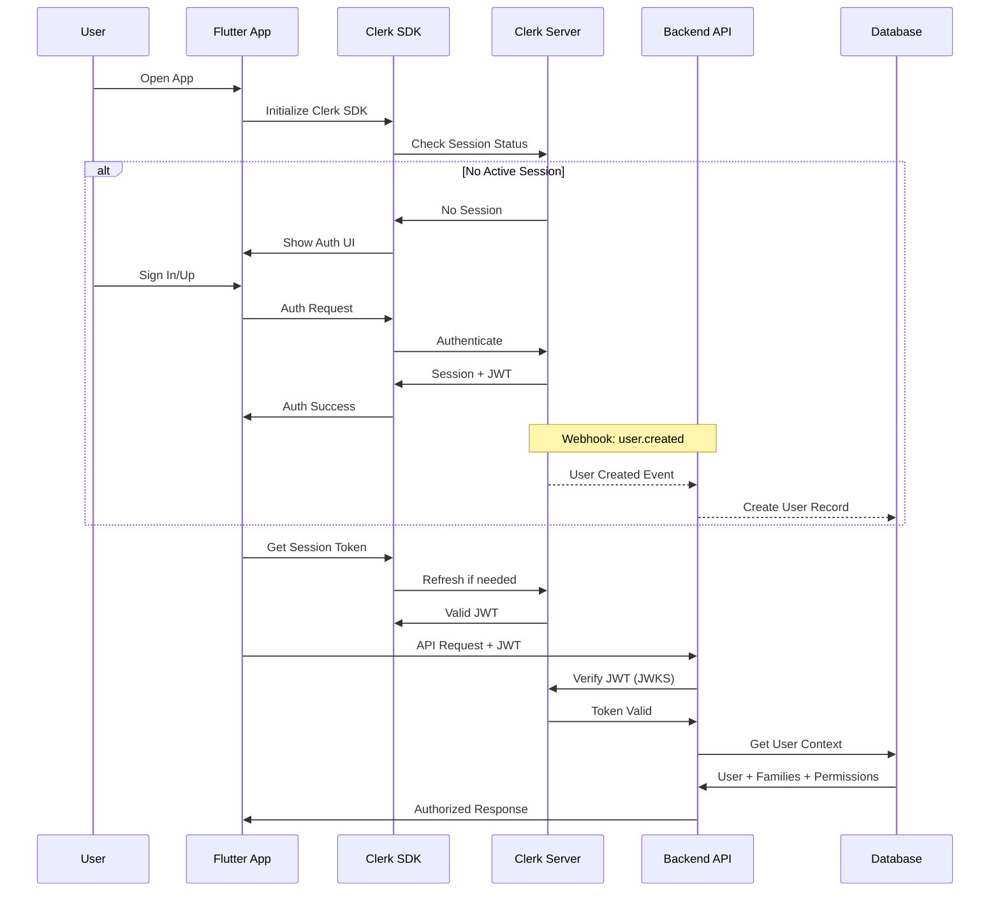
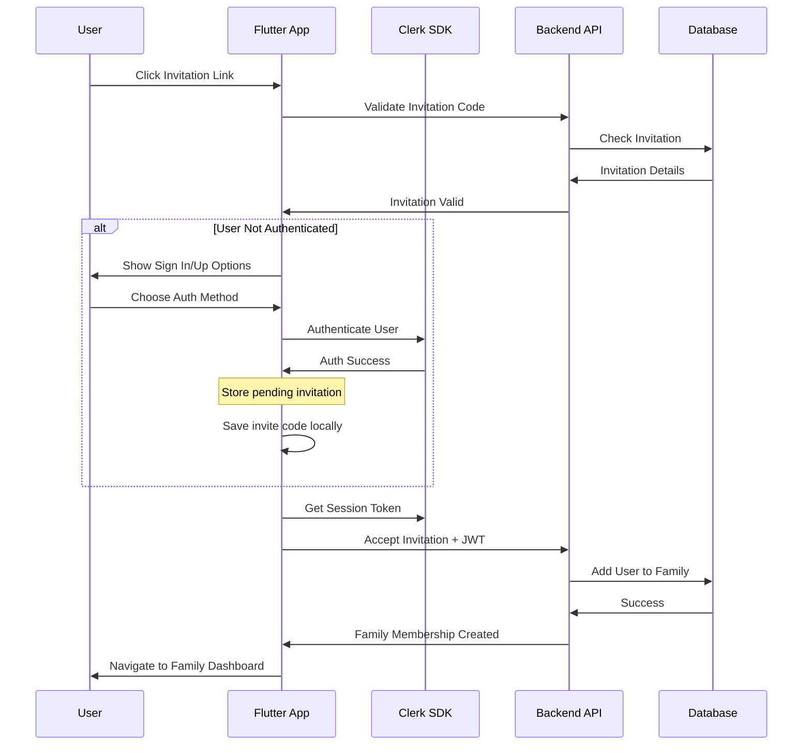

# FamilyTales Authentication System Specification

## Overview

The FamilyTales authentication system is built on Clerk, providing secure, seamless authentication across web and mobile platforms. The system supports family-based access control, invitation flows, multi-family membership, and role-based permissions while maintaining a frictionless user experience for all family members.

## Table of Contents

1. [Architecture Overview](#architecture-overview)
2. [Clerk Integration](#clerk-integration)
3. [JWT Token Management](#jwt-token-management)
4. [Family Invitation Flow](#family-invitation-flow)
5. [Multi-Family Support](#multi-family-support)
6. [Role-Based Permissions](#role-based-permissions)
7. [Session Management](#session-management)
8. [Security Considerations](#security-considerations)
9. [Implementation Details](#implementation-details)

## Architecture Overview

### System Components

```rust
pub struct AuthenticationSystem {
    clerk_client: ClerkClient,
    jwt_verifier: JwtVerifier,
    session_manager: SessionManager,
    family_manager: FamilyManager,
    permission_engine: PermissionEngine,
}

pub struct AuthContext {
    pub user: AuthenticatedUser,
    pub current_family: Option<Family>,
    pub all_families: Vec<FamilyMembership>,
    pub permissions: PermissionSet,
    pub session: Session,
}

pub struct AuthenticatedUser {
    pub id: Uuid,
    pub clerk_id: String,
    pub email: String,
    pub display_name: String,
    pub profile_image_url: Option<String>,
    pub created_at: DateTime<Utc>,
    pub metadata: UserMetadata,
}
```

### Authentication Flow with Clerk Integration



### Family Invitation Authentication Flow



## Clerk Integration

### Clerk Configuration

```typescript
// Frontend Clerk Setup (Flutter/Web)
class ClerkConfig {
  static const String publishableKey = ENV.CLERK_PUBLISHABLE_KEY;
  
  static const ClerkSettings settings = ClerkSettings(
    // Appearance customization
    appearance: ClerkAppearance(
      theme: ClerkTheme(
        primaryColor: '#4A90E2',
        fontFamily: 'Inter',
      ),
      elements: {
        formButtonPrimary: 'bg-primary hover:bg-primary-dark',
        card: 'shadow-lg rounded-xl',
      },
    ),
    
    // Sign-in/up options
    signInOptions: SignInOptions(
      allowedIdentifiers: ['email_address', 'phone_number'],
      socialProviders: ['google', 'apple', 'facebook'],
    ),
    
    // Redirect URLs
    afterSignInUrl: '/dashboard',
    afterSignUpUrl: '/onboarding',
    afterSignOutUrl: '/',
  );
}
```

### Backend Clerk Integration

```rust
pub struct ClerkClient {
    api_key: String,
    webhook_secret: String,
    http_client: reqwest::Client,
}

impl ClerkClient {
    pub async fn verify_session_token(&self, token: &str) -> Result<ClerkSession> {
        // Verify JWT signature
        let claims = self.verify_jwt(token)?;
        
        // Get session from Clerk API
        let session = self.get_session(&claims.sid).await?;
        
        // Verify session is active
        if session.status != "active" {
            return Err(AuthError::SessionInactive);
        }
        
        Ok(session)
    }
    
    pub async fn get_user(&self, user_id: &str) -> Result<ClerkUser> {
        let url = format!("https://api.clerk.dev/v1/users/{}", user_id);
        
        let response = self.http_client
            .get(&url)
            .bearer_auth(&self.api_key)
            .send()
            .await?;
        
        if response.status().is_success() {
            Ok(response.json::<ClerkUser>().await?)
        } else {
            Err(AuthError::UserNotFound)
        }
    }
    
    pub async fn create_invitation(
        &self,
        email: &str,
        redirect_url: &str,
        metadata: Option<serde_json::Value>,
    ) -> Result<ClerkInvitation> {
        let request = CreateInvitationRequest {
            email_address: email.to_string(),
            redirect_url: Some(redirect_url.to_string()),
            public_metadata: metadata,
            notify: true,
        };
        
        let response = self.http_client
            .post("https://api.clerk.dev/v1/invitations")
            .bearer_auth(&self.api_key)
            .json(&request)
            .send()
            .await?;
        
        Ok(response.json::<ClerkInvitation>().await?)
    }
}
```

### Webhook Integration for User Events

```rust
pub struct ClerkWebhookHandler {
    webhook_secret: String,
    user_service: UserService,
    family_service: FamilyService,
}

impl ClerkWebhookHandler {
    pub async fn handle_webhook(
        &self,
        headers: HeaderMap,
        body: Bytes,
    ) -> Result<()> {
        // Verify webhook signature using Svix
        self.verify_signature(&headers, &body)?;
        
        // Parse event
        let event: ClerkWebhookEvent = serde_json::from_slice(&body)?;
        
        match event.event_type.as_str() {
            "user.created" => {
                self.handle_user_created(event.data).await?;
            }
            "user.updated" => {
                self.handle_user_updated(event.data).await?;
            }
            "user.deleted" => {
                self.handle_user_deleted(event.data).await?;
            }
            "session.created" => {
                self.handle_session_created(event.data).await?;
            }
            "session.ended" => {
                self.handle_session_ended(event.data).await?;
            }
            _ => {
                // Log unknown event type
                tracing::warn!("Unknown webhook event type: {}", event.event_type);
            }
        }
        
        Ok(())
    }
    
    fn verify_signature(&self, headers: &HeaderMap, body: &Bytes) -> Result<()> {
        // Get Svix headers
        let svix_id = headers
            .get("svix-id")
            .and_then(|v| v.to_str().ok())
            .ok_or(AuthError::MissingWebhookHeader)?;
            
        let svix_timestamp = headers
            .get("svix-timestamp")
            .and_then(|v| v.to_str().ok())
            .ok_or(AuthError::MissingWebhookHeader)?;
            
        let svix_signature = headers
            .get("svix-signature")
            .and_then(|v| v.to_str().ok())
            .ok_or(AuthError::MissingWebhookHeader)?;
        
        // Verify using Svix
        let wh = Webhook::new(&self.webhook_secret)?;
        wh.verify(&body, &[
            ("svix-id", svix_id),
            ("svix-timestamp", svix_timestamp),
            ("svix-signature", svix_signature),
        ])?;
        
        Ok(())
    }
    
    async fn handle_user_created(&self, data: serde_json::Value) -> Result<()> {
        let clerk_user: ClerkUser = serde_json::from_value(data)?;
        
        // Create user in our database
        let user = User {
            id: Uuid::new_v4(),
            clerk_id: clerk_user.id,
            email: clerk_user.email_addresses[0].email_address.clone(),
            display_name: format!(
                "{} {}",
                clerk_user.first_name.unwrap_or_default(),
                clerk_user.last_name.unwrap_or_default()
            ).trim().to_string(),
            profile_image_url: clerk_user.profile_image_url,
            created_at: Utc::now(),
            metadata: UserMetadata {
                onboarding_completed: false,
                preferred_language: "en".to_string(),
                timezone: "UTC".to_string(),
            },
        };
        
        self.user_service.create_user(user).await?;
        
        // Check if user was invited to a family
        if let Some(invitation_metadata) = clerk_user.public_metadata {
            if let Some(family_id) = invitation_metadata.get("family_id") {
                let family_id = Uuid::parse_str(family_id.as_str().unwrap())?;
                self.family_service.add_member_from_invitation(
                    family_id,
                    user.id,
                ).await?;
            }
        }
        
        Ok(())
    }
    
    async fn handle_user_updated(&self, data: serde_json::Value) -> Result<()> {
        let clerk_user: ClerkUser = serde_json::from_value(data)?;
        
        // Update user in our database
        self.user_service.update_user_from_clerk(
            &clerk_user.id,
            UpdateUserData {
                email: Some(clerk_user.email_addresses[0].email_address.clone()),
                display_name: Some(format!(
                    "{} {}",
                    clerk_user.first_name.unwrap_or_default(),
                    clerk_user.last_name.unwrap_or_default()
                ).trim().to_string()),
                profile_image_url: clerk_user.profile_image_url,
            },
        ).await?;
        
        Ok(())
    }
    
    async fn handle_session_created(&self, data: serde_json::Value) -> Result<()> {
        let session_data: ClerkSession = serde_json::from_value(data)?;
        
        // Log session creation for security monitoring
        self.audit_logger.log_auth_event(
            AuthEvent::SessionCreated {
                user_id: self.user_service.get_by_clerk_id(&session_data.user_id).await?.id,
                session_id: session_data.id,
                client_info: session_data.client,
                created_at: Utc::now(),
            }
        ).await?;
        
        Ok(())
    }
    
    async fn handle_session_ended(&self, data: serde_json::Value) -> Result<()> {
        let session_data: ClerkSession = serde_json::from_value(data)?;
        
        // Log session end
        self.audit_logger.log_auth_event(
            AuthEvent::SessionEnded {
                session_id: session_data.id,
                ended_at: Utc::now(),
            }
        ).await?;
        
        Ok(())
    }
}

// Webhook route configuration
pub fn configure_webhooks(cfg: &mut web::ServiceConfig) {
    cfg.service(
        web::resource("/webhooks/clerk")
            .route(web::post().to(handle_clerk_webhook))
    );
}

async fn handle_clerk_webhook(
    headers: web::HttpRequest,
    body: web::Bytes,
    webhook_handler: web::Data<ClerkWebhookHandler>,
) -> Result<impl Responder, Error> {
    webhook_handler.handle_webhook(
        headers.headers().clone(),
        body,
    ).await?;
    
    Ok(HttpResponse::Ok().finish())
}
```

## JWT Token Management

### Token Structure

```rust
#[derive(Debug, Serialize, Deserialize)]
pub struct FamilyTalesJwtClaims {
    // Standard claims
    pub sub: String,        // User ID
    pub exp: i64,          // Expiration time
    pub iat: i64,          // Issued at
    pub nbf: i64,          // Not before
    pub iss: String,       // Issuer (FamilyTales)
    
    // Custom claims
    pub clerk_user_id: String,
    pub email: String,
    pub families: Vec<FamilyClaimInfo>,
    pub current_family_id: Option<Uuid>,
    pub permissions: Vec<String>,
    pub session_id: String,
}

#[derive(Debug, Serialize, Deserialize)]
pub struct FamilyClaimInfo {
    pub family_id: Uuid,
    pub role: FamilyRole,
    pub joined_at: DateTime<Utc>,
}
```

### Token Verification

```rust
pub struct JwtVerifier {
    clerk_client: ClerkClient,
    public_keys: Arc<RwLock<HashMap<String, JsonWebKey>>>,
    issuer: String,
}

impl JwtVerifier {
    pub async fn verify_token(&self, token: &str) -> Result<AuthContext> {
        // First, verify with Clerk
        let clerk_claims = self.verify_clerk_token(token).await?;
        
        // Then create our extended token
        let user = self.get_or_create_user(&clerk_claims).await?;
        let families = self.get_user_families(&user.id).await?;
        let current_family = self.determine_current_family(&user, &families).await?;
        let permissions = self.calculate_permissions(&user, &current_family).await?;
        
        Ok(AuthContext {
            user,
            current_family: current_family.clone(),
            all_families: families,
            permissions,
            session: Session {
                id: clerk_claims.sid,
                expires_at: DateTime::from_timestamp(clerk_claims.exp, 0).unwrap(),
            },
        })
    }
    
    async fn verify_clerk_token(&self, token: &str) -> Result<ClerkClaims> {
        // Get JWKS from Clerk
        let keys = self.get_public_keys().await?;
        
        // Parse token header to get kid
        let header = jsonwebtoken::decode_header(token)?;
        let kid = header.kid.ok_or(AuthError::MissingKeyId)?;
        
        // Get the right key
        let key = keys.get(&kid).ok_or(AuthError::InvalidKeyId)?;
        
        // Verify token
        let validation = Validation {
            iss: Some(self.issuer.clone()),
            validate_exp: true,
            validate_nbf: true,
            ..Default::default()
        };
        
        let token_data = decode::<ClerkClaims>(
            token,
            &DecodingKey::from_jwk(key)?,
            &validation,
        )?;
        
        Ok(token_data.claims)
    }
    
    async fn get_public_keys(&self) -> Result<HashMap<String, JsonWebKey>> {
        // Check cache first
        if let Ok(keys) = self.public_keys.read() {
            if !keys.is_empty() {
                return Ok(keys.clone());
            }
        }
        
        // Fetch from Clerk
        let jwks_url = "https://api.clerk.dev/v1/jwks";
        let response = reqwest::get(jwks_url).await?;
        let jwks: JsonWebKeySet = response.json().await?;
        
        // Update cache
        let mut keys_map = HashMap::new();
        for key in jwks.keys {
            if let Some(kid) = &key.kid {
                keys_map.insert(kid.clone(), key);
            }
        }
        
        *self.public_keys.write().await = keys_map.clone();
        
        Ok(keys_map)
    }
}
```

### Token Refresh

```rust
pub struct TokenRefreshService {
    clerk_client: ClerkClient,
    token_cache: TokenCache,
}

impl TokenRefreshService {
    pub async fn refresh_token_if_needed(
        &self,
        current_token: &str,
    ) -> Result<Option<String>> {
        let claims = decode_without_verification::<ClerkClaims>(current_token)?;
        
        // Check if token expires in next 5 minutes
        let now = Utc::now().timestamp();
        let expires_in = claims.exp - now;
        
        if expires_in > 300 {
            // Token still valid for more than 5 minutes
            return Ok(None);
        }
        
        // Refresh the token
        let new_token = self.clerk_client
            .refresh_session(&claims.sid)
            .await?;
        
        // Cache the new token
        self.token_cache.store(&claims.sub, &new_token).await?;
        
        Ok(Some(new_token))
    }
}
```

## Family Invitation Flow

### Invitation Creation

```rust
pub struct FamilyInvitationService {
    db: Database,
    clerk_client: ClerkClient,
    email_service: EmailService,
    url_shortener: UrlShortener,
}

impl FamilyInvitationService {
    pub async fn create_invitation(
        &self,
        family_id: Uuid,
        invited_by: Uuid,
        options: InvitationOptions,
    ) -> Result<FamilyInvitation> {
        // Generate secure invite code
        let invite_code = self.generate_invite_code();
        
        // Create invitation record
        let invitation = FamilyInvitation {
            id: Uuid::new_v4(),
            family_id,
            invite_code: invite_code.clone(),
            invited_by,
            email: options.email.clone(),
            role: options.role.unwrap_or(FamilyRole::Member),
            expires_at: Utc::now() + options.valid_for.unwrap_or(Duration::days(7)),
            max_uses: options.max_uses,
            used_count: 0,
            created_at: Utc::now(),
            custom_message: options.custom_message,
        };
        
        self.db.create_invitation(&invitation).await?;
        
        // Generate invitation URL
        let invite_url = self.generate_invite_url(&invite_code).await?;
        
        // Send invitation based on method
        match options.method {
            InvitationMethod::Email => {
                self.send_email_invitation(&invitation, &invite_url).await?;
            }
            InvitationMethod::Link => {
                // Just return the link
            }
            InvitationMethod::QrCode => {
                // Generate QR code
                invitation.qr_code = Some(self.generate_qr_code(&invite_url)?);
            }
        }
        
        Ok(invitation)
    }
    
    fn generate_invite_code(&self) -> String {
        // Generate 6-character alphanumeric code
        use rand::Rng;
        const CHARSET: &[u8] = b"ABCDEFGHIJKLMNOPQRSTUVWXYZ0123456789";
        let mut rng = rand::thread_rng();
        
        (0..6)
            .map(|_| {
                let idx = rng.gen_range(0..CHARSET.len());
                CHARSET[idx] as char
            })
            .collect::<String>()
    }
    
    async fn generate_invite_url(&self, code: &str) -> Result<String> {
        let base_url = std::env::var("APP_URL")?;
        let full_url = format!("{}/join/{}", base_url, code);
        
        // Shorten URL for easier sharing
        let short_url = self.url_shortener.shorten(&full_url).await?;
        
        Ok(short_url)
    }
    
    async fn send_email_invitation(
        &self,
        invitation: &FamilyInvitation,
        invite_url: &str,
    ) -> Result<()> {
        let family = self.db.get_family(invitation.family_id).await?;
        let inviter = self.db.get_user(invitation.invited_by).await?;
        
        let email_data = EmailInvitationData {
            recipient_email: invitation.email.as_ref().unwrap().clone(),
            family_name: family.name,
            inviter_name: inviter.display_name,
            invite_url: invite_url.to_string(),
            custom_message: invitation.custom_message.clone(),
            expires_at: invitation.expires_at,
        };
        
        self.email_service.send_invitation(email_data).await?;
        
        Ok(())
    }
}
```

### Invitation Acceptance Flow

```dart
class InvitationAcceptanceFlow extends StatefulWidget {
  final String inviteCode;
  
  @override
  _InvitationAcceptanceFlowState createState() => _InvitationAcceptanceFlowState();
}

class _InvitationAcceptanceFlowState extends State<InvitationAcceptanceFlow> {
  InvitationStatus _status = InvitationStatus.loading;
  FamilyInvitation? _invitation;
  Family? _family;
  
  @override
  void initState() {
    super.initState();
    _validateInvitation();
  }
  
  Future<void> _validateInvitation() async {
    try {
      // Validate invitation code
      final invitation = await authService.validateInvitation(widget.inviteCode);
      final family = await familyService.getFamily(invitation.familyId);
      
      setState(() {
        _invitation = invitation;
        _family = family;
        _status = InvitationStatus.valid;
      });
      
      // Check if user is already authenticated
      if (await clerk.isSignedIn()) {
        // User is signed in, join family immediately
        _joinFamily();
      } else {
        // Show sign-up/sign-in options
        _status = InvitationStatus.needsAuth;
      }
    } catch (e) {
      setState(() {
        _status = InvitationStatus.invalid;
      });
    }
  }
  
  Future<void> _joinFamily() async {
    try {
      setState(() => _status = InvitationStatus.joining);
      
      // Accept invitation
      await authService.acceptInvitation(
        inviteCode: widget.inviteCode,
        userId: clerk.user!.id,
      );
      
      // Navigate to family dashboard
      context.go('/families/${_family!.id}/welcome');
    } catch (e) {
      setState(() => _status = InvitationStatus.error);
      _showError(e.toString());
    }
  }
  
  @override
  Widget build(BuildContext context) {
    switch (_status) {
      case InvitationStatus.loading:
        return LoadingScreen(message: 'Validating invitation...');
        
      case InvitationStatus.valid:
      case InvitationStatus.needsAuth:
        return InvitationDetailsScreen(
          invitation: _invitation!,
          family: _family!,
          onAccept: _status == InvitationStatus.needsAuth
              ? () => _showAuthOptions()
              : _joinFamily,
        );
        
      case InvitationStatus.invalid:
        return ErrorScreen(
          title: 'Invalid Invitation',
          message: 'This invitation link is invalid or has expired.',
          action: ElevatedButton(
            onPressed: () => context.go('/'),
            child: Text('Go Home'),
          ),
        );
        
      case InvitationStatus.joining:
        return LoadingScreen(message: 'Joining family...');
        
      case InvitationStatus.error:
        return ErrorScreen(
          title: 'Something went wrong',
          message: 'Unable to join family. Please try again.',
          onRetry: _validateInvitation,
        );
    }
  }
  
  void _showAuthOptions() {
    showModalBottomSheet(
      context: context,
      builder: (context) => AuthOptionsSheet(
        title: 'Join ${_family!.name}',
        subtitle: 'Sign in or create an account to continue',
        onSuccess: () {
          Navigator.pop(context);
          _joinFamily();
        },
        metadata: {
          'family_id': _family!.id.toString(),
          'invite_code': widget.inviteCode,
        },
      ),
    );
  }
}
```

### Deep Link Handling

```dart
class DeepLinkHandler {
  static void configureDeepLinks() {
    // Configure for mobile platforms
    if (Platform.isIOS || Platform.isAndroid) {
      uni_links.getInitialLink().then((initialLink) {
        if (initialLink != null) {
          _handleDeepLink(initialLink);
        }
      });
      
      uni_links.linkStream.listen((link) {
        if (link != null) {
          _handleDeepLink(link);
        }
      });
    }
  }
  
  static void _handleDeepLink(String link) {
    final uri = Uri.parse(link);
    
    if (uri.pathSegments.isNotEmpty && uri.pathSegments[0] == 'join') {
      final inviteCode = uri.pathSegments[1];
      
      // Navigate to invitation acceptance flow
      navigatorKey.currentContext?.go('/join/$inviteCode');
    }
  }
}
```

## Multi-Family Support

### Family Context Management

```rust
pub struct FamilyContextManager {
    db: Database,
    cache: FamilyCache,
}

impl FamilyContextManager {
    pub async fn get_user_families(&self, user_id: Uuid) -> Result<Vec<FamilyMembership>> {
        // Check cache first
        if let Some(cached) = self.cache.get_user_families(user_id).await? {
            return Ok(cached);
        }
        
        // Query database
        let memberships = self.db
            .query(
                r#"
                SELECT 
                    fm.*,
                    f.name as family_name,
                    f.subscription_tier,
                    f.subscription_status
                FROM family_members fm
                JOIN families f ON fm.family_id = f.id
                WHERE fm.user_id = $1
                ORDER BY fm.joined_at DESC
                "#,
            )
            .bind(user_id)
            .fetch_all()
            .await?;
        
        // Transform to domain model
        let family_memberships: Vec<FamilyMembership> = memberships
            .into_iter()
            .map(|row| FamilyMembership {
                family: Family {
                    id: row.get("family_id"),
                    name: row.get("family_name"),
                    subscription_tier: row.get("subscription_tier"),
                    subscription_status: row.get("subscription_status"),
                },
                role: row.get("role"),
                joined_at: row.get("joined_at"),
                invited_by: row.get("invited_by"),
            })
            .collect();
        
        // Cache for future requests
        self.cache.set_user_families(user_id, &family_memberships).await?;
        
        Ok(family_memberships)
    }
    
    pub async fn switch_family_context(
        &self,
        user_id: Uuid,
        new_family_id: Uuid,
    ) -> Result<FamilyContext> {
        // Verify user is member of target family
        let memberships = self.get_user_families(user_id).await?;
        
        let membership = memberships
            .iter()
            .find(|m| m.family.id == new_family_id)
            .ok_or(AuthError::NotFamilyMember)?;
        
        // Update user's current family
        self.db
            .execute(
                "UPDATE users SET current_family_id = $1 WHERE id = $2",
            )
            .bind(new_family_id)
            .bind(user_id)
            .await?;
        
        // Clear relevant caches
        self.cache.invalidate_user_context(user_id).await?;
        
        // Return new context
        Ok(FamilyContext {
            family: membership.family.clone(),
            role: membership.role.clone(),
            permissions: self.calculate_permissions(&membership.role),
        })
    }
}
```

### Family Selector UI

```dart
class FamilySelectorWidget extends ConsumerWidget {
  @override
  Widget build(BuildContext context, WidgetRef ref) {
    final authState = ref.watch(authStateProvider);
    final currentFamily = authState.currentFamily;
    final allFamilies = authState.allFamilies;
    
    if (allFamilies.length <= 1) {
      // User only belongs to one family, no need for selector
      return SizedBox.shrink();
    }
    
    return DropdownButton<Family>(
      value: currentFamily,
      underline: Container(),
      icon: Icon(Icons.arrow_drop_down),
      items: allFamilies.map((membership) {
        final family = membership.family;
        return DropdownMenuItem<Family>(
          value: family,
          child: Row(
            children: [
              // Premium indicator
              if (family.isPremium)
                Padding(
                  padding: EdgeInsets.only(right: 4),
                  child: Icon(
                    Icons.star,
                    size: 16,
                    color: Colors.amber,
                  ),
                ),
              
              // Family name
              Text(
                family.name,
                style: TextStyle(
                  fontWeight: currentFamily?.id == family.id
                      ? FontWeight.bold
                      : FontWeight.normal,
                ),
              ),
              
              // Role badge
              if (membership.role == FamilyRole.headOfFamily)
                Container(
                  margin: EdgeInsets.only(left: 8),
                  padding: EdgeInsets.symmetric(horizontal: 6, vertical: 2),
                  decoration: BoxDecoration(
                    color: Theme.of(context).primaryColor.withOpacity(0.1),
                    borderRadius: BorderRadius.circular(4),
                  ),
                  child: Text(
                    'Owner',
                    style: TextStyle(
                      fontSize: 10,
                      color: Theme.of(context).primaryColor,
                    ),
                  ),
                ),
            ],
          ),
        );
      }).toList(),
      onChanged: (family) async {
        if (family != null && family.id != currentFamily?.id) {
          await ref.read(authStateProvider.notifier).switchFamily(family.id);
          
          // Show confirmation
          ScaffoldMessenger.of(context).showSnackBar(
            SnackBar(
              content: Text('Switched to ${family.name}'),
              duration: Duration(seconds: 2),
            ),
          );
        }
      },
    );
  }
}
```

## Role-Based Permissions

### Permission Model

```rust
#[derive(Debug, Clone, Serialize, Deserialize)]
pub enum Permission {
    // Content permissions
    ViewContent,
    UploadContent,
    EditContent,
    DeleteContent,
    ShareContent,
    
    // Family management
    InviteMembers,
    RemoveMembers,
    ManageRoles,
    ViewAnalytics,
    
    // Subscription management
    ManageSubscription,
    ViewBilling,
    
    // Admin permissions
    TransferOwnership,
    DeleteFamily,
    
    // Memory Book permissions
    CreateMemoryBook,
    EditMemoryBook,
    DeleteMemoryBook,
    ManageThreads,
}

#[derive(Debug, Clone)]
pub struct PermissionSet {
    permissions: HashSet<Permission>,
}

impl PermissionSet {
    pub fn for_role(role: &FamilyRole) -> Self {
        let permissions = match role {
            FamilyRole::HeadOfFamily => {
                // Head of family has all permissions
                Permission::all()
            }
            FamilyRole::Admin => {
                vec![
                    Permission::ViewContent,
                    Permission::UploadContent,
                    Permission::EditContent,
                    Permission::DeleteContent,
                    Permission::ShareContent,
                    Permission::InviteMembers,
                    Permission::ManageRoles,
                    Permission::ViewAnalytics,
                    Permission::CreateMemoryBook,
                    Permission::EditMemoryBook,
                    Permission::DeleteMemoryBook,
                    Permission::ManageThreads,
                ]
            }
            FamilyRole::Member => {
                vec![
                    Permission::ViewContent,
                    Permission::UploadContent,
                    Permission::ShareContent,
                    Permission::CreateMemoryBook,
                ]
            }
        };
        
        Self {
            permissions: permissions.into_iter().collect(),
        }
    }
    
    pub fn has(&self, permission: &Permission) -> bool {
        self.permissions.contains(permission)
    }
    
    pub fn has_any(&self, permissions: &[Permission]) -> bool {
        permissions.iter().any(|p| self.has(p))
    }
    
    pub fn has_all(&self, permissions: &[Permission]) -> bool {
        permissions.iter().all(|p| self.has(p))
    }
}
```

### Authorization Middleware

```rust
pub struct AuthorizationMiddleware;

impl AuthorizationMiddleware {
    pub async fn require_permission(
        permission: Permission,
    ) -> impl Filter<Extract = (), Error = Rejection> + Clone {
        warp::any()
            .and(auth_context())
            .and_then(move |ctx: AuthContext| async move {
                if ctx.permissions.has(&permission) {
                    Ok(())
                } else {
                    Err(warp::reject::custom(AuthError::InsufficientPermissions))
                }
            })
            .untuple_one()
    }
    
    pub async fn require_family_member(
    ) -> impl Filter<Extract = (), Error = Rejection> + Clone {
        warp::any()
            .and(auth_context())
            .and_then(|ctx: AuthContext| async move {
                if ctx.current_family.is_some() {
                    Ok(())
                } else {
                    Err(warp::reject::custom(AuthError::NoFamilyContext))
                }
            })
            .untuple_one()
    }
    
    pub async fn require_family_role(
        min_role: FamilyRole,
    ) -> impl Filter<Extract = (), Error = Rejection> + Clone {
        warp::any()
            .and(auth_context())
            .and_then(move |ctx: AuthContext| async move {
                if let Some(family) = &ctx.current_family {
                    let membership = ctx.all_families
                        .iter()
                        .find(|m| m.family.id == family.id)
                        .ok_or(AuthError::NotFamilyMember)?;
                    
                    if membership.role >= min_role {
                        Ok(())
                    } else {
                        Err(warp::reject::custom(AuthError::InsufficientRole))
                    }
                } else {
                    Err(warp::reject::custom(AuthError::NoFamilyContext))
                }
            })
            .untuple_one()
    }
}

// Usage in routes
pub fn family_routes() -> impl Filter<Extract = impl Reply, Error = Rejection> + Clone {
    let invite_member = warp::path!("families" / Uuid / "invite")
        .and(warp::post())
        .and(AuthorizationMiddleware::require_permission(Permission::InviteMembers).await)
        .and(with_auth_context())
        .and(warp::body::json())
        .and_then(handlers::invite_family_member);
    
    let remove_member = warp::path!("families" / Uuid / "members" / Uuid)
        .and(warp::delete())
        .and(AuthorizationMiddleware::require_permission(Permission::RemoveMembers).await)
        .and(with_auth_context())
        .and_then(handlers::remove_family_member);
    
    invite_member.or(remove_member)
}
```

### Permission Checking in UI

```dart
class PermissionAwareWidget extends ConsumerWidget {
  final Permission requiredPermission;
  final Widget child;
  final Widget? fallback;
  
  const PermissionAwareWidget({
    required this.requiredPermission,
    required this.child,
    this.fallback,
  });
  
  @override
  Widget build(BuildContext context, WidgetRef ref) {
    final permissions = ref.watch(authStateProvider).permissions;
    
    if (permissions.has(requiredPermission)) {
      return child;
    }
    
    return fallback ?? SizedBox.shrink();
  }
}

// Usage example
class FamilyMembersList extends ConsumerWidget {
  @override
  Widget build(BuildContext context, WidgetRef ref) {
    return Column(
      children: [
        // Only show invite button if user has permission
        PermissionAwareWidget(
          requiredPermission: Permission.inviteMembers,
          child: ElevatedButton.icon(
            icon: Icon(Icons.person_add),
            label: Text('Invite Member'),
            onPressed: () => _showInviteDialog(context),
          ),
        ),
        
        // Member list
        Expanded(
          child: ListView.builder(
            itemCount: members.length,
            itemBuilder: (context, index) {
              final member = members[index];
              return ListTile(
                leading: CircleAvatar(
                  backgroundImage: member.profileImageUrl != null
                      ? NetworkImage(member.profileImageUrl!)
                      : null,
                  child: member.profileImageUrl == null
                      ? Text(member.initials)
                      : null,
                ),
                title: Text(member.displayName),
                subtitle: Text(member.role.displayName),
                trailing: PermissionAwareWidget(
                  requiredPermission: Permission.removeMembers,
                  child: PopupMenuButton<MemberAction>(
                    onSelected: (action) => _handleMemberAction(action, member),
                    itemBuilder: (context) => [
                      PopupMenuItem(
                        value: MemberAction.changeRole,
                        child: ListTile(
                          leading: Icon(Icons.swap_vert),
                          title: Text('Change Role'),
                        ),
                      ),
                      PopupMenuItem(
                        value: MemberAction.remove,
                        child: ListTile(
                          leading: Icon(Icons.remove_circle, color: Colors.red),
                          title: Text('Remove Member'),
                          textColor: Colors.red,
                        ),
                      ),
                    ],
                  ),
                ),
              );
            },
          ),
        ),
      ],
    );
  }
}
```

## Session Management

### Session Storage

```rust
pub struct SessionManager {
    redis: RedisConnection,
    db: Database,
    config: SessionConfig,
}

#[derive(Debug, Clone)]
pub struct SessionConfig {
    pub ttl: Duration,
    pub refresh_threshold: Duration,
    pub max_concurrent_sessions: usize,
    pub enable_session_fixation_protection: bool,
}

impl SessionManager {
    pub async fn create_session(
        &self,
        user_id: Uuid,
        device_info: DeviceInfo,
        ip_address: IpAddr,
    ) -> Result<Session> {
        // Check concurrent session limit
        let active_sessions = self.get_active_sessions(user_id).await?;
        
        if active_sessions.len() >= self.config.max_concurrent_sessions {
            // Revoke oldest session
            if let Some(oldest) = active_sessions.iter().min_by_key(|s| s.created_at) {
                self.revoke_session(&oldest.id).await?;
            }
        }
        
        let session = Session {
            id: Uuid::new_v4().to_string(),
            user_id,
            device_info,
            ip_address,
            created_at: Utc::now(),
            last_accessed: Utc::now(),
            expires_at: Utc::now() + self.config.ttl,
            is_active: true,
        };
        
        // Store in Redis with TTL
        let key = format!("session:{}", session.id);
        self.redis
            .setex(
                &key,
                self.config.ttl.num_seconds() as u64,
                &serde_json::to_string(&session)?,
            )
            .await?;
        
        // Store in database for audit trail
        self.db.create_session(&session).await?;
        
        Ok(session)
    }
    
    pub async fn validate_session(&self, session_id: &str) -> Result<Session> {
        let key = format!("session:{}", session_id);
        
        // Check Redis first
        if let Some(session_data) = self.redis.get(&key).await? {
            let mut session: Session = serde_json::from_str(&session_data)?;
            
            // Check if expired
            if session.expires_at < Utc::now() {
                self.revoke_session(session_id).await?;
                return Err(AuthError::SessionExpired);
            }
            
            // Update last accessed time
            session.last_accessed = Utc::now();
            
            // Check if needs refresh
            let time_until_expiry = session.expires_at - Utc::now();
            if time_until_expiry < self.config.refresh_threshold {
                session.expires_at = Utc::now() + self.config.ttl;
            }
            
            // Update in Redis
            self.redis
                .setex(
                    &key,
                    self.config.ttl.num_seconds() as u64,
                    &serde_json::to_string(&session)?,
                )
                .await?;
            
            Ok(session)
        } else {
            // Check database as fallback
            let session = self.db.get_session(session_id).await?;
            
            if !session.is_active || session.expires_at < Utc::now() {
                return Err(AuthError::SessionInvalid);
            }
            
            // Restore to Redis
            self.redis
                .setex(
                    &key,
                    self.config.ttl.num_seconds() as u64,
                    &serde_json::to_string(&session)?,
                )
                .await?;
            
            Ok(session)
        }
    }
    
    pub async fn revoke_session(&self, session_id: &str) -> Result<()> {
        // Remove from Redis
        let key = format!("session:{}", session_id);
        self.redis.del(&key).await?;
        
        // Mark as inactive in database
        self.db
            .execute(
                "UPDATE sessions SET is_active = false, revoked_at = $1 WHERE id = $2",
            )
            .bind(Utc::now())
            .bind(session_id)
            .await?;
        
        Ok(())
    }
    
    pub async fn revoke_all_sessions(&self, user_id: Uuid) -> Result<()> {
        // Get all active sessions
        let sessions = self.get_active_sessions(user_id).await?;
        
        // Revoke each one
        for session in sessions {
            self.revoke_session(&session.id).await?;
        }
        
        Ok(())
    }
}
```

### Session Monitoring

```rust
pub struct SessionMonitor {
    session_manager: SessionManager,
    anomaly_detector: AnomalyDetector,
}

impl SessionMonitor {
    pub async fn monitor_session_activity(
        &self,
        session_id: &str,
        activity: SessionActivity,
    ) -> Result<()> {
        // Check for anomalies
        if let Some(anomaly) = self.anomaly_detector.check(&activity).await? {
            match anomaly.severity {
                AnomalySeverity::High => {
                    // Immediate session termination
                    self.session_manager.revoke_session(session_id).await?;
                    
                    // Notify user
                    self.notify_security_event(
                        &activity.user_id,
                        SecurityEvent::SuspiciousActivity(anomaly),
                    ).await?;
                }
                AnomalySeverity::Medium => {
                    // Require re-authentication
                    self.mark_session_for_reauth(session_id).await?;
                }
                AnomalySeverity::Low => {
                    // Just log for monitoring
                    tracing::warn!(
                        "Low severity anomaly detected for session {}: {:?}",
                        session_id,
                        anomaly
                    );
                }
            }
        }
        
        // Log activity
        self.log_session_activity(&activity).await?;
        
        Ok(())
    }
}

pub struct AnomalyDetector {
    pub async fn check(&self, activity: &SessionActivity) -> Result<Option<Anomaly>> {
        // Check for suspicious patterns
        let checks = vec![
            self.check_location_change(activity),
            self.check_rapid_requests(activity),
            self.check_unusual_access_pattern(activity),
            self.check_device_fingerprint_change(activity),
        ];
        
        for check in checks {
            if let Some(anomaly) = check.await? {
                return Ok(Some(anomaly));
            }
        }
        
        Ok(None)
    }
    
    async fn check_location_change(&self, activity: &SessionActivity) -> Result<Option<Anomaly>> {
        // Get previous activity
        let previous = self.get_previous_activity(&activity.session_id).await?;
        
        if let Some(prev) = previous {
            // Calculate distance between IP locations
            let distance = self.calculate_ip_distance(&prev.ip_address, &activity.ip_address)?;
            let time_diff = activity.timestamp - prev.timestamp;
            
            // Check if impossible travel
            let max_possible_distance = time_diff.num_hours() as f64 * 1000.0; // 1000 km/h max
            
            if distance > max_possible_distance {
                return Ok(Some(Anomaly {
                    anomaly_type: AnomalyType::ImpossibleTravel,
                    severity: AnomalySeverity::High,
                    details: format!(
                        "User traveled {} km in {} minutes",
                        distance,
                        time_diff.num_minutes()
                    ),
                }));
            }
        }
        
        Ok(None)
    }
}
```

## Security Considerations

### Token Security

```rust
pub struct TokenSecurity {
    pub fn validate_token_security(&self, token: &str) -> Result<()> {
        // Check token length
        if token.len() < 100 || token.len() > 2000 {
            return Err(AuthError::InvalidTokenFormat);
        }
        
        // Verify it's a valid JWT structure
        let parts: Vec<&str> = token.split('.').collect();
        if parts.len() != 3 {
            return Err(AuthError::InvalidTokenFormat);
        }
        
        // Decode and validate header
        let header = base64_url_decode(parts[0])?;
        let header_json: serde_json::Value = serde_json::from_slice(&header)?;
        
        // Check algorithm
        if let Some(alg) = header_json.get("alg").and_then(|v| v.as_str()) {
            if !["RS256", "ES256"].contains(&alg) {
                return Err(AuthError::UnsupportedAlgorithm);
            }
        } else {
            return Err(AuthError::MissingAlgorithm);
        }
        
        Ok(())
    }
}
```

### Rate Limiting

```rust
pub struct AuthRateLimiter {
    redis: RedisConnection,
    config: RateLimitConfig,
}

impl AuthRateLimiter {
    pub async fn check_rate_limit(
        &self,
        identifier: &str,
        action: AuthAction,
    ) -> Result<RateLimitResult> {
        let key = format!("rate_limit:{}:{}", action.as_str(), identifier);
        let window = self.config.get_window(&action);
        let limit = self.config.get_limit(&action);
        
        // Increment counter
        let count = self.redis.incr(&key).await?;
        
        // Set expiry on first request
        if count == 1 {
            self.redis.expire(&key, window.as_secs() as i64).await?;
        }
        
        if count > limit {
            let ttl = self.redis.ttl(&key).await?;
            Ok(RateLimitResult::Exceeded {
                retry_after: Duration::seconds(ttl),
            })
        } else {
            Ok(RateLimitResult::Allowed {
                remaining: limit - count,
                reset_at: Utc::now() + Duration::seconds(
                    self.redis.ttl(&key).await? as i64
                ),
            })
        }
    }
}

#[derive(Debug)]
pub enum AuthAction {
    Login,
    Register,
    PasswordReset,
    InvitationAccept,
    TokenRefresh,
}

impl AuthAction {
    fn as_str(&self) -> &'static str {
        match self {
            Self::Login => "login",
            Self::Register => "register",
            Self::PasswordReset => "password_reset",
            Self::InvitationAccept => "invitation_accept",
            Self::TokenRefresh => "token_refresh",
        }
    }
}
```

### Audit Logging

```rust
pub struct AuthAuditLogger {
    db: Database,
    event_bus: EventBus,
}

impl AuthAuditLogger {
    pub async fn log_auth_event(&self, event: AuthEvent) -> Result<()> {
        let audit_entry = AuditLogEntry {
            id: Uuid::new_v4(),
            event_type: event.event_type(),
            user_id: event.user_id(),
            timestamp: Utc::now(),
            ip_address: event.ip_address(),
            user_agent: event.user_agent(),
            success: event.is_success(),
            metadata: serde_json::to_value(&event)?,
        };
        
        // Store in database
        self.db.create_audit_log(&audit_entry).await?;
        
        // Publish for real-time monitoring
        self.event_bus.publish(Event::AuthAudit(audit_entry)).await?;
        
        Ok(())
    }
}

#[derive(Debug, Serialize)]
pub enum AuthEvent {
    Login {
        user_id: Uuid,
        ip_address: IpAddr,
        user_agent: String,
        success: bool,
        failure_reason: Option<String>,
    },
    Logout {
        user_id: Uuid,
        session_id: String,
    },
    SessionCreated {
        user_id: Uuid,
        session_id: String,
        device_info: DeviceInfo,
    },
    SessionRevoked {
        session_id: String,
        reason: String,
    },
    PasswordChanged {
        user_id: Uuid,
        ip_address: IpAddr,
    },
    InvitationAccepted {
        user_id: Uuid,
        family_id: Uuid,
        invite_code: String,
    },
    PermissionGranted {
        user_id: Uuid,
        family_id: Uuid,
        permission: Permission,
        granted_by: Uuid,
    },
}
```

## Implementation Details

### Authentication State Provider

```dart
final authStateProvider = StateNotifierProvider<AuthStateNotifier, AuthState>((ref) {
  final clerk = ref.watch(clerkProvider);
  final apiClient = ref.watch(apiClientProvider);
  
  return AuthStateNotifier(clerk, apiClient);
});

class AuthStateNotifier extends StateNotifier<AuthState> {
  final ClerkClient _clerk;
  final ApiClient _apiClient;
  StreamSubscription? _clerkSubscription;
  
  AuthStateNotifier(this._clerk, this._apiClient) : super(AuthState.initial()) {
    _initializeAuth();
  }
  
  Future<void> _initializeAuth() async {
    // Listen to Clerk auth state changes
    _clerkSubscription = _clerk.authStateStream.listen((clerkAuth) async {
      if (clerkAuth.isSignedIn) {
        // Get extended user context from our API
        try {
          final context = await _apiClient.getAuthContext();
          state = AuthState.authenticated(
            user: context.user,
            currentFamily: context.currentFamily,
            allFamilies: context.allFamilies,
            permissions: context.permissions,
            session: context.session,
          );
        } catch (e) {
          state = AuthState.error(e.toString());
        }
      } else {
        state = AuthState.unauthenticated();
      }
    });
  }
  
  Future<void> switchFamily(String familyId) async {
    if (!state.isAuthenticated) return;
    
    try {
      final newContext = await _apiClient.switchFamily(familyId);
      state = state.copyWith(
        currentFamily: newContext.family,
        permissions: newContext.permissions,
      );
    } catch (e) {
      // Handle error
      throw e;
    }
  }
  
  Future<void> signOut() async {
    await _clerk.signOut();
    state = AuthState.unauthenticated();
  }
  
  @override
  void dispose() {
    _clerkSubscription?.cancel();
    super.dispose();
  }
}
```

### API Authentication Interceptor

```dart
class AuthInterceptor extends Interceptor {
  final ClerkClient _clerk;
  final TokenRefreshService _tokenRefresh;
  
  AuthInterceptor(this._clerk, this._tokenRefresh);
  
  @override
  Future<void> onRequest(
    RequestOptions options,
    RequestInterceptorHandler handler,
  ) async {
    // Get current token from Clerk
    final token = await _clerk.getToken();
    
    if (token != null) {
      // Check if token needs refresh
      final refreshedToken = await _tokenRefresh.refreshIfNeeded(token);
      final finalToken = refreshedToken ?? token;
      
      // Add to headers
      options.headers['Authorization'] = 'Bearer $finalToken';
      
      // Add current family context if available
      final currentFamilyId = await _getCurrentFamilyId();
      if (currentFamilyId != null) {
        options.headers['X-Family-Context'] = currentFamilyId;
      }
    }
    
    handler.next(options);
  }
  
  @override
  Future<void> onError(
    DioError err,
    ErrorInterceptorHandler handler,
  ) async {
    if (err.response?.statusCode == 401) {
      // Token might be expired, try to refresh
      try {
        final newToken = await _clerk.refreshToken();
        
        if (newToken != null) {
          // Retry the request with new token
          final options = err.requestOptions;
          options.headers['Authorization'] = 'Bearer $newToken';
          
          final response = await Dio().fetch(options);
          handler.resolve(response);
          return;
        }
      } catch (e) {
        // Refresh failed, user needs to re-authenticate
        await _clerk.signOut();
      }
    }
    
    handler.next(err);
  }
}
```

## Platform-Specific Considerations

### iOS Configuration

```xml
<!-- ios/Runner/Info.plist -->
<key>CFBundleURLTypes</key>
<array>
    <dict>
        <key>CFBundleURLSchemes</key>
        <array>
            <string>familytales</string>
        </array>
    </dict>
</array>

<!-- For Apple Sign In -->
<key>CFBundleURLTypes</key>
<array>
    <dict>
        <key>CFBundleURLSchemes</key>
        <array>
            <string>com.familytales.app</string>
        </array>
    </dict>
</array>
```

### Android Configuration

```xml
<!-- android/app/src/main/AndroidManifest.xml -->
<activity
    android:name=".MainActivity"
    android:launchMode="singleTop">
    <intent-filter>
        <action android:name="android.intent.action.VIEW" />
        <category android:name="android.intent.category.DEFAULT" />
        <category android:name="android.intent.category.BROWSABLE" />
        <data
            android:scheme="familytales"
            android:host="oauth-callback" />
        <data
            android:scheme="https"
            android:host="app.familytales.com"
            android:pathPrefix="/join" />
    </intent-filter>
</activity>
```

### Web Configuration

```dart
// web/index.html
<script>
  // Initialize Clerk before Flutter
  window.addEventListener('load', function() {
    const script = document.createElement('script');
    script.src = 'https://cdn.jsdelivr.net/npm/@clerk/clerk-js@latest/dist/clerk.browser.js';
    script.onload = function() {
      window.Clerk.load({
        publishableKey: 'YOUR_PUBLISHABLE_KEY',
        appearance: {
          variables: {
            colorPrimary: '#4A90E2',
          },
        },
      });
    };
    document.head.appendChild(script);
  });
</script>
```

## Security Best Practices

1. **Token Security**:
   - Never store JWT tokens in local storage on web
   - Use secure storage on mobile platforms
   - Implement token rotation for long-lived sessions

2. **API Security**:
   - Validate all JWT tokens on every request
   - Implement rate limiting per user/IP
   - Use HTTPS everywhere
   - Validate webhook signatures

3. **Session Management**:
   - Implement device fingerprinting
   - Monitor for suspicious activity
   - Allow users to view/revoke sessions
   - Implement session timeouts

4. **Family Access Control**:
   - Validate family membership on every request
   - Cache permissions with short TTL
   - Audit all permission changes
   - Implement invitation expiry

## Monitoring and Analytics

```rust
// Track authentication metrics
pub struct AuthMetrics {
    login_attempts: Counter,
    login_failures: Counter,
    signup_completions: Counter,
    invitation_accepts: Counter,
    session_duration: Histogram,
    active_sessions: Gauge,
}

impl AuthMetrics {
    pub fn record_login_attempt(&self, success: bool) {
        self.login_attempts.inc();
        if !success {
            self.login_failures.inc();
        }
    }
    
    pub fn record_session_duration(&self, duration: Duration) {
        self.session_duration.observe(duration.as_secs_f64());
    }
}
```

## Conclusion

The FamilyTales authentication system provides a robust, secure foundation for family-based access control. By leveraging Clerk's authentication infrastructure combined with custom family management logic, the system delivers a seamless experience across all platforms. The integration includes:

- **Seamless Authentication**: Social logins, email/password, and phone authentication
- **Family Management**: Invitation flows, multi-family support, and role-based access
- **Security**: JWT token validation, session management, and webhook verification
- **Cross-Platform**: Consistent experience across Flutter mobile apps and web
- **Monitoring**: Comprehensive audit logging and security monitoring

The multi-family support and granular permission system ensure that families can share their memories safely and privately, with each member having appropriate access based on their role.