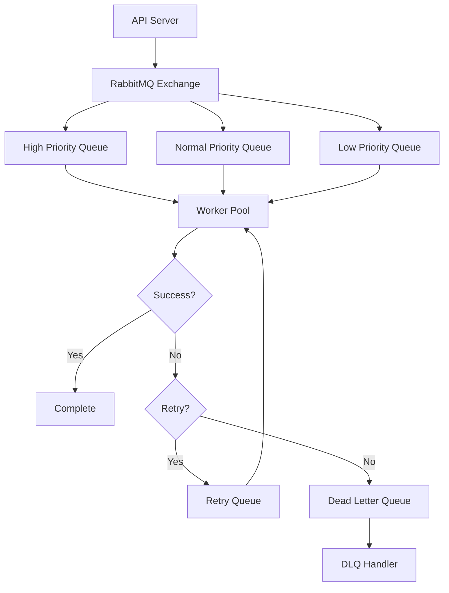

# FamilyTales Background Jobs Specification

## Overview

The FamilyTales background job system handles asynchronous processing tasks using RabbitMQ as the message broker. This architecture enables efficient processing of resource-intensive operations like OCR, audio generation, and bulk uploads while maintaining responsive user experiences. The system supports job prioritization, retry logic, dead letter queues, and distributed processing across multiple workers.

## Table of Contents

1. [Architecture Overview](#architecture-overview)
2. [RabbitMQ Setup](#rabbitmq-setup)
3. [Job Types & Processing](#job-types--processing)
4. [OCR Processing Jobs](#ocr-processing-jobs)
5. [Audio Generation Jobs](#audio-generation-jobs)
6. [Bulk Upload Handling](#bulk-upload-handling)
7. [Notification Jobs](#notification-jobs)
8. [Job Retry Logic & Dead Letter Queues](#job-retry-logic--dead-letter-queues)
9. [Worker Implementation](#worker-implementation)
10. [Monitoring & Observability](#monitoring--observability)

## Architecture Overview

### System Components

```rust
pub struct BackgroundJobSystem {
    rabbitmq: RabbitMqConnection,
    job_registry: JobRegistry,
    worker_pool: WorkerPool,
    monitoring: JobMonitoring,
    dlq_handler: DeadLetterQueueHandler,
}

pub struct Job {
    pub id: Uuid,
    pub job_type: JobType,
    pub payload: serde_json::Value,
    pub priority: Priority,
    pub created_at: DateTime<Utc>,
    pub retry_count: u32,
    pub max_retries: u32,
    pub timeout: Duration,
    pub correlation_id: Option<String>,
    pub user_id: Uuid,
    pub family_id: Uuid,
}

pub enum JobType {
    OcrProcessing,
    AudioGeneration,
    BulkUpload,
    EmailNotification,
    PushNotification,
    ThumbnailGeneration,
    DocumentIndexing,
    FamilyInvitation,
    SubscriptionRenewal,
    DataExport,
}
```

### Queue Architecture



## RabbitMQ Setup

### Connection Configuration

```rust
pub struct RabbitMqConfig {
    pub uri: String,
    pub prefetch_count: u16,
    pub heartbeat_interval: Duration,
    pub connection_timeout: Duration,
    pub retry_policy: RetryPolicy,
}

pub struct RabbitMqConnection {
    connection: lapin::Connection,
    channel: lapin::Channel,
    config: RabbitMqConfig,
}

impl RabbitMqConnection {
    pub async fn new(config: RabbitMqConfig) -> Result<Self> {
        let options = ConnectionProperties::default()
            .with_executor(TokioExecutor::default())
            .with_reactor(TokioReactor::default())
            .with_heartbeat(config.heartbeat_interval.as_secs() as u16)
            .with_connection_timeout(config.connection_timeout);
        
        let connection = Connection::connect(&config.uri, options).await?;
        let channel = connection.create_channel().await?;
        
        // Set QoS
        channel.basic_qos(config.prefetch_count, BasicQosOptions::default()).await?;
        
        Ok(Self {
            connection,
            channel,
            config,
        })
    }
    
    pub async fn setup_topology(&self) -> Result<()> {
        // Declare exchanges
        self.declare_exchanges().await?;
        
        // Declare queues
        self.declare_queues().await?;
        
        // Bind queues to exchanges
        self.bind_queues().await?;
        
        Ok(())
    }
    
    async fn declare_exchanges(&self) -> Result<()> {
        // Main job exchange
        self.channel
            .exchange_declare(
                "familytales.jobs",
                ExchangeKind::Topic,
                ExchangeDeclareOptions {
                    durable: true,
                    ..Default::default()
                },
                FieldTable::default(),
            )
            .await?;
        
        // DLX exchange
        self.channel
            .exchange_declare(
                "familytales.dlx",
                ExchangeKind::Topic,
                ExchangeDeclareOptions {
                    durable: true,
                    ..Default::default()
                },
                FieldTable::default(),
            )
            .await?;
        
        Ok(())
    }
}
```

### Queue Declaration

```rust
impl RabbitMqConnection {
    async fn declare_queues(&self) -> Result<()> {
        // Priority queues
        for priority in &[Priority::High, Priority::Normal, Priority::Low] {
            let queue_name = format!("familytales.jobs.{}", priority.as_str());
            
            let mut args = FieldTable::default();
            args.insert(
                "x-dead-letter-exchange".into(),
                AMQPValue::LongString("familytales.dlx".into()),
            );
            args.insert(
                "x-message-ttl".into(),
                AMQPValue::LongInt(3600000), // 1 hour
            );
            args.insert(
                "x-max-priority".into(),
                AMQPValue::ShortInt(10),
            );
            
            self.channel
                .queue_declare(
                    &queue_name,
                    QueueDeclareOptions {
                        durable: true,
                        ..Default::default()
                    },
                    args,
                )
                .await?;
        }
        
        // Job-specific queues
        let job_queues = vec![
            ("familytales.ocr", 60000),           // 1 minute TTL
            ("familytales.audio", 300000),        // 5 minutes TTL
            ("familytales.bulk", 1800000),        // 30 minutes TTL
            ("familytales.notifications", 30000),  // 30 seconds TTL
        ];
        
        for (queue_name, ttl) in job_queues {
            let mut args = FieldTable::default();
            args.insert(
                "x-dead-letter-exchange".into(),
                AMQPValue::LongString("familytales.dlx".into()),
            );
            args.insert(
                "x-message-ttl".into(),
                AMQPValue::LongInt(ttl),
            );
            
            self.channel
                .queue_declare(
                    queue_name,
                    QueueDeclareOptions {
                        durable: true,
                        ..Default::default()
                    },
                    args,
                )
                .await?;
        }
        
        // Dead letter queues
        self.channel
            .queue_declare(
                "familytales.dlq",
                QueueDeclareOptions {
                    durable: true,
                    ..Default::default()
                },
                FieldTable::default(),
            )
            .await?;
        
        Ok(())
    }
    
    async fn bind_queues(&self) -> Result<()> {
        // Bind priority queues
        self.channel
            .queue_bind(
                "familytales.jobs.high",
                "familytales.jobs",
                "jobs.*.high",
                QueueBindOptions::default(),
                FieldTable::default(),
            )
            .await?;
        
        // Bind job-specific queues
        self.channel
            .queue_bind(
                "familytales.ocr",
                "familytales.jobs",
                "jobs.ocr.*",
                QueueBindOptions::default(),
                FieldTable::default(),
            )
            .await?;
        
        // Bind DLQ
        self.channel
            .queue_bind(
                "familytales.dlq",
                "familytales.dlx",
                "#",
                QueueBindOptions::default(),
                FieldTable::default(),
            )
            .await?;
        
        Ok(())
    }
}
```

## Job Types & Processing

### Job Definition

```rust
#[derive(Debug, Clone, Serialize, Deserialize)]
pub struct JobDefinition {
    pub job_type: JobType,
    pub handler: String,
    pub queue: String,
    pub priority: Priority,
    pub max_retries: u32,
    pub timeout: Duration,
    pub rate_limit: Option<RateLimit>,
}

pub struct JobRegistry {
    definitions: HashMap<JobType, JobDefinition>,
}

impl JobRegistry {
    pub fn new() -> Self {
        let mut definitions = HashMap::new();
        
        // OCR Processing
        definitions.insert(
            JobType::OcrProcessing,
            JobDefinition {
                job_type: JobType::OcrProcessing,
                handler: "OcrProcessor".to_string(),
                queue: "familytales.ocr".to_string(),
                priority: Priority::Normal,
                max_retries: 3,
                timeout: Duration::minutes(5),
                rate_limit: Some(RateLimit {
                    max_concurrent: 10,
                    per_family: 2,
                }),
            },
        );
        
        // Audio Generation
        definitions.insert(
            JobType::AudioGeneration,
            JobDefinition {
                job_type: JobType::AudioGeneration,
                handler: "AudioProcessor".to_string(),
                queue: "familytales.audio".to_string(),
                priority: Priority::Normal,
                max_retries: 2,
                timeout: Duration::minutes(10),
                rate_limit: Some(RateLimit {
                    max_concurrent: 5,
                    per_family: 1,
                }),
            },
        );
        
        // Bulk Upload
        definitions.insert(
            JobType::BulkUpload,
            JobDefinition {
                job_type: JobType::BulkUpload,
                handler: "BulkUploadProcessor".to_string(),
                queue: "familytales.bulk".to_string(),
                priority: Priority::Low,
                max_retries: 1,
                timeout: Duration::minutes(30),
                rate_limit: Some(RateLimit {
                    max_concurrent: 2,
                    per_family: 1,
                }),
            },
        );
        
        Self { definitions }
    }
}
```

### Job Publisher

```rust
pub struct JobPublisher {
    channel: lapin::Channel,
    registry: Arc<JobRegistry>,
}

impl JobPublisher {
    pub async fn publish<T: Serialize>(
        &self,
        job_type: JobType,
        payload: T,
        options: PublishOptions,
    ) -> Result<Uuid> {
        let job_id = Uuid::new_v4();
        let definition = self.registry
            .get(&job_type)
            .ok_or_else(|| anyhow!("Unknown job type"))?;
        
        let job = Job {
            id: job_id,
            job_type,
            payload: serde_json::to_value(payload)?,
            priority: options.priority.unwrap_or(definition.priority),
            created_at: Utc::now(),
            retry_count: 0,
            max_retries: definition.max_retries,
            timeout: definition.timeout,
            correlation_id: options.correlation_id,
            user_id: options.user_id,
            family_id: options.family_id,
        };
        
        let routing_key = format!(
            "jobs.{}.{}",
            job_type.as_str(),
            job.priority.as_str()
        );
        
        let properties = BasicProperties::default()
            .with_message_id(job_id.to_string().into())
            .with_timestamp(job.created_at.timestamp() as u64)
            .with_expiration(definition.timeout.as_millis().to_string().into())
            .with_priority(job.priority.as_u8())
            .with_headers({
                let mut headers = FieldTable::default();
                headers.insert(
                    "x-job-type".into(),
                    AMQPValue::LongString(job_type.as_str().into()),
                );
                headers.insert(
                    "x-user-id".into(),
                    AMQPValue::LongString(job.user_id.to_string().into()),
                );
                headers.insert(
                    "x-family-id".into(),
                    AMQPValue::LongString(job.family_id.to_string().into()),
                );
                headers
            });
        
        self.channel
            .basic_publish(
                "familytales.jobs",
                &routing_key,
                BasicPublishOptions::default(),
                &serde_json::to_vec(&job)?,
                properties,
            )
            .await?;
        
        // Log job creation
        tracing::info!(
            job_id = %job_id,
            job_type = %job_type.as_str(),
            "Published job to queue"
        );
        
        Ok(job_id)
    }
}
```

## OCR Processing Jobs

### OCR Job Payload

```rust
#[derive(Debug, Serialize, Deserialize)]
pub struct OcrJobPayload {
    pub document_id: Uuid,
    pub image_url: String,
    pub image_format: ImageFormat,
    pub language_hints: Vec<String>,
    pub enhance_image: bool,
    pub detection_options: OcrDetectionOptions,
}

#[derive(Debug, Serialize, Deserialize)]
pub struct OcrDetectionOptions {
    pub detect_handwriting: bool,
    pub detect_orientation: bool,
    pub detect_tables: bool,
    pub confidence_threshold: f32,
}
```

### OCR Processor

```rust
pub struct OcrProcessor {
    ocr_engine: Box<dyn OcrEngine>,
    storage: StorageService,
    db: Database,
    metrics: MetricsCollector,
}

#[async_trait]
impl JobProcessor for OcrProcessor {
    async fn process(&self, job: Job) -> Result<JobResult> {
        let payload: OcrJobPayload = serde_json::from_value(job.payload)?;
        let start_time = Instant::now();
        
        // Update document status
        self.db.update_document_status(
            payload.document_id,
            DocumentStatus::Processing,
        ).await?;
        
        // Download image
        let image_data = self.storage.download(&payload.image_url).await?;
        
        // Enhance image if requested
        let processed_image = if payload.enhance_image {
            self.enhance_image(&image_data).await?
        } else {
            image_data
        };
        
        // Perform OCR
        let ocr_result = self.ocr_engine
            .process_image(&processed_image, &payload.detection_options)
            .await?;
        
        // Validate results
        if ocr_result.confidence < payload.detection_options.confidence_threshold {
            return Ok(JobResult::Retry {
                reason: format!(
                    "OCR confidence {} below threshold {}",
                    ocr_result.confidence,
                    payload.detection_options.confidence_threshold
                ),
                delay: Some(Duration::seconds(30)),
            });
        }
        
        // Store results
        self.db.update_document_ocr(
            payload.document_id,
            OcrUpdate {
                text: ocr_result.text,
                confidence: ocr_result.confidence,
                language: ocr_result.detected_language,
                word_boxes: ocr_result.word_boxes,
                processing_time: start_time.elapsed(),
            },
        ).await?;
        
        // Update status
        self.db.update_document_status(
            payload.document_id,
            DocumentStatus::OcrComplete,
        ).await?;
        
        // Record metrics
        self.metrics.record_ocr_processing(
            &payload.document_id,
            start_time.elapsed(),
            ocr_result.confidence,
        ).await;
        
        // Trigger next steps
        self.trigger_audio_generation(payload.document_id).await?;
        
        Ok(JobResult::Success {
            output: serde_json::to_value(&ocr_result)?,
        })
    }
    
    async fn handle_failure(&self, job: Job, error: &Error) -> Result<()> {
        let payload: OcrJobPayload = serde_json::from_value(job.payload)?;
        
        // Update document status
        self.db.update_document_status(
            payload.document_id,
            DocumentStatus::OcrFailed,
        ).await?;
        
        // Notify user
        self.notify_ocr_failure(payload.document_id, error).await?;
        
        Ok(())
    }
}

impl OcrProcessor {
    async fn enhance_image(&self, image_data: &[u8]) -> Result<Vec<u8>> {
        // Apply image enhancements for better OCR
        let img = image::load_from_memory(image_data)?;
        
        // Convert to grayscale
        let gray = img.grayscale();
        
        // Apply contrast enhancement
        let enhanced = imageproc::contrast::adaptive_threshold(
            &gray.to_luma8(),
            21, // block size
        );
        
        // Denoise
        let denoised = imageproc::noise::median_filter(&enhanced, 3, 3);
        
        // Convert back to bytes
        let mut buffer = Vec::new();
        image::DynamicImage::ImageLuma8(denoised)
            .write_to(&mut Cursor::new(&mut buffer), image::ImageFormat::Png)?;
        
        Ok(buffer)
    }
    
    async fn trigger_audio_generation(&self, document_id: Uuid) -> Result<()> {
        // Check if auto-generate audio is enabled
        let document = self.db.get_document(document_id).await?;
        
        if document.auto_generate_audio {
            let audio_payload = AudioJobPayload {
                document_id,
                text: document.ocr_text.unwrap(),
                voice_settings: document.voice_settings,
                output_format: AudioFormat::Mp3,
            };
            
            JobPublisher::new()
                .publish(
                    JobType::AudioGeneration,
                    audio_payload,
                    PublishOptions {
                        priority: Some(Priority::Normal),
                        user_id: document.user_id,
                        family_id: document.family_id,
                        ..Default::default()
                    },
                )
                .await?;
        }
        
        Ok(())
    }
}
```

## Audio Generation Jobs

### Audio Job Payload

```rust
#[derive(Debug, Serialize, Deserialize)]
pub struct AudioJobPayload {
    pub document_id: Uuid,
    pub text: String,
    pub voice_settings: VoiceSettings,
    pub output_format: AudioFormat,
}

#[derive(Debug, Serialize, Deserialize)]
pub struct ThreadAudioJobPayload {
    pub thread_id: Uuid,
    pub segments: Vec<AudioSegmentData>,
    pub voice_settings: VoiceSettings,
    pub concatenation_settings: ConcatenationSettings,
}
```

### Audio Processor

```rust
pub struct AudioProcessor {
    tts_service: TtsService,
    audio_pipeline: AudioPipeline,
    mux_client: MuxClient,
    db: Database,
}

#[async_trait]
impl JobProcessor for AudioProcessor {
    async fn process(&self, job: Job) -> Result<JobResult> {
        match serde_json::from_value::<AudioJobPayload>(job.payload.clone()) {
            Ok(payload) => self.process_single_document(payload).await,
            Err(_) => {
                // Try thread payload
                let payload: ThreadAudioJobPayload = serde_json::from_value(job.payload)?;
                self.process_thread(payload).await
            }
        }
    }
    
    async fn process_single_document(&self, payload: AudioJobPayload) -> Result<JobResult> {
        // Update status
        self.db.update_document_status(
            payload.document_id,
            DocumentStatus::GeneratingAudio,
        ).await?;
        
        // Generate audio
        let audio_segment = self.tts_service
            .generate_speech(&payload.text, &payload.voice_settings)
            .await?;
        
        // Process audio (normalize, enhance)
        let processed_audio = self.audio_pipeline
            .process(audio_segment)
            .await?;
        
        // Upload to Mux
        let mux_asset = self.mux_client
            .upload_audio(processed_audio)
            .await?;
        
        // Update document
        self.db.update_document_audio(
            payload.document_id,
            AudioUpdate {
                audio_url: mux_asset.playback_url,
                duration: mux_asset.duration,
                mux_asset_id: mux_asset.id,
            },
        ).await?;
        
        Ok(JobResult::Success {
            output: serde_json::to_value(&mux_asset)?,
        })
    }
    
    async fn process_thread(&self, payload: ThreadAudioJobPayload) -> Result<JobResult> {
        // Update thread status
        self.db.update_thread_status(
            payload.thread_id,
            ThreadStatus::GeneratingAudio,
        ).await?;
        
        // Process each segment
        let mut processed_segments = Vec::new();
        
        for segment in payload.segments {
            let audio = self.tts_service
                .generate_speech(&segment.text, &payload.voice_settings)
                .await?;
            
            processed_segments.push(ProcessedAudioSegment {
                segment_id: segment.id,
                audio,
                duration: audio.duration_ms,
            });
        }
        
        // Concatenate segments
        let concatenated = self.audio_pipeline
            .concatenate_segments(processed_segments, &payload.concatenation_settings)
            .await?;
        
        // Upload to Mux
        let mux_asset = self.mux_client
            .upload_audio(concatenated.audio)
            .await?;
        
        // Update thread
        self.db.update_thread_audio(
            payload.thread_id,
            ThreadAudioUpdate {
                audio_url: mux_asset.playback_url,
                duration: mux_asset.duration,
                mux_asset_id: mux_asset.id,
                timestamps: concatenated.timestamps,
            },
        ).await?;
        
        Ok(JobResult::Success {
            output: serde_json::to_value(&mux_asset)?,
        })
    }
}
```

## Bulk Upload Handling

### Bulk Upload Job

```rust
#[derive(Debug, Serialize, Deserialize)]
pub struct BulkUploadJobPayload {
    pub upload_id: Uuid,
    pub family_id: Uuid,
    pub user_id: Uuid,
    pub files: Vec<BulkUploadFile>,
    pub processing_options: BulkProcessingOptions,
}

#[derive(Debug, Serialize, Deserialize)]
pub struct BulkUploadFile {
    pub file_url: String,
    pub file_name: String,
    pub file_type: FileType,
    pub metadata: Option<serde_json::Value>,
}

#[derive(Debug, Serialize, Deserialize)]
pub struct BulkProcessingOptions {
    pub auto_organize: bool,
    pub memory_book_id: Option<Uuid>,
    pub voice_settings: VoiceSettings,
    pub ocr_language_hints: Vec<String>,
    pub generate_audio: bool,
}
```

### Bulk Upload Processor

```rust
pub struct BulkUploadProcessor {
    document_service: DocumentService,
    job_publisher: JobPublisher,
    db: Database,
    storage: StorageService,
}

#[async_trait]
impl JobProcessor for BulkUploadProcessor {
    async fn process(&self, job: Job) -> Result<JobResult> {
        let payload: BulkUploadJobPayload = serde_json::from_value(job.payload)?;
        
        // Create bulk upload record
        let bulk_upload = self.db.create_bulk_upload(BulkUpload {
            id: payload.upload_id,
            family_id: payload.family_id,
            user_id: payload.user_id,
            total_files: payload.files.len(),
            processed_files: 0,
            failed_files: 0,
            status: BulkUploadStatus::Processing,
            created_at: Utc::now(),
        }).await?;
        
        // Process files in batches
        let batch_size = 10;
        let mut processed = 0;
        let mut failed = 0;
        
        for chunk in payload.files.chunks(batch_size) {
            let results = self.process_batch(chunk, &payload.processing_options).await;
            
            for result in results {
                match result {
                    Ok(document_id) => {
                        processed += 1;
                        
                        // Trigger OCR job
                        if payload.processing_options.generate_audio {
                            self.trigger_ocr_job(document_id, &payload).await?;
                        }
                    }
                    Err(e) => {
                        failed += 1;
                        tracing::error!("Failed to process file: {}", e);
                    }
                }
            }
            
            // Update progress
            self.db.update_bulk_upload_progress(
                payload.upload_id,
                processed,
                failed,
            ).await?;
            
            // Send progress notification
            self.send_progress_notification(&bulk_upload, processed, failed).await?;
        }
        
        // Auto-organize if requested
        if payload.processing_options.auto_organize {
            self.auto_organize_documents(
                payload.family_id,
                payload.upload_id,
            ).await?;
        }
        
        // Final status update
        let final_status = if failed == 0 {
            BulkUploadStatus::Completed
        } else if processed == 0 {
            BulkUploadStatus::Failed
        } else {
            BulkUploadStatus::PartiallyCompleted
        };
        
        self.db.update_bulk_upload_status(
            payload.upload_id,
            final_status,
        ).await?;
        
        Ok(JobResult::Success {
            output: serde_json::json!({
                "processed": processed,
                "failed": failed,
                "total": payload.files.len(),
            }),
        })
    }
}

impl BulkUploadProcessor {
    async fn process_batch(
        &self,
        files: &[BulkUploadFile],
        options: &BulkProcessingOptions,
    ) -> Vec<Result<Uuid>> {
        let futures = files.iter().map(|file| {
            self.process_single_file(file, options)
        });
        
        futures::future::join_all(futures).await
    }
    
    async fn process_single_file(
        &self,
        file: &BulkUploadFile,
        options: &BulkProcessingOptions,
    ) -> Result<Uuid> {
        // Download file
        let file_data = self.storage.download(&file.file_url).await?;
        
        // Create document
        let document = self.document_service.create_document(
            CreateDocumentRequest {
                family_id: options.memory_book_id
                    .map(|id| self.db.get_memory_book_family(id))
                    .transpose()?
                    .unwrap_or(self.family_id),
                file_name: file.file_name.clone(),
                file_data,
                file_type: file.file_type,
                metadata: file.metadata.clone(),
                voice_settings: Some(options.voice_settings.clone()),
            },
        ).await?;
        
        Ok(document.id)
    }
    
    async fn auto_organize_documents(
        &self,
        family_id: Uuid,
        upload_id: Uuid,
    ) -> Result<()> {
        // Get all documents from this upload
        let documents = self.db.get_bulk_upload_documents(upload_id).await?;
        
        // Group by detected type/date/content
        let groups = self.analyze_and_group_documents(&documents).await?;
        
        // Create memory books for each group
        for group in groups {
            let memory_book = self.db.create_memory_book(
                CreateMemoryBook {
                    family_id,
                    title: group.suggested_title,
                    description: group.suggested_description,
                    auto_generated: true,
                },
            ).await?;
            
            // Add documents to memory book
            for doc_id in group.document_ids {
                self.db.add_document_to_memory_book(
                    doc_id,
                    memory_book.id,
                ).await?;
            }
        }
        
        Ok(())
    }
}
```

## Notification Jobs

### Notification Payloads

```rust
#[derive(Debug, Serialize, Deserialize)]
pub enum NotificationJobPayload {
    Email(EmailNotification),
    Push(PushNotification),
    InApp(InAppNotification),
    Sms(SmsNotification),
}

#[derive(Debug, Serialize, Deserialize)]
pub struct EmailNotification {
    pub recipient_id: Uuid,
    pub template: EmailTemplate,
    pub data: serde_json::Value,
    pub attachments: Vec<EmailAttachment>,
}

#[derive(Debug, Serialize, Deserialize)]
pub struct PushNotification {
    pub user_id: Uuid,
    pub title: String,
    pub body: String,
    pub data: Option<serde_json::Value>,
    pub priority: PushPriority,
}
```

### Notification Processor

```rust
pub struct NotificationProcessor {
    email_service: EmailService,
    push_service: PushService,
    sms_service: SmsService,
    db: Database,
}

#[async_trait]
impl JobProcessor for NotificationProcessor {
    async fn process(&self, job: Job) -> Result<JobResult> {
        let payload: NotificationJobPayload = serde_json::from_value(job.payload)?;
        
        match payload {
            NotificationJobPayload::Email(email) => {
                self.process_email(email).await
            }
            NotificationJobPayload::Push(push) => {
                self.process_push(push).await
            }
            NotificationJobPayload::InApp(in_app) => {
                self.process_in_app(in_app).await
            }
            NotificationJobPayload::Sms(sms) => {
                self.process_sms(sms).await
            }
        }
    }
}

impl NotificationProcessor {
    async fn process_email(&self, notification: EmailNotification) -> Result<JobResult> {
        // Get recipient details
        let recipient = self.db.get_user(notification.recipient_id).await?;
        
        // Check notification preferences
        if !recipient.preferences.email_notifications {
            return Ok(JobResult::Success {
                output: serde_json::json!({
                    "skipped": true,
                    "reason": "Email notifications disabled"
                }),
            });
        }
        
        // Render template
        let rendered = self.email_service
            .render_template(&notification.template, &notification.data)
            .await?;
        
        // Send email
        let result = self.email_service
            .send_email(SendEmailRequest {
                to: recipient.email,
                subject: rendered.subject,
                html: rendered.html,
                text: rendered.text,
                attachments: notification.attachments,
            })
            .await?;
        
        // Log notification
        self.db.log_notification(NotificationLog {
            user_id: notification.recipient_id,
            notification_type: NotificationType::Email,
            template: notification.template.to_string(),
            sent_at: Utc::now(),
            success: true,
            message_id: Some(result.message_id),
        }).await?;
        
        Ok(JobResult::Success {
            output: serde_json::to_value(&result)?,
        })
    }
}
```

## Job Retry Logic & Dead Letter Queues

### Retry Configuration

```rust
#[derive(Debug, Clone)]
pub struct RetryPolicy {
    pub max_attempts: u32,
    pub backoff_strategy: BackoffStrategy,
    pub jitter: bool,
}

#[derive(Debug, Clone)]
pub enum BackoffStrategy {
    Fixed(Duration),
    Linear { initial: Duration, increment: Duration },
    Exponential { initial: Duration, multiplier: f64, max: Duration },
}

impl RetryPolicy {
    pub fn calculate_delay(&self, attempt: u32) -> Duration {
        let base_delay = match &self.backoff_strategy {
            BackoffStrategy::Fixed(duration) => *duration,
            BackoffStrategy::Linear { initial, increment } => {
                *initial + *increment * (attempt - 1)
            }
            BackoffStrategy::Exponential { initial, multiplier, max } => {
                let exponential = *initial * (*multiplier).powi(attempt as i32 - 1);
                exponential.min(*max)
            }
        };
        
        if self.jitter {
            self.add_jitter(base_delay)
        } else {
            base_delay
        }
    }
    
    fn add_jitter(&self, duration: Duration) -> Duration {
        use rand::Rng;
        let mut rng = rand::thread_rng();
        let jitter_factor = rng.gen_range(0.8..1.2);
        
        Duration::milliseconds((duration.num_milliseconds() as f64 * jitter_factor) as i64)
    }
}
```

### Retry Handler

```rust
pub struct RetryHandler {
    channel: lapin::Channel,
    registry: Arc<JobRegistry>,
}

impl RetryHandler {
    pub async fn handle_retry(&self, job: Job, error: &Error) -> Result<()> {
        let definition = self.registry.get(&job.job_type).unwrap();
        
        if job.retry_count >= definition.max_retries {
            // Send to DLQ
            self.send_to_dlq(job, error).await?;
        } else {
            // Calculate retry delay
            let delay = definition.retry_policy.calculate_delay(job.retry_count + 1);
            
            // Update job
            let mut retry_job = job;
            retry_job.retry_count += 1;
            
            // Add retry metadata
            let mut retry_metadata = serde_json::Map::new();
            retry_metadata.insert(
                "retry_count".to_string(),
                serde_json::Value::Number(retry_job.retry_count.into()),
            );
            retry_metadata.insert(
                "last_error".to_string(),
                serde_json::Value::String(error.to_string()),
            );
            retry_metadata.insert(
                "retry_at".to_string(),
                serde_json::Value::String((Utc::now() + delay).to_rfc3339()),
            );
            
            // Publish with delay
            let properties = BasicProperties::default()
                .with_headers({
                    let mut headers = FieldTable::default();
                    headers.insert(
                        "x-delay".into(),
                        AMQPValue::LongInt(delay.num_milliseconds()),
                    );
                    headers
                });
            
            self.channel
                .basic_publish(
                    "familytales.jobs",
                    &format!("jobs.{}.retry", retry_job.job_type.as_str()),
                    BasicPublishOptions::default(),
                    &serde_json::to_vec(&retry_job)?,
                    properties,
                )
                .await?;
            
            tracing::warn!(
                job_id = %retry_job.id,
                retry_count = retry_job.retry_count,
                delay_ms = delay.num_milliseconds(),
                "Job retry scheduled"
            );
        }
        
        Ok(())
    }
    
    async fn send_to_dlq(&self, job: Job, error: &Error) -> Result<()> {
        let dlq_message = DeadLetterMessage {
            job,
            final_error: error.to_string(),
            failed_at: Utc::now(),
        };
        
        self.channel
            .basic_publish(
                "familytales.dlx",
                "dlq.job",
                BasicPublishOptions::default(),
                &serde_json::to_vec(&dlq_message)?,
                BasicProperties::default(),
            )
            .await?;
        
        tracing::error!(
            job_id = %dlq_message.job.id,
            job_type = %dlq_message.job.job_type.as_str(),
            "Job sent to DLQ after max retries"
        );
        
        Ok(())
    }
}
```

### Dead Letter Queue Handler

```rust
pub struct DeadLetterQueueHandler {
    channel: lapin::Channel,
    db: Database,
    alert_service: AlertService,
}

impl DeadLetterQueueHandler {
    pub async fn start(&self) -> Result<()> {
        let mut consumer = self.channel
            .basic_consume(
                "familytales.dlq",
                "dlq_handler",
                BasicConsumeOptions::default(),
                FieldTable::default(),
            )
            .await?;
        
        while let Some(delivery) = consumer.next().await {
            let delivery = delivery?;
            
            match self.handle_dead_letter(delivery.data).await {
                Ok(_) => {
                    delivery.ack(BasicAckOptions::default()).await?;
                }
                Err(e) => {
                    tracing::error!("Failed to handle dead letter: {}", e);
                    delivery.nack(BasicNackOptions::default()).await?;
                }
            }
        }
        
        Ok(())
    }
    
    async fn handle_dead_letter(&self, data: Vec<u8>) -> Result<()> {
        let message: DeadLetterMessage = serde_json::from_slice(&data)?;
        
        // Store in database for analysis
        self.db.create_dead_letter_record(DeadLetterRecord {
            id: Uuid::new_v4(),
            job_id: message.job.id,
            job_type: message.job.job_type,
            payload: message.job.payload,
            error: message.final_error,
            retry_count: message.job.retry_count,
            created_at: message.job.created_at,
            failed_at: message.failed_at,
            user_id: message.job.user_id,
            family_id: message.job.family_id,
        }).await?;
        
        // Alert based on job type and severity
        match message.job.job_type {
            JobType::SubscriptionRenewal => {
                // Critical - alert immediately
                self.alert_service.send_critical_alert(
                    AlertType::PaymentProcessingFailure,
                    &message,
                ).await?;
            }
            JobType::OcrProcessing | JobType::AudioGeneration => {
                // Notify user of processing failure
                self.notify_user_of_failure(&message).await?;
            }
            _ => {
                // Log for monitoring
                tracing::error!(
                    job_type = %message.job.job_type.as_str(),
                    job_id = %message.job.id,
                    "Job failed and sent to DLQ"
                );
            }
        }
        
        Ok(())
    }
    
    async fn notify_user_of_failure(&self, message: &DeadLetterMessage) -> Result<()> {
        // Create user notification
        let notification = match message.job.job_type {
            JobType::OcrProcessing => {
                let payload: OcrJobPayload = serde_json::from_value(message.job.payload)?;
                NotificationJobPayload::InApp(InAppNotification {
                    user_id: message.job.user_id,
                    title: "Document Processing Failed".to_string(),
                    body: "We couldn't process one of your documents. Please try again.".to_string(),
                    action_url: Some(format!("/documents/{}", payload.document_id)),
                    priority: NotificationPriority::High,
                })
            }
            _ => return Ok(()),
        };
        
        // Publish notification job
        JobPublisher::new()
            .publish(
                JobType::InAppNotification,
                notification,
                PublishOptions::default(),
            )
            .await?;
        
        Ok(())
    }
}
```

## Worker Implementation

### Worker Pool

```rust
pub struct WorkerPool {
    workers: Vec<Worker>,
    config: WorkerConfig,
    shutdown_tx: broadcast::Sender<()>,
}

#[derive(Debug, Clone)]
pub struct WorkerConfig {
    pub num_workers: usize,
    pub queue_assignments: HashMap<String, Vec<String>>, // worker_id -> queues
    pub prefetch_count: u16,
    pub heartbeat_interval: Duration,
}

impl WorkerPool {
    pub async fn start(&self) -> Result<()> {
        let mut handles = Vec::new();
        
        for (idx, worker) in self.workers.iter().enumerate() {
            let worker_id = format!("worker_{}", idx);
            let queues = self.config.queue_assignments
                .get(&worker_id)
                .cloned()
                .unwrap_or_else(|| vec!["familytales.jobs.normal".to_string()]);
            
            let handle = tokio::spawn(
                worker.run(
                    worker_id,
                    queues,
                    self.shutdown_tx.subscribe(),
                )
            );
            
            handles.push(handle);
        }
        
        // Wait for all workers
        futures::future::join_all(handles).await;
        
        Ok(())
    }
}
```

### Individual Worker

```rust
pub struct Worker {
    connection: RabbitMqConnection,
    processor_registry: Arc<ProcessorRegistry>,
    metrics: Arc<Metrics>,
}

impl Worker {
    pub async fn run(
        &self,
        worker_id: String,
        queues: Vec<String>,
        mut shutdown_rx: broadcast::Receiver<()>,
    ) -> Result<()> {
        tracing::info!(
            worker_id = %worker_id,
            queues = ?queues,
            "Worker starting"
        );
        
        // Create consumers for each queue
        let mut consumers = Vec::new();
        
        for queue in queues {
            let consumer = self.connection.channel
                .basic_consume(
                    &queue,
                    &format!("{}_{}", worker_id, queue),
                    BasicConsumeOptions::default(),
                    FieldTable::default(),
                )
                .await?;
            
            consumers.push(consumer);
        }
        
        // Process messages
        loop {
            tokio::select! {
                _ = shutdown_rx.recv() => {
                    tracing::info!("Worker {} shutting down", worker_id);
                    break;
                }
                
                Some(delivery) = self.get_next_delivery(&mut consumers) => {
                    self.process_delivery(delivery).await?;
                }
            }
        }
        
        Ok(())
    }
    
    async fn process_delivery(&self, delivery: Delivery) -> Result<()> {
        let start_time = Instant::now();
        
        // Parse job
        let job: Job = serde_json::from_slice(&delivery.data)?;
        
        tracing::info!(
            job_id = %job.id,
            job_type = %job.job_type.as_str(),
            "Processing job"
        );
        
        // Get processor
        let processor = self.processor_registry
            .get(&job.job_type)
            .ok_or_else(|| anyhow!("No processor for job type"))?;
        
        // Set timeout
        let result = tokio::time::timeout(
            job.timeout,
            processor.process(job.clone())
        ).await;
        
        match result {
            Ok(Ok(job_result)) => {
                match job_result {
                    JobResult::Success { output } => {
                        delivery.ack(BasicAckOptions::default()).await?;
                        
                        self.metrics.record_job_success(
                            &job.job_type,
                            start_time.elapsed(),
                        );
                        
                        tracing::info!(
                            job_id = %job.id,
                            duration_ms = start_time.elapsed().as_millis(),
                            "Job completed successfully"
                        );
                    }
                    JobResult::Retry { reason, delay } => {
                        delivery.nack(BasicNackOptions::default()).await?;
                        
                        self.handle_retry(job, reason, delay).await?;
                    }
                }
            }
            Ok(Err(e)) => {
                // Processing error
                delivery.nack(BasicNackOptions::default()).await?;
                
                processor.handle_failure(job.clone(), &e).await?;
                self.handle_retry(job, e.to_string(), None).await?;
                
                self.metrics.record_job_failure(&job.job_type);
            }
            Err(_) => {
                // Timeout
                delivery.nack(BasicNackOptions::default()).await?;
                
                let error = anyhow!("Job processing timeout");
                processor.handle_failure(job.clone(), &error).await?;
                self.handle_retry(job, "Timeout".to_string(), None).await?;
                
                self.metrics.record_job_timeout(&job.job_type);
            }
        }
        
        Ok(())
    }
}
```

## Monitoring & Observability

### Job Metrics

```rust
pub struct JobMetrics {
    processed_counter: IntCounterVec,
    processing_duration: HistogramVec,
    queue_depth: IntGaugeVec,
    worker_utilization: GaugeVec,
}

impl JobMetrics {
    pub fn new() -> Self {
        let processed_counter = register_int_counter_vec!(
            "familytales_jobs_processed_total",
            "Total number of jobs processed",
            &["job_type", "status"]
        ).unwrap();
        
        let processing_duration = register_histogram_vec!(
            "familytales_job_processing_duration_seconds",
            "Job processing duration in seconds",
            &["job_type"],
            vec![0.1, 0.5, 1.0, 2.5, 5.0, 10.0, 30.0, 60.0]
        ).unwrap();
        
        let queue_depth = register_int_gauge_vec!(
            "familytales_job_queue_depth",
            "Current depth of job queues",
            &["queue"]
        ).unwrap();
        
        let worker_utilization = register_gauge_vec!(
            "familytales_worker_utilization",
            "Worker utilization percentage",
            &["worker_id"]
        ).unwrap();
        
        Self {
            processed_counter,
            processing_duration,
            queue_depth,
            worker_utilization,
        }
    }
    
    pub fn record_job_success(&self, job_type: &JobType, duration: Duration) {
        self.processed_counter
            .with_label_values(&[job_type.as_str(), "success"])
            .inc();
        
        self.processing_duration
            .with_label_values(&[job_type.as_str()])
            .observe(duration.as_secs_f64());
    }
    
    pub fn record_job_failure(&self, job_type: &JobType) {
        self.processed_counter
            .with_label_values(&[job_type.as_str(), "failure"])
            .inc();
    }
}
```

### Queue Monitoring

```rust
pub struct QueueMonitor {
    connection: RabbitMqConnection,
    metrics: Arc<JobMetrics>,
}

impl QueueMonitor {
    pub async fn start(&self) -> Result<()> {
        let mut interval = tokio::time::interval(Duration::seconds(30));
        
        loop {
            interval.tick().await;
            self.update_metrics().await?;
        }
    }
    
    async fn update_metrics(&self) -> Result<()> {
        let queues = vec![
            "familytales.jobs.high",
            "familytales.jobs.normal",
            "familytales.jobs.low",
            "familytales.ocr",
            "familytales.audio",
            "familytales.bulk",
            "familytales.notifications",
            "familytales.dlq",
        ];
        
        for queue in queues {
            let queue_state = self.connection.channel
                .queue_declare_passive(queue)
                .await?;
            
            self.metrics.queue_depth
                .with_label_values(&[queue])
                .set(queue_state.message_count as i64);
        }
        
        Ok(())
    }
}
```

### Job Dashboard

```rust
pub struct JobDashboard {
    db: Database,
    metrics: Arc<JobMetrics>,
}

impl JobDashboard {
    pub async fn get_dashboard_data(&self) -> Result<DashboardData> {
        let now = Utc::now();
        let one_hour_ago = now - Duration::hours(1);
        let one_day_ago = now - Duration::days(1);
        
        // Get job statistics
        let hourly_stats = self.db
            .query(
                r#"
                SELECT 
                    job_type,
                    COUNT(*) as total,
                    COUNT(*) FILTER (WHERE status = 'completed') as completed,
                    COUNT(*) FILTER (WHERE status = 'failed') as failed,
                    AVG(processing_time_ms) as avg_duration_ms
                FROM job_history
                WHERE created_at > $1
                GROUP BY job_type
                "#,
            )
            .bind(one_hour_ago)
            .fetch_all()
            .await?;
        
        // Get queue depths
        let queue_depths = self.get_current_queue_depths().await?;
        
        // Get worker status
        let worker_status = self.get_worker_status().await?;
        
        // Get recent failures
        let recent_failures = self.db
            .query(
                r#"
                SELECT 
                    j.*,
                    dlq.error,
                    dlq.failed_at
                FROM dead_letter_queue dlq
                JOIN job_history j ON dlq.job_id = j.id
                WHERE dlq.failed_at > $1
                ORDER BY dlq.failed_at DESC
                LIMIT 50
                "#,
            )
            .bind(one_hour_ago)
            .fetch_all()
            .await?;
        
        Ok(DashboardData {
            hourly_stats,
            daily_stats: self.get_daily_stats(one_day_ago).await?,
            queue_depths,
            worker_status,
            recent_failures,
            alerts: self.get_active_alerts().await?,
        })
    }
}
```

## Conclusion

The FamilyTales background job system provides a robust, scalable foundation for handling asynchronous processing tasks. RabbitMQ's reliability combined with comprehensive retry logic and monitoring ensures that family memories are processed efficiently and reliably. The system's modular design allows for easy addition of new job types and processors as the application grows.