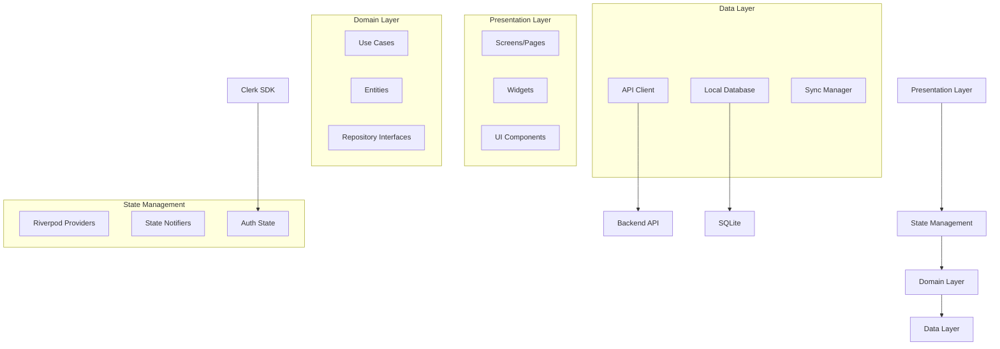

# FamilyTales Frontend Architecture (Flutter)

## Overview

The FamilyTales mobile application is built with Flutter, providing a native experience across iOS and Android platforms. The architecture emphasizes offline-first capabilities, secure authentication through Clerk, and efficient state management with Riverpod. This document outlines the technical architecture, implementation patterns, and best practices for the Flutter frontend.

## Table of Contents

1. [Architecture Overview](#architecture-overview)
2. [Clerk Flutter SDK Integration](#clerk-flutter-sdk-integration)
3. [State Management with Riverpod](#state-management-with-riverpod)
4. [Navigation with go_router](#navigation-with-go_router)
5. [API Client with Dio](#api-client-with-dio)
6. [Offline-First with Drift](#offline-first-with-drift)
7. [Project Structure](#project-structure)
8. [Best Practices](#best-practices)

## Architecture Overview

### Core Principles

- **Offline-First**: All data is cached locally with background sync
- **Reactive State Management**: UI updates automatically based on state changes
- **Secure Authentication**: Clerk handles all auth flows with JWT tokens
- **Type Safety**: Strong typing throughout with null safety
- **Modular Architecture**: Clear separation of concerns with feature-based modules

### Technology Stack

```yaml
dependencies:
  # Core
  flutter: ^3.19.0
  
  # Authentication
  clerk_flutter: ^1.0.0
  
  # State Management
  flutter_riverpod: ^2.4.0
  riverpod_annotation: ^2.3.0
  
  # Navigation
  go_router: ^13.0.0
  
  # Networking
  dio: ^5.4.0
  retrofit: ^4.1.0
  
  # Local Database
  drift: ^2.14.0
  sqlite3_flutter_libs: ^0.5.0
  
  # Utilities
  freezed: ^2.4.0
  json_serializable: ^6.7.0
  flutter_secure_storage: ^9.0.0
  
dev_dependencies:
  build_runner: ^2.4.0
  drift_dev: ^2.14.0
  freezed_annotation: ^2.4.0
  riverpod_generator: ^2.3.0
```

### Architecture Diagram



## Clerk Flutter SDK Integration

### Installation and Setup

```dart
// lib/core/auth/clerk_config.dart
import 'package:clerk_flutter/clerk_flutter.dart';
import 'package:flutter_dotenv/flutter_dotenv.dart';

class ClerkConfig {
  static late final ClerkClient instance;
  
  static Future<void> initialize() async {
    instance = ClerkClient(
      publishableKey: dotenv.env['CLERK_PUBLISHABLE_KEY']!,
      configuration: ClerkConfiguration(
        // Appearance customization
        appearance: ClerkAppearance(
          theme: ClerkTheme.custom(
            colors: ClerkColors(
              primary: AppColors.primary,
              background: AppColors.background,
              text: AppColors.text,
            ),
            fonts: ClerkFonts(
              body: 'Inter',
              heading: 'Inter',
            ),
          ),
          elements: ClerkElements(
            formButtonPrimary: ClerkElementStyle(
              backgroundColor: AppColors.primary,
              textColor: Colors.white,
              borderRadius: 12,
            ),
            card: ClerkElementStyle(
              backgroundColor: AppColors.surface,
              borderRadius: 16,
              boxShadow: '0 4px 6px rgba(0, 0, 0, 0.1)',
            ),
          ),
        ),
        
        // Sign-in/up options
        signInOptions: SignInOptions(
          providers: [
            OAuthProvider.google,
            OAuthProvider.apple,
            OAuthProvider.facebook,
          ],
          identifiers: [
            SignInIdentifier.emailAddress,
            SignInIdentifier.phoneNumber,
          ],
        ),
        
        // Redirect configuration
        redirectUrls: RedirectUrls(
          afterSignIn: '/dashboard',
          afterSignUp: '/onboarding',
          afterSignOut: '/',
        ),
      ),
    );
  }
}

// main.dart
void main() async {
  WidgetsFlutterBinding.ensureInitialized();
  
  await dotenv.load();
  await ClerkConfig.initialize();
  
  runApp(
    ProviderScope(
      child: FamilyTalesApp(),
    ),
  );
}
```

### SignIn/SignUp Widgets

```dart
// lib/features/auth/presentation/screens/sign_in_screen.dart
import 'package:clerk_flutter/clerk_flutter.dart';
import 'package:flutter_riverpod/flutter_riverpod.dart';

class SignInScreen extends ConsumerWidget {
  const SignInScreen({super.key});
  
  @override
  Widget build(BuildContext context, WidgetRef ref) {
    return Scaffold(
      body: SafeArea(
        child: Padding(
          padding: const EdgeInsets.all(24.0),
          child: Column(
            children: [
              // App branding
              const AppLogo(),
              const SizedBox(height: 48),
              
              // Clerk SignIn component
              ClerkSignIn(
                onSuccess: (session) {
                  // Handle successful sign-in
                  ref.read(routerProvider).go('/dashboard');
                },
                onError: (error) {
                  // Handle sign-in errors
                  ScaffoldMessenger.of(context).showSnackBar(
                    SnackBar(
                      content: Text(error.message),
                      backgroundColor: Colors.red,
                    ),
                  );
                },
                
                // Custom header
                header: Column(
                  children: [
                    Text(
                      'Welcome Back',
                      style: Theme.of(context).textTheme.headlineMedium,
                    ),
                    const SizedBox(height: 8),
                    Text(
                      'Sign in to continue sharing memories',
                      style: Theme.of(context).textTheme.bodyMedium,
                    ),
                  ],
                ),
                
                // Custom footer with sign-up link
                footer: Row(
                  mainAxisAlignment: MainAxisAlignment.center,
                  children: [
                    const Text("Don't have an account?"),
                    TextButton(
                      onPressed: () => context.go('/sign-up'),
                      child: const Text('Sign Up'),
                    ),
                  ],
                ),
              ),
            ],
          ),
        ),
      ),
    );
  }
}

// lib/features/auth/presentation/screens/sign_up_screen.dart
class SignUpScreen extends ConsumerWidget {
  const SignUpScreen({super.key});
  
  @override
  Widget build(BuildContext context, WidgetRef ref) {
    // Extract invitation metadata if coming from invite link
    final inviteCode = ref.watch(inviteCodeProvider);
    
    return Scaffold(
      body: SafeArea(
        child: Padding(
          padding: const EdgeInsets.all(24.0),
          child: ClerkSignUp(
            // Pass invitation metadata
            initialValues: inviteCode != null
                ? {
                    'publicMetadata': {
                      'inviteCode': inviteCode,
                      'joinedVia': 'invitation',
                    },
                  }
                : null,
            
            onSuccess: (session) async {
              // Handle successful sign-up
              if (inviteCode != null) {
                // Accept family invitation
                await ref.read(familyServiceProvider).acceptInvitation(inviteCode);
                ref.read(routerProvider).go('/families/${session.publicMetadata['familyId']}/welcome');
              } else {
                ref.read(routerProvider).go('/onboarding');
              }
            },
            
            // Custom fields
            additionalFields: [
              ClerkFormField(
                name: 'displayName',
                label: 'Display Name',
                placeholder: 'How should we address you?',
                required: true,
              ),
            ],
            
            header: Column(
              children: [
                Text(
                  'Create Your Account',
                  style: Theme.of(context).textTheme.headlineMedium,
                ),
                if (inviteCode != null) ...[
                  const SizedBox(height: 8),
                  Container(
                    padding: const EdgeInsets.all(12),
                    decoration: BoxDecoration(
                      color: Colors.green.shade50,
                      borderRadius: BorderRadius.circular(8),
                    ),
                    child: Row(
                      children: [
                        Icon(Icons.family_restroom, color: Colors.green.shade700),
                        const SizedBox(width: 8),
                        Expanded(
                          child: Text(
                            'You\'ve been invited to join a family!',
                            style: TextStyle(color: Colors.green.shade700),
                          ),
                        ),
                      ],
                    ),
                  ),
                ],
              ],
            ),
          ),
        ),
      ),
    );
  }
}
```

### Session Management

```dart
// lib/features/auth/data/services/session_service.dart
import 'package:clerk_flutter/clerk_flutter.dart';
import 'package:flutter_secure_storage/flutter_secure_storage.dart';

class SessionService {
  final ClerkClient _clerk;
  final FlutterSecureStorage _secureStorage;
  
  SessionService(this._clerk, this._secureStorage);
  
  // Get current session
  Stream<ClerkSession?> get sessionStream => _clerk.sessionStream;
  
  // Get current JWT token
  Future<String?> getToken() async {
    final session = _clerk.currentSession;
    if (session == null) return null;
    
    // Check if token needs refresh
    final token = session.getToken();
    if (_isTokenExpiringSoon(token)) {
      await refreshToken();
      return _clerk.currentSession?.getToken();
    }
    
    return token;
  }
  
  // Refresh token if needed
  Future<void> refreshToken() async {
    try {
      await _clerk.refreshSession();
    } catch (e) {
      // Handle refresh failure
      throw SessionRefreshException(e.toString());
    }
  }
  
  // Sign out
  Future<void> signOut() async {
    await _clerk.signOut();
    await _clearLocalData();
  }
  
  // Check if token expires soon (within 5 minutes)
  bool _isTokenExpiringSoon(String? token) {
    if (token == null) return true;
    
    try {
      final payload = _parseJwtPayload(token);
      final exp = payload['exp'] as int;
      final expiryTime = DateTime.fromMillisecondsSinceEpoch(exp * 1000);
      final now = DateTime.now();
      
      return expiryTime.difference(now).inMinutes < 5;
    } catch (e) {
      return true;
    }
  }
  
  Map<String, dynamic> _parseJwtPayload(String token) {
    final parts = token.split('.');
    if (parts.length != 3) throw FormatException('Invalid JWT');
    
    final payload = parts[1];
    final normalized = base64Url.normalize(payload);
    final decoded = utf8.decode(base64Url.decode(normalized));
    
    return json.decode(decoded);
  }
  
  Future<void> _clearLocalData() async {
    await _secureStorage.deleteAll();
    // Clear other local data as needed
  }
}
```

### JWT Token Handling

```dart
// lib/features/auth/domain/models/auth_token.dart
import 'package:freezed_annotation/freezed_annotation.dart';

part 'auth_token.freezed.dart';
part 'auth_token.g.dart';

@freezed
class AuthToken with _$AuthToken {
  const factory AuthToken({
    required String accessToken,
    required DateTime expiresAt,
    String? refreshToken,
  }) = _AuthToken;
  
  factory AuthToken.fromJson(Map<String, dynamic> json) => _$AuthTokenFromJson(json);
  
  // Extension methods
  const AuthToken._();
  
  bool get isExpired => DateTime.now().isAfter(expiresAt);
  
  bool get needsRefresh {
    final now = DateTime.now();
    final timeUntilExpiry = expiresAt.difference(now);
    return timeUntilExpiry.inMinutes < 5;
  }
}

// lib/features/auth/data/repositories/token_repository.dart
class TokenRepository {
  final FlutterSecureStorage _secureStorage;
  static const _tokenKey = 'auth_token';
  static const _refreshTokenKey = 'refresh_token';
  
  TokenRepository(this._secureStorage);
  
  Future<void> saveToken(AuthToken token) async {
    await _secureStorage.write(
      key: _tokenKey,
      value: json.encode(token.toJson()),
    );
  }
  
  Future<AuthToken?> getToken() async {
    final tokenJson = await _secureStorage.read(key: _tokenKey);
    if (tokenJson == null) return null;
    
    try {
      return AuthToken.fromJson(json.decode(tokenJson));
    } catch (e) {
      await _secureStorage.delete(key: _tokenKey);
      return null;
    }
  }
  
  Future<void> clearTokens() async {
    await _secureStorage.delete(key: _tokenKey);
    await _secureStorage.delete(key: _refreshTokenKey);
  }
}
```

### Deep Linking for Invitations

```dart
// lib/core/routing/deep_link_handler.dart
import 'package:app_links/app_links.dart';
import 'package:flutter_riverpod/flutter_riverpod.dart';

final deepLinkHandlerProvider = Provider<DeepLinkHandler>((ref) {
  return DeepLinkHandler(ref);
});

class DeepLinkHandler {
  final Ref _ref;
  late final AppLinks _appLinks;
  StreamSubscription<Uri>? _linkSubscription;
  
  DeepLinkHandler(this._ref) {
    _appLinks = AppLinks();
    _initialize();
  }
  
  void _initialize() {
    // Handle initial link if app was opened via deep link
    _handleInitialLink();
    
    // Listen for subsequent links
    _linkSubscription = _appLinks.uriLinkStream.listen(_handleDeepLink);
  }
  
  Future<void> _handleInitialLink() async {
    try {
      final initialUri = await _appLinks.getInitialAppLink();
      if (initialUri != null) {
        _handleDeepLink(initialUri);
      }
    } catch (e) {
      // Handle error
    }
  }
  
  void _handleDeepLink(Uri uri) {
    // Handle different deep link patterns
    switch (uri.pathSegments.firstOrNull) {
      case 'join':
        _handleInvitationLink(uri);
        break;
      case 'family':
        _handleFamilyLink(uri);
        break;
      case 'memory':
        _handleMemoryLink(uri);
        break;
      default:
        // Navigate to home
        _ref.read(routerProvider).go('/');
    }
  }
  
  void _handleInvitationLink(Uri uri) {
    final inviteCode = uri.pathSegments.elementAtOrNull(1);
    if (inviteCode != null) {
      // Store invite code for use during sign-up
      _ref.read(inviteCodeProvider.notifier).state = inviteCode;
      
      // Navigate to invitation acceptance flow
      _ref.read(routerProvider).go('/join/$inviteCode');
    }
  }
  
  void _handleFamilyLink(Uri uri) {
    final familyId = uri.pathSegments.elementAtOrNull(1);
    if (familyId != null && _ref.read(authStateProvider).isAuthenticated) {
      _ref.read(routerProvider).go('/families/$familyId');
    }
  }
  
  void _handleMemoryLink(Uri uri) {
    final memoryId = uri.pathSegments.elementAtOrNull(1);
    if (memoryId != null && _ref.read(authStateProvider).isAuthenticated) {
      _ref.read(routerProvider).go('/memories/$memoryId');
    }
  }
  
  void dispose() {
    _linkSubscription?.cancel();
  }
}

// Platform-specific configuration

// iOS: Info.plist
/*
<key>CFBundleURLTypes</key>
<array>
    <dict>
        <key>CFBundleURLSchemes</key>
        <array>
            <string>familytales</string>
        </array>
    </dict>
</array>
<key>FlutterDeepLinkingEnabled</key>
<true/>
*/

// Android: AndroidManifest.xml
/*
<intent-filter>
    <action android:name="android.intent.action.VIEW" />
    <category android:name="android.intent.category.DEFAULT" />
    <category android:name="android.intent.category.BROWSABLE" />
    <data
        android:scheme="familytales"
        android:host="app" />
    <data
        android:scheme="https"
        android:host="app.familytales.com" />
</intent-filter>
*/
```

## State Management with Riverpod

### Auth State Providers

```dart
// lib/features/auth/presentation/providers/auth_state_provider.dart
import 'package:riverpod_annotation/riverpod_annotation.dart';

part 'auth_state_provider.g.dart';

@freezed
class AuthState with _$AuthState {
  const factory AuthState({
    required bool isAuthenticated,
    User? user,
    Family? currentFamily,
    required List<FamilyMembership> allFamilies,
    required PermissionSet permissions,
    Session? session,
    String? error,
  }) = _AuthState;
  
  factory AuthState.initial() => const AuthState(
    isAuthenticated: false,
    allFamilies: [],
    permissions: PermissionSet.empty(),
  );
}

@riverpod
class AuthStateNotifier extends _$AuthStateNotifier {
  late final ClerkClient _clerk;
  late final ApiClient _apiClient;
  StreamSubscription? _sessionSubscription;
  
  @override
  AuthState build() {
    _clerk = ref.watch(clerkProvider);
    _apiClient = ref.watch(apiClientProvider);
    
    // Initialize auth state
    _initializeAuth();
    
    // Clean up on dispose
    ref.onDispose(() {
      _sessionSubscription?.cancel();
    });
    
    return AuthState.initial();
  }
  
  Future<void> _initializeAuth() async {
    // Listen to Clerk session changes
    _sessionSubscription = _clerk.sessionStream.listen((session) async {
      if (session != null) {
        await _loadUserContext();
      } else {
        state = AuthState.initial();
      }
    });
  }
  
  Future<void> _loadUserContext() async {
    try {
      // Get extended user context from API
      final context = await _apiClient.getAuthContext();
      
      state = AuthState(
        isAuthenticated: true,
        user: context.user,
        currentFamily: context.currentFamily,
        allFamilies: context.allFamilies,
        permissions: context.permissions,
        session: context.session,
        error: null,
      );
    } catch (e) {
      state = state.copyWith(
        error: e.toString(),
      );
    }
  }
  
  Future<void> switchFamily(String familyId) async {
    if (!state.isAuthenticated) return;
    
    try {
      final newContext = await _apiClient.switchFamily(familyId);
      
      state = state.copyWith(
        currentFamily: newContext.family,
        permissions: newContext.permissions,
        error: null,
      );
      
      // Invalidate family-specific caches
      ref.invalidate(memoryBooksProvider);
      ref.invalidate(familyMembersProvider);
    } catch (e) {
      state = state.copyWith(error: e.toString());
      rethrow;
    }
  }
  
  Future<void> signOut() async {
    await _clerk.signOut();
    state = AuthState.initial();
    
    // Clear all caches
    ref.invalidate(apiClientProvider);
    await ref.read(databaseProvider).clearAllData();
  }
}

// Convenience providers
@riverpod
User? currentUser(CurrentUserRef ref) {
  return ref.watch(authStateNotifierProvider.select((state) => state.user));
}

@riverpod
Family? currentFamily(CurrentFamilyRef ref) {
  return ref.watch(authStateNotifierProvider.select((state) => state.currentFamily));
}

@riverpod
PermissionSet permissions(PermissionsRef ref) {
  return ref.watch(authStateNotifierProvider.select((state) => state.permissions));
}

@riverpod
bool hasPermission(HasPermissionRef ref, Permission permission) {
  final permissions = ref.watch(permissionsProvider);
  return permissions.has(permission);
}
```

### Family Context Management

```dart
// lib/features/family/presentation/providers/family_context_provider.dart
@riverpod
class FamilyContext extends _$FamilyContext {
  @override
  FutureOr<Family?> build() async {
    final authState = ref.watch(authStateNotifierProvider);
    
    if (!authState.isAuthenticated || authState.currentFamily == null) {
      return null;
    }
    
    // Get full family details
    final familyService = ref.watch(familyServiceProvider);
    return familyService.getFamily(authState.currentFamily!.id);
  }
  
  Future<void> createFamily(CreateFamilyRequest request) async {
    state = const AsyncLoading();
    
    state = await AsyncValue.guard(() async {
      final familyService = ref.read(familyServiceProvider);
      final newFamily = await familyService.createFamily(request);
      
      // Update auth state with new family
      await ref.read(authStateNotifierProvider.notifier).switchFamily(newFamily.id);
      
      return newFamily;
    });
  }
  
  Future<void> updateFamily(UpdateFamilyRequest request) async {
    state = const AsyncLoading();
    
    state = await AsyncValue.guard(() async {
      final familyService = ref.read(familyServiceProvider);
      return familyService.updateFamily(request);
    });
  }
  
  Future<void> inviteMember(InviteMemberRequest request) async {
    final familyService = ref.read(familyServiceProvider);
    await familyService.inviteMember(request);
    
    // Refresh family data to get updated member count
    ref.invalidateSelf();
  }
}

// Family members provider
@riverpod
class FamilyMembers extends _$FamilyMembers {
  @override
  FutureOr<List<FamilyMember>> build() async {
    final family = await ref.watch(familyContextProvider.future);
    if (family == null) return [];
    
    final familyService = ref.watch(familyServiceProvider);
    return familyService.getFamilyMembers(family.id);
  }
  
  Future<void> removeMember(String memberId) async {
    final family = await ref.read(familyContextProvider.future);
    if (family == null) return;
    
    state = const AsyncLoading();
    
    state = await AsyncValue.guard(() async {
      final familyService = ref.read(familyServiceProvider);
      await familyService.removeMember(family.id, memberId);
      
      // Refresh member list
      return ref.refresh(familyMembersProvider.future);
    });
  }
  
  Future<void> updateMemberRole(String memberId, FamilyRole newRole) async {
    final family = await ref.read(familyContextProvider.future);
    if (family == null) return;
    
    state = const AsyncLoading();
    
    state = await AsyncValue.guard(() async {
      final familyService = ref.read(familyServiceProvider);
      await familyService.updateMemberRole(family.id, memberId, newRole);
      
      // Refresh member list
      return ref.refresh(familyMembersProvider.future);
    });
  }
}
```

### Memory Book State

```dart
// lib/features/memory_book/presentation/providers/memory_book_provider.dart
@riverpod
class MemoryBooks extends _$MemoryBooks {
  @override
  FutureOr<List<MemoryBook>> build() async {
    final family = await ref.watch(familyContextProvider.future);
    if (family == null) return [];
    
    // Try to get from local database first
    final database = ref.watch(databaseProvider);
    final cachedBooks = await database.getMemoryBooks(family.id);
    
    // If we have cached data, return it immediately
    if (cachedBooks.isNotEmpty) {
      // Trigger background sync
      _syncInBackground(family.id);
      return cachedBooks;
    }
    
    // Otherwise fetch from API
    return _fetchFromApi(family.id);
  }
  
  Future<List<MemoryBook>> _fetchFromApi(String familyId) async {
    final apiClient = ref.read(apiClientProvider);
    final books = await apiClient.getMemoryBooks(familyId);
    
    // Cache in local database
    final database = ref.read(databaseProvider);
    await database.saveMemoryBooks(books);
    
    return books;
  }
  
  void _syncInBackground(String familyId) {
    // Don't await this - let it run in background
    () async {
      try {
        final freshBooks = await _fetchFromApi(familyId);
        
        // Update state if data changed
        if (state.hasValue && state.value != freshBooks) {
          state = AsyncData(freshBooks);
        }
      } catch (e) {
        // Log error but don't update state
        // We still have cached data to show
      }
    }();
  }
  
  Future<MemoryBook> createMemoryBook(CreateMemoryBookRequest request) async {
    final family = await ref.read(familyContextProvider.future);
    if (family == null) throw Exception('No family selected');
    
    // Optimistic update
    final tempBook = MemoryBook(
      id: 'temp_${DateTime.now().millisecondsSinceEpoch}',
      familyId: family.id,
      title: request.title,
      description: request.description,
      coverImageUrl: null,
      createdBy: ref.read(currentUserProvider)!.id,
      createdAt: DateTime.now(),
      updatedAt: DateTime.now(),
      threadCount: 0,
      lastActivity: DateTime.now(),
      syncStatus: SyncStatus.pending,
    );
    
    state = AsyncData([...state.value ?? [], tempBook]);
    
    try {
      // Create on server
      final apiClient = ref.read(apiClientProvider);
      final newBook = await apiClient.createMemoryBook(request);
      
      // Update local database
      final database = ref.read(databaseProvider);
      await database.saveMemoryBook(newBook);
      
      // Replace temp book with real one
      state = AsyncData(
        state.value!.map((book) => book.id == tempBook.id ? newBook : book).toList(),
      );
      
      return newBook;
    } catch (e) {
      // Revert optimistic update
      state = AsyncData(
        state.value!.where((book) => book.id != tempBook.id).toList(),
      );
      rethrow;
    }
  }
}

// Individual memory book state
@riverpod
class MemoryBookDetail extends _$MemoryBookDetail {
  @override
  FutureOr<MemoryBook?> build(String bookId) async {
    // Try local database first
    final database = ref.watch(databaseProvider);
    final cachedBook = await database.getMemoryBook(bookId);
    
    if (cachedBook != null) {
      // Trigger background sync
      _syncInBackground(bookId);
      return cachedBook;
    }
    
    // Fetch from API
    return _fetchFromApi(bookId);
  }
  
  Future<MemoryBook> _fetchFromApi(String bookId) async {
    final apiClient = ref.read(apiClientProvider);
    final book = await apiClient.getMemoryBook(bookId);
    
    // Cache locally
    final database = ref.read(databaseProvider);
    await database.saveMemoryBook(book);
    
    return book;
  }
  
  void _syncInBackground(String bookId) {
    () async {
      try {
        final freshBook = await _fetchFromApi(bookId);
        if (state.hasValue && state.value != freshBook) {
          state = AsyncData(freshBook);
        }
      } catch (e) {
        // Silent fail - we have cached data
      }
    }();
  }
}
```

### Offline Sync State

```dart
// lib/features/sync/presentation/providers/sync_state_provider.dart
@freezed
class SyncState with _$SyncState {
  const factory SyncState({
    required bool isSyncing,
    required Map<String, SyncStatus> itemStatuses,
    required List<SyncConflict> conflicts,
    DateTime? lastSyncTime,
    String? currentOperation,
    double? progress,
  }) = _SyncState;
  
  factory SyncState.initial() => const SyncState(
    isSyncing: false,
    itemStatuses: {},
    conflicts: [],
  );
}

@riverpod
class SyncStateNotifier extends _$SyncStateNotifier {
  Timer? _syncTimer;
  
  @override
  SyncState build() {
    // Set up periodic sync
    _syncTimer = Timer.periodic(const Duration(minutes: 5), (_) {
      _performSync();
    });
    
    // Clean up on dispose
    ref.onDispose(() {
      _syncTimer?.cancel();
    });
    
    // Perform initial sync
    _performSync();
    
    return SyncState.initial();
  }
  
  Future<void> _performSync() async {
    if (state.isSyncing) return;
    
    // Check connectivity
    final connectivity = await Connectivity().checkConnectivity();
    if (connectivity == ConnectivityResult.none) return;
    
    state = state.copyWith(isSyncing: true);
    
    try {
      // Sync different data types
      await _syncMemoryBooks();
      await _syncThreads();
      await _syncMedia();
      
      state = state.copyWith(
        isSyncing: false,
        lastSyncTime: DateTime.now(),
        currentOperation: null,
        progress: null,
      );
    } catch (e) {
      state = state.copyWith(
        isSyncing: false,
        currentOperation: 'Sync failed: ${e.toString()}',
      );
    }
  }
  
  Future<void> _syncMemoryBooks() async {
    state = state.copyWith(currentOperation: 'Syncing memory books...');
    
    final database = ref.read(databaseProvider);
    final apiClient = ref.read(apiClientProvider);
    
    // Get unsynced items
    final unsyncedBooks = await database.getUnsyncedMemoryBooks();
    
    for (var i = 0; i < unsyncedBooks.length; i++) {
      final book = unsyncedBooks[i];
      state = state.copyWith(
        progress: (i + 1) / unsyncedBooks.length,
      );
      
      try {
        if (book.id.startsWith('temp_')) {
          // Create new book
          final newBook = await apiClient.createMemoryBook(
            CreateMemoryBookRequest.fromMemoryBook(book),
          );
          await database.replaceTemporaryBook(book.id, newBook);
        } else {
          // Update existing book
          await apiClient.updateMemoryBook(book);
          await database.markMemoryBookSynced(book.id);
        }
        
        state = state.copyWith(
          itemStatuses: {
            ...state.itemStatuses,
            book.id: SyncStatus.synced,
          },
        );
      } catch (e) {
        if (e is ConflictException) {
          // Handle conflict
          state = state.copyWith(
            conflicts: [
              ...state.conflicts,
              SyncConflict(
                itemId: book.id,
                itemType: 'MemoryBook',
                localVersion: book,
                serverVersion: e.serverVersion,
                conflictedAt: DateTime.now(),
              ),
            ],
          );
        } else {
          // Mark as failed
          state = state.copyWith(
            itemStatuses: {
              ...state.itemStatuses,
              book.id: SyncStatus.failed,
            },
          );
        }
      }
    }
  }
  
  Future<void> resolveConflict(String itemId, ConflictResolution resolution) async {
    final conflict = state.conflicts.firstWhere((c) => c.itemId == itemId);
    
    switch (resolution) {
      case ConflictResolution.keepLocal:
        // Force push local version
        await _forcePushItem(conflict.localVersion);
        break;
      case ConflictResolution.keepServer:
        // Overwrite local with server version
        await _overwriteLocal(conflict.serverVersion);
        break;
      case ConflictResolution.merge:
        // Implement merge logic
        await _mergeVersions(conflict);
        break;
    }
    
    // Remove conflict from state
    state = state.copyWith(
      conflicts: state.conflicts.where((c) => c.itemId != itemId).toList(),
    );
  }
  
  void forceSync() {
    _performSync();
  }
}
```

## Navigation with go_router

### Router Configuration

```dart
// lib/core/routing/app_router.dart
import 'package:go_router/go_router.dart';
import 'package:riverpod_annotation/riverpod_annotation.dart';

part 'app_router.g.dart';

@riverpod
GoRouter router(RouterRef ref) {
  final authState = ref.watch(authStateNotifierProvider);
  
  return GoRouter(
    initialLocation: '/',
    debugLogDiagnostics: kDebugMode,
    
    // Refresh when auth state changes
    refreshListenable: RouterNotifier(ref),
    
    // Global error handler
    errorBuilder: (context, state) => ErrorScreen(error: state.error),
    
    // Routes
    routes: [
      // Public routes
      GoRoute(
        path: '/',
        builder: (context, state) => const LandingScreen(),
        routes: [
          GoRoute(
            path: 'sign-in',
            builder: (context, state) => const SignInScreen(),
          ),
          GoRoute(
            path: 'sign-up',
            builder: (context, state) => const SignUpScreen(),
          ),
          GoRoute(
            path: 'join/:inviteCode',
            builder: (context, state) {
              final inviteCode = state.pathParameters['inviteCode']!;
              return InvitationAcceptanceScreen(inviteCode: inviteCode);
            },
          ),
        ],
      ),
      
      // Authenticated routes
      ShellRoute(
        builder: (context, state, child) => AppShell(child: child),
        routes: [
          GoRoute(
            path: '/dashboard',
            builder: (context, state) => const DashboardScreen(),
          ),
          
          // Family routes
          GoRoute(
            path: '/families',
            builder: (context, state) => const FamiliesListScreen(),
            routes: [
              GoRoute(
                path: 'create',
                builder: (context, state) => const CreateFamilyScreen(),
              ),
              GoRoute(
                path: ':familyId',
                builder: (context, state) {
                  final familyId = state.pathParameters['familyId']!;
                  return FamilyDetailScreen(familyId: familyId);
                },
                routes: [
                  GoRoute(
                    path: 'welcome',
                    builder: (context, state) => const FamilyWelcomeScreen(),
                  ),
                  GoRoute(
                    path: 'settings',
                    builder: (context, state) => const FamilySettingsScreen(),
                  ),
                  GoRoute(
                    path: 'members',
                    builder: (context, state) => const FamilyMembersScreen(),
                  ),
                ],
              ),
            ],
          ),
          
          // Memory book routes
          GoRoute(
            path: '/memory-books',
            builder: (context, state) => const MemoryBooksListScreen(),
            routes: [
              GoRoute(
                path: 'create',
                builder: (context, state) => const CreateMemoryBookScreen(),
              ),
              GoRoute(
                path: ':bookId',
                builder: (context, state) {
                  final bookId = state.pathParameters['bookId']!;
                  return MemoryBookDetailScreen(bookId: bookId);
                },
                routes: [
                  GoRoute(
                    path: 'threads',
                    builder: (context, state) => const ThreadsListScreen(),
                    routes: [
                      GoRoute(
                        path: ':threadId',
                        builder: (context, state) {
                          final threadId = state.pathParameters['threadId']!;
                          return ThreadDetailScreen(threadId: threadId);
                        },
                      ),
                    ],
                  ),
                ],
              ),
            ],
          ),
          
          // Profile routes
          GoRoute(
            path: '/profile',
            builder: (context, state) => const ProfileScreen(),
            routes: [
              GoRoute(
                path: 'settings',
                builder: (context, state) => const SettingsScreen(),
              ),
            ],
          ),
        ],
      ),
      
      // Onboarding flow
      GoRoute(
        path: '/onboarding',
        builder: (context, state) => const OnboardingScreen(),
        redirect: (context, state) {
          // Skip if user already completed onboarding
          if (authState.user?.hasCompletedOnboarding ?? false) {
            return '/dashboard';
          }
          return null;
        },
      ),
    ],
    
    // Auth redirect
    redirect: (context, state) {
      final isAuthenticated = authState.isAuthenticated;
      final isAuthRoute = state.matchedLocation.startsWith('/sign-in') ||
                         state.matchedLocation.startsWith('/sign-up') ||
                         state.matchedLocation == '/';
      
      if (!isAuthenticated && !isAuthRoute && !state.matchedLocation.startsWith('/join')) {
        // Redirect to sign in, preserving the intended destination
        return '/sign-in?redirect=${Uri.encodeComponent(state.matchedLocation)}';
      }
      
      if (isAuthenticated && isAuthRoute) {
        // Redirect to dashboard or intended destination
        final redirectUrl = state.queryParameters['redirect'];
        if (redirectUrl != null) {
          return Uri.decodeComponent(redirectUrl);
        }
        return '/dashboard';
      }
      
      return null;
    },
  );
}

// Router notifier for reactive updates
class RouterNotifier extends ChangeNotifier {
  final Ref _ref;
  
  RouterNotifier(this._ref) {
    _ref.listen(
      authStateNotifierProvider,
      (_, __) => notifyListeners(),
    );
  }
}
```

### Auth Guards

```dart
// lib/core/routing/guards/auth_guard.dart
class AuthGuard {
  static String? redirectIfNotAuthenticated(BuildContext context, GoRouterState state) {
    final container = ProviderScope.containerOf(context);
    final authState = container.read(authStateNotifierProvider);
    
    if (!authState.isAuthenticated) {
      return '/sign-in?redirect=${Uri.encodeComponent(state.matchedLocation)}';
    }
    
    return null;
  }
  
  static String? redirectIfNoFamily(BuildContext context, GoRouterState state) {
    final container = ProviderScope.containerOf(context);
    final authState = container.read(authStateNotifierProvider);
    
    if (authState.currentFamily == null && authState.allFamilies.isEmpty) {
      return '/families/create';
    }
    
    return null;
  }
  
  static String? requirePermission(
    BuildContext context,
    GoRouterState state,
    Permission permission,
  ) {
    final container = ProviderScope.containerOf(context);
    final permissions = container.read(permissionsProvider);
    
    if (!permissions.has(permission)) {
      // Show error or redirect to appropriate page
      return '/error?message=insufficient_permissions';
    }
    
    return null;
  }
}

// Usage in routes
GoRoute(
  path: '/families/:familyId/settings',
  redirect: (context, state) {
    // Chain multiple guards
    return AuthGuard.redirectIfNotAuthenticated(context, state) ??
           AuthGuard.redirectIfNoFamily(context, state) ??
           AuthGuard.requirePermission(context, state, Permission.manageFamily);
  },
  builder: (context, state) => const FamilySettingsScreen(),
)
```

### Deep Link Handling

```dart
// lib/core/routing/deep_link_routes.dart
extension DeepLinkRoutes on GoRouter {
  void handleDeepLink(Uri uri) {
    switch (uri.pathSegments.firstOrNull) {
      case 'join':
        _handleInvitationLink(uri);
        break;
      case 'family':
        _handleFamilyLink(uri);
        break;
      case 'memory':
        _handleMemoryLink(uri);
        break;
      case 'thread':
        _handleThreadLink(uri);
        break;
      default:
        go('/');
    }
  }
  
  void _handleInvitationLink(Uri uri) {
    final inviteCode = uri.pathSegments.elementAtOrNull(1);
    if (inviteCode != null) {
      go('/join/$inviteCode');
    }
  }
  
  void _handleFamilyLink(Uri uri) {
    final familyId = uri.pathSegments.elementAtOrNull(1);
    final action = uri.pathSegments.elementAtOrNull(2);
    
    if (familyId != null) {
      switch (action) {
        case 'members':
          go('/families/$familyId/members');
          break;
        case 'settings':
          go('/families/$familyId/settings');
          break;
        default:
          go('/families/$familyId');
      }
    }
  }
  
  void _handleMemoryLink(Uri uri) {
    final memoryId = uri.pathSegments.elementAtOrNull(1);
    if (memoryId != null) {
      go('/memory-books/$memoryId');
    }
  }
  
  void _handleThreadLink(Uri uri) {
    final bookId = uri.pathSegments.elementAtOrNull(1);
    final threadId = uri.pathSegments.elementAtOrNull(2);
    
    if (bookId != null && threadId != null) {
      go('/memory-books/$bookId/threads/$threadId');
    }
  }
}
```

### Family Switching

```dart
// lib/features/family/presentation/widgets/family_switcher.dart
class FamilySwitcher extends ConsumerWidget {
  const FamilySwitcher({super.key});
  
  @override
  Widget build(BuildContext context, WidgetRef ref) {
    final authState = ref.watch(authStateNotifierProvider);
    
    if (authState.allFamilies.length <= 1) {
      // Show current family name only
      return Text(
        authState.currentFamily?.name ?? 'No Family',
        style: Theme.of(context).textTheme.titleMedium,
      );
    }
    
    return PopupMenuButton<String>(
      onSelected: (familyId) async {
        try {
          await ref.read(authStateNotifierProvider.notifier).switchFamily(familyId);
          
          // Navigate to family dashboard
          context.go('/families/$familyId');
          
          // Show confirmation
          if (context.mounted) {
            ScaffoldMessenger.of(context).showSnackBar(
              SnackBar(
                content: Text('Switched to ${authState.allFamilies.firstWhere((f) => f.family.id == familyId).family.name}'),
              ),
            );
          }
        } catch (e) {
          if (context.mounted) {
            ScaffoldMessenger.of(context).showSnackBar(
              SnackBar(
                content: Text('Failed to switch family: ${e.toString()}'),
                backgroundColor: Colors.red,
              ),
            );
          }
        }
      },
      itemBuilder: (context) => authState.allFamilies.map((membership) {
        final family = membership.family;
        final isCurrentFamily = family.id == authState.currentFamily?.id;
        
        return PopupMenuItem<String>(
          value: family.id,
          child: ListTile(
            leading: CircleAvatar(
              backgroundColor: isCurrentFamily ? Theme.of(context).primaryColor : Colors.grey.shade300,
              child: Text(
                family.name.substring(0, 1).toUpperCase(),
                style: TextStyle(
                  color: isCurrentFamily ? Colors.white : Colors.grey.shade600,
                ),
              ),
            ),
            title: Text(
              family.name,
              style: TextStyle(
                fontWeight: isCurrentFamily ? FontWeight.bold : FontWeight.normal,
              ),
            ),
            subtitle: Text(membership.role.displayName),
            trailing: isCurrentFamily
                ? Icon(Icons.check, color: Theme.of(context).primaryColor)
                : null,
          ),
        );
      }).toList(),
      child: Container(
        padding: const EdgeInsets.symmetric(horizontal: 12, vertical: 8),
        decoration: BoxDecoration(
          border: Border.all(color: Colors.grey.shade300),
          borderRadius: BorderRadius.circular(8),
        ),
        child: Row(
          mainAxisSize: MainAxisSize.min,
          children: [
            Text(
              authState.currentFamily?.name ?? 'Select Family',
              style: Theme.of(context).textTheme.titleMedium,
            ),
            const SizedBox(width: 8),
            const Icon(Icons.arrow_drop_down),
          ],
        ),
      ),
    );
  }
}
```

## API Client with Dio

### Dio Configuration

```dart
// lib/core/api/dio_client.dart
import 'package:dio/dio.dart';
import 'package:riverpod_annotation/riverpod_annotation.dart';

part 'dio_client.g.dart';

@riverpod
Dio dio(DioRef ref) {
  final dio = Dio(BaseOptions(
    baseUrl: const String.fromEnvironment('API_URL', defaultValue: 'https://api.familytales.com'),
    connectTimeout: const Duration(seconds: 30),
    receiveTimeout: const Duration(seconds: 30),
    headers: {
      'Content-Type': 'application/json',
      'Accept': 'application/json',
    },
  ));
  
  // Add interceptors
  dio.interceptors.addAll([
    ref.watch(authInterceptorProvider),
    ref.watch(loggingInterceptorProvider),
    ref.watch(retryInterceptorProvider),
    ref.watch(errorInterceptorProvider),
  ]);
  
  return dio;
}

// lib/core/api/api_client.dart
@riverpod
ApiClient apiClient(ApiClientRef ref) {
  final dio = ref.watch(dioProvider);
  return ApiClient(dio);
}

@RestApi()
abstract class ApiClient {
  factory ApiClient(Dio dio, {String baseUrl}) = _ApiClient;
  
  // Auth endpoints
  @GET('/auth/context')
  Future<AuthContext> getAuthContext();
  
  @POST('/auth/switch-family')
  Future<FamilyContext> switchFamily(@Body() SwitchFamilyRequest request);
  
  // Family endpoints
  @GET('/families')
  Future<List<Family>> getFamilies();
  
  @GET('/families/{id}')
  Future<Family> getFamily(@Path('id') String familyId);
  
  @POST('/families')
  Future<Family> createFamily(@Body() CreateFamilyRequest request);
  
  @PUT('/families/{id}')
  Future<Family> updateFamily(
    @Path('id') String familyId,
    @Body() UpdateFamilyRequest request,
  );
  
  @GET('/families/{id}/members')
  Future<List<FamilyMember>> getFamilyMembers(@Path('id') String familyId);
  
  @POST('/families/{id}/invite')
  Future<FamilyInvitation> inviteMember(
    @Path('id') String familyId,
    @Body() InviteMemberRequest request,
  );
  
  // Memory book endpoints
  @GET('/families/{familyId}/memory-books')
  Future<List<MemoryBook>> getMemoryBooks(@Path('familyId') String familyId);
  
  @GET('/memory-books/{id}')
  Future<MemoryBook> getMemoryBook(@Path('id') String bookId);
  
  @POST('/memory-books')
  Future<MemoryBook> createMemoryBook(@Body() CreateMemoryBookRequest request);
  
  @PUT('/memory-books/{id}')
  Future<MemoryBook> updateMemoryBook(
    @Path('id') String bookId,
    @Body() UpdateMemoryBookRequest request,
  );
  
  // Thread endpoints
  @GET('/memory-books/{bookId}/threads')
  Future<List<Thread>> getThreads(@Path('bookId') String bookId);
  
  @POST('/memory-books/{bookId}/threads')
  Future<Thread> createThread(
    @Path('bookId') String bookId,
    @Body() CreateThreadRequest request,
  );
  
  // Upload endpoints
  @POST('/upload/image')
  @MultiPart()
  Future<UploadResponse> uploadImage(@Part() File file);
  
  @POST('/upload/audio')
  @MultiPart()
  Future<UploadResponse> uploadAudio(@Part() File file);
}
```

### Interceptors for Auth Tokens

```dart
// lib/core/api/interceptors/auth_interceptor.dart
@riverpod
AuthInterceptor authInterceptor(AuthInterceptorRef ref) {
  final sessionService = ref.watch(sessionServiceProvider);
  return AuthInterceptor(sessionService);
}

class AuthInterceptor extends Interceptor {
  final SessionService _sessionService;
  
  AuthInterceptor(this._sessionService);
  
  @override
  void onRequest(
    RequestOptions options,
    RequestInterceptorHandler handler,
  ) async {
    // Skip auth for public endpoints
    if (_isPublicEndpoint(options.path)) {
      return handler.next(options);
    }
    
    try {
      // Get token from session service
      final token = await _sessionService.getToken();
      
      if (token != null) {
        options.headers['Authorization'] = 'Bearer $token';
      }
      
      // Add family context header if available
      final familyId = await _getCurrentFamilyId();
      if (familyId != null) {
        options.headers['X-Family-Context'] = familyId;
      }
      
      handler.next(options);
    } catch (e) {
      handler.reject(
        DioException(
          requestOptions: options,
          error: e,
          type: DioExceptionType.unknown,
        ),
      );
    }
  }
  
  @override
  void onError(
    DioException err,
    ErrorInterceptorHandler handler,
  ) async {
    if (err.response?.statusCode == 401) {
      try {
        // Try to refresh token
        await _sessionService.refreshToken();
        
        // Retry the request
        final options = err.requestOptions;
        final token = await _sessionService.getToken();
        
        if (token != null) {
          options.headers['Authorization'] = 'Bearer $token';
          
          final response = await Dio().fetch(options);
          return handler.resolve(response);
        }
      } catch (e) {
        // Refresh failed, sign out user
        await _sessionService.signOut();
      }
    }
    
    handler.next(err);
  }
  
  bool _isPublicEndpoint(String path) {
    const publicPaths = [
      '/health',
      '/version',
    ];
    
    return publicPaths.any((p) => path.startsWith(p));
  }
  
  Future<String?> _getCurrentFamilyId() async {
    // Implementation to get current family ID
    // This could be from a provider or local storage
    return null;
  }
}
```

### Error Handling

```dart
// lib/core/api/interceptors/error_interceptor.dart
@riverpod
ErrorInterceptor errorInterceptor(ErrorInterceptorRef ref) {
  return ErrorInterceptor();
}

class ErrorInterceptor extends Interceptor {
  @override
  void onError(
    DioException err,
    ErrorInterceptorHandler handler,
  ) {
    ApiException apiException;
    
    switch (err.type) {
      case DioExceptionType.connectionTimeout:
      case DioExceptionType.sendTimeout:
      case DioExceptionType.receiveTimeout:
        apiException = ApiException(
          message: 'Connection timeout. Please check your internet connection.',
          statusCode: null,
          type: ApiExceptionType.timeout,
        );
        break;
        
      case DioExceptionType.connectionError:
        apiException = ApiException(
          message: 'Unable to connect to server. Please check your internet connection.',
          statusCode: null,
          type: ApiExceptionType.network,
        );
        break;
        
      case DioExceptionType.badResponse:
        apiException = _handleBadResponse(err);
        break;
        
      case DioExceptionType.cancel:
        apiException = ApiException(
          message: 'Request cancelled',
          statusCode: null,
          type: ApiExceptionType.cancel,
        );
        break;
        
      default:
        apiException = ApiException(
          message: err.message ?? 'An unexpected error occurred',
          statusCode: null,
          type: ApiExceptionType.unknown,
        );
    }
    
    handler.reject(
      DioException(
        requestOptions: err.requestOptions,
        response: err.response,
        type: err.type,
        error: apiException,
      ),
    );
  }
  
  ApiException _handleBadResponse(DioException err) {
    final statusCode = err.response?.statusCode;
    final data = err.response?.data;
    
    String message;
    ApiExceptionType type;
    
    // Try to parse error message from response
    if (data is Map<String, dynamic>) {
      message = data['message'] ?? data['error'] ?? 'Unknown error';
    } else {
      message = 'Unknown error';
    }
    
    switch (statusCode) {
      case 400:
        type = ApiExceptionType.badRequest;
        break;
      case 401:
        type = ApiExceptionType.unauthorized;
        message = 'Your session has expired. Please sign in again.';
        break;
      case 403:
        type = ApiExceptionType.forbidden;
        message = 'You don\'t have permission to perform this action.';
        break;
      case 404:
        type = ApiExceptionType.notFound;
        message = 'The requested resource was not found.';
        break;
      case 409:
        type = ApiExceptionType.conflict;
        break;
      case 422:
        type = ApiExceptionType.validation;
        break;
      case 429:
        type = ApiExceptionType.rateLimited;
        message = 'Too many requests. Please try again later.';
        break;
      case 500:
      case 502:
      case 503:
      case 504:
        type = ApiExceptionType.server;
        message = 'Server error. Please try again later.';
        break;
      default:
        type = ApiExceptionType.unknown;
    }
    
    return ApiException(
      message: message,
      statusCode: statusCode,
      type: type,
      validationErrors: type == ApiExceptionType.validation
          ? _parseValidationErrors(data)
          : null,
    );
  }
  
  Map<String, List<String>>? _parseValidationErrors(dynamic data) {
    if (data is Map<String, dynamic> && data['errors'] is Map) {
      final errors = data['errors'] as Map<String, dynamic>;
      return errors.map((key, value) {
        if (value is List) {
          return MapEntry(key, value.cast<String>());
        } else if (value is String) {
          return MapEntry(key, [value]);
        }
        return MapEntry(key, ['Invalid value']);
      });
    }
    return null;
  }
}

// lib/core/api/exceptions/api_exception.dart
class ApiException implements Exception {
  final String message;
  final int? statusCode;
  final ApiExceptionType type;
  final Map<String, List<String>>? validationErrors;
  
  ApiException({
    required this.message,
    required this.statusCode,
    required this.type,
    this.validationErrors,
  });
  
  @override
  String toString() => message;
  
  String getUserMessage() {
    if (validationErrors != null && validationErrors!.isNotEmpty) {
      return validationErrors!.entries
          .map((e) => '${e.key}: ${e.value.join(', ')}')
          .join('\n');
    }
    return message;
  }
}

enum ApiExceptionType {
  timeout,
  network,
  badRequest,
  unauthorized,
  forbidden,
  notFound,
  conflict,
  validation,
  rateLimited,
  server,
  cancel,
  unknown,
}
```

### Retry Logic

```dart
// lib/core/api/interceptors/retry_interceptor.dart
@riverpod
RetryInterceptor retryInterceptor(RetryInterceptorRef ref) {
  return RetryInterceptor();
}

class RetryInterceptor extends Interceptor {
  static const int maxRetries = 3;
  static const int retryDelay = 1000; // milliseconds
  
  @override
  void onError(
    DioException err,
    ErrorInterceptorHandler handler,
  ) async {
    final shouldRetry = _shouldRetry(err);
    final retryCount = err.requestOptions.extra['retryCount'] ?? 0;
    
    if (shouldRetry && retryCount < maxRetries) {
      // Calculate exponential backoff
      final delay = retryDelay * pow(2, retryCount);
      
      // Wait before retrying
      await Future.delayed(Duration(milliseconds: delay));
      
      try {
        // Update retry count
        err.requestOptions.extra['retryCount'] = retryCount + 1;
        
        // Retry the request
        final response = await Dio().fetch(err.requestOptions);
        return handler.resolve(response);
      } catch (e) {
        // Retry failed, pass the error along
        if (e is DioException) {
          return handler.next(e);
        }
        
        return handler.next(
          DioException(
            requestOptions: err.requestOptions,
            error: e,
          ),
        );
      }
    }
    
    handler.next(err);
  }
  
  bool _shouldRetry(DioException err) {
    // Don't retry cancelled requests
    if (err.type == DioExceptionType.cancel) {
      return false;
    }
    
    // Retry network errors
    if (err.type == DioExceptionType.connectionError ||
        err.type == DioExceptionType.connectionTimeout) {
      return true;
    }
    
    // Retry specific status codes
    final statusCode = err.response?.statusCode;
    if (statusCode != null) {
      // Retry server errors (5xx) and rate limiting (429)
      return statusCode >= 500 || statusCode == 429;
    }
    
    return false;
  }
}
```

## Offline-First with Drift

### Local Database Schema

```dart
// lib/core/database/database.dart
import 'package:drift/drift.dart';
import 'package:drift/native.dart';
import 'package:path_provider/path_provider.dart';
import 'package:path/path.dart' as p;
import 'dart:io';

part 'database.g.dart';

// Tables
class Users extends Table {
  TextColumn get id => text()();
  TextColumn get clerkId => text()();
  TextColumn get email => text()();
  TextColumn get displayName => text()();
  TextColumn get profileImageUrl => text().nullable()();
  DateTimeColumn get createdAt => dateTime()();
  DateTimeColumn get updatedAt => dateTime()();
  
  @override
  Set<Column> get primaryKey => {id};
}

class Families extends Table {
  TextColumn get id => text()();
  TextColumn get name => text()();
  TextColumn get description => text().nullable()();
  TextColumn get subscriptionTier => text()();
  TextColumn get subscriptionStatus => text()();
  DateTimeColumn get createdAt => dateTime()();
  DateTimeColumn get updatedAt => dateTime()();
  IntColumn get syncStatus => integer().withDefault(const Constant(0))();
  DateTimeColumn get lastSyncedAt => dateTime().nullable()();
  
  @override
  Set<Column> get primaryKey => {id};
}

class FamilyMembers extends Table {
  TextColumn get familyId => text().references(Families, #id)();
  TextColumn get userId => text().references(Users, #id)();
  TextColumn get role => text()();
  DateTimeColumn get joinedAt => dateTime()();
  TextColumn get invitedBy => text().nullable()();
  
  @override
  Set<Column> get primaryKey => {familyId, userId};
}

class MemoryBooks extends Table {
  TextColumn get id => text()();
  TextColumn get familyId => text().references(Families, #id)();
  TextColumn get title => text()();
  TextColumn get description => text().nullable()();
  TextColumn get coverImageUrl => text().nullable()();
  TextColumn get createdBy => text().references(Users, #id)();
  DateTimeColumn get createdAt => dateTime()();
  DateTimeColumn get updatedAt => dateTime()();
  IntColumn get threadCount => integer().withDefault(const Constant(0))();
  DateTimeColumn get lastActivity => dateTime()();
  IntColumn get syncStatus => integer().withDefault(const Constant(0))();
  DateTimeColumn get lastSyncedAt => dateTime().nullable()();
  TextColumn get localChanges => text().nullable()(); // JSON of pending changes
  
  @override
  Set<Column> get primaryKey => {id};
}

class Threads extends Table {
  TextColumn get id => text()();
  TextColumn get memoryBookId => text().references(MemoryBooks, #id)();
  TextColumn get prompt => text()();
  TextColumn get description => text().nullable()();
  TextColumn get createdBy => text().references(Users, #id)();
  DateTimeColumn get createdAt => dateTime()();
  DateTimeColumn get updatedAt => dateTime()();
  IntColumn get responseCount => integer().withDefault(const Constant(0))();
  DateTimeColumn get lastActivity => dateTime()();
  IntColumn get syncStatus => integer().withDefault(const Constant(0))();
  DateTimeColumn get lastSyncedAt => dateTime().nullable()();
  
  @override
  Set<Column> get primaryKey => {id};
}

class ThreadResponses extends Table {
  TextColumn get id => text()();
  TextColumn get threadId => text().references(Threads, #id)();
  TextColumn get userId => text().references(Users, #id)();
  TextColumn get contentType => text()(); // text, audio, image, video
  TextColumn get content => text()(); // URL for media, text for text responses
  TextColumn get transcription => text().nullable()(); // For audio/video
  IntColumn get duration => integer().nullable()(); // For audio/video in seconds
  DateTimeColumn get createdAt => dateTime()();
  IntColumn get syncStatus => integer().withDefault(const Constant(0))();
  DateTimeColumn get lastSyncedAt => dateTime().nullable()();
  
  @override
  Set<Column> get primaryKey => {id};
}

class MediaCache extends Table {
  TextColumn get url => text()();
  TextColumn get localPath => text()();
  IntColumn get fileSize => integer()();
  TextColumn get mimeType => text()();
  DateTimeColumn get cachedAt => dateTime()();
  DateTimeColumn get lastAccessedAt => dateTime()();
  IntColumn get accessCount => integer().withDefault(const Constant(1))();
  
  @override
  Set<Column> get primaryKey => {url};
}

class SyncQueue extends Table {
  IntColumn get id => integer().autoIncrement()();
  TextColumn get entityType => text()(); // MemoryBook, Thread, ThreadResponse, etc.
  TextColumn get entityId => text()();
  TextColumn get operation => text()(); // create, update, delete
  TextColumn get payload => text()(); // JSON payload
  DateTimeColumn get createdAt => dateTime()();
  IntColumn get retryCount => integer().withDefault(const Constant(0))();
  TextColumn get lastError => text().nullable()();
  DateTimeColumn get lastAttemptAt => dateTime().nullable()();
}

// Converters
class SyncStatusConverter extends TypeConverter<SyncStatus, int> {
  const SyncStatusConverter();
  
  @override
  SyncStatus fromSql(int fromDb) {
    return SyncStatus.values[fromDb];
  }
  
  @override
  int toSql(SyncStatus value) {
    return value.index;
  }
}

enum SyncStatus {
  synced,     // 0 - In sync with server
  pending,    // 1 - Local changes pending sync
  syncing,    // 2 - Currently syncing
  failed,     // 3 - Sync failed
  conflict,   // 4 - Conflict with server version
}

// Database class
@DriftDatabase(
  tables: [
    Users,
    Families,
    FamilyMembers,
    MemoryBooks,
    Threads,
    ThreadResponses,
    MediaCache,
    SyncQueue,
  ],
)
class AppDatabase extends _$AppDatabase {
  AppDatabase() : super(_openConnection());
  
  @override
  int get schemaVersion => 1;
  
  @override
  MigrationStrategy get migration {
    return MigrationStrategy(
      onCreate: (Migrator m) async {
        await m.createAll();
      },
      onUpgrade: (Migrator m, int from, int to) async {
        // Handle migrations
      },
    );
  }
  
  // User queries
  Future<User?> getUser(String userId) {
    return (select(users)..where((u) => u.id.equals(userId))).getSingleOrNull();
  }
  
  Future<void> saveUser(User user) {
    return into(users).insertOnConflictUpdate(user);
  }
  
  // Family queries
  Future<List<Family>> getUserFamilies(String userId) {
    final query = select(families).join([
      innerJoin(
        familyMembers,
        familyMembers.familyId.equalsExp(families.id),
      ),
    ])..where(familyMembers.userId.equals(userId));
    
    return query.map((row) => row.readTable(families)).get();
  }
  
  // Memory book queries
  Future<List<MemoryBook>> getMemoryBooks(String familyId) {
    return (select(memoryBooks)
      ..where((m) => m.familyId.equals(familyId))
      ..orderBy([(m) => OrderingTerm.desc(m.lastActivity)]))
      .get();
  }
  
  Future<List<MemoryBook>> getUnsyncedMemoryBooks() {
    return (select(memoryBooks)
      ..where((m) => m.syncStatus.equals(SyncStatus.pending.index)))
      .get();
  }
  
  Future<MemoryBook?> getMemoryBook(String bookId) {
    return (select(memoryBooks)..where((m) => m.id.equals(bookId)))
      .getSingleOrNull();
  }
  
  Future<void> saveMemoryBook(MemoryBook book) {
    return into(memoryBooks).insertOnConflictUpdate(book);
  }
  
  Future<void> saveMemoryBooks(List<MemoryBook> books) {
    return batch((batch) {
      batch.insertAllOnConflictUpdate(memoryBooks, books);
    });
  }
  
  Future<void> markMemoryBookSynced(String bookId) {
    return (update(memoryBooks)..where((m) => m.id.equals(bookId)))
      .write(MemoryBooksCompanion(
        syncStatus: Value(SyncStatus.synced.index),
        lastSyncedAt: Value(DateTime.now()),
      ));
  }
  
  Future<void> replaceTemporaryBook(String tempId, MemoryBook newBook) {
    return transaction(() async {
      // Delete temporary book
      await (delete(memoryBooks)..where((m) => m.id.equals(tempId))).go();
      
      // Insert new book
      await into(memoryBooks).insert(newBook);
    });
  }
  
  // Thread queries
  Future<List<Thread>> getThreads(String memoryBookId) {
    return (select(threads)
      ..where((t) => t.memoryBookId.equals(memoryBookId))
      ..orderBy([(t) => OrderingTerm.desc(t.lastActivity)]))
      .get();
  }
  
  Future<List<ThreadResponse>> getThreadResponses(String threadId) {
    return (select(threadResponses)
      ..where((r) => r.threadId.equals(threadId))
      ..orderBy([(r) => OrderingTerm.asc(r.createdAt)]))
      .get();
  }
  
  // Media cache queries
  Future<String?> getCachedMediaPath(String url) async {
    final entry = await (select(mediaCache)..where((m) => m.url.equals(url)))
      .getSingleOrNull();
    
    if (entry != null) {
      // Update last accessed time
      await (update(mediaCache)..where((m) => m.url.equals(url)))
        .write(MediaCacheCompanion(
          lastAccessedAt: Value(DateTime.now()),
          accessCount: Value(entry.accessCount + 1),
        ));
      
      return entry.localPath;
    }
    
    return null;
  }
  
  Future<void> cacheMedia(String url, String localPath, int fileSize, String mimeType) {
    return into(mediaCache).insertOnConflictUpdate(MediaCacheCompanion(
      url: Value(url),
      localPath: Value(localPath),
      fileSize: Value(fileSize),
      mimeType: Value(mimeType),
      cachedAt: Value(DateTime.now()),
      lastAccessedAt: Value(DateTime.now()),
    ));
  }
  
  Future<void> cleanupOldCache({Duration maxAge = const Duration(days: 30)}) async {
    final cutoffDate = DateTime.now().subtract(maxAge);
    
    // Get entries to delete
    final entriesToDelete = await (select(mediaCache)
      ..where((m) => m.lastAccessedAt.isSmallerThanValue(cutoffDate)))
      .get();
    
    // Delete files
    for (final entry in entriesToDelete) {
      try {
        final file = File(entry.localPath);
        if (await file.exists()) {
          await file.delete();
        }
      } catch (e) {
        // Log error but continue
      }
    }
    
    // Delete database entries
    await (delete(mediaCache)
      ..where((m) => m.lastAccessedAt.isSmallerThanValue(cutoffDate)))
      .go();
  }
  
  // Sync queue operations
  Future<void> addToSyncQueue(SyncQueueData item) {
    return into(syncQueue).insert(item);
  }
  
  Future<List<SyncQueueData>> getPendingSyncItems({int limit = 50}) {
    return (select(syncQueue)
      ..where((s) => s.retryCount.isSmallerThanValue(5))
      ..orderBy([(s) => OrderingTerm.asc(s.createdAt)])
      ..limit(limit))
      .get();
  }
  
  Future<void> removeSyncItem(int id) {
    return (delete(syncQueue)..where((s) => s.id.equals(id))).go();
  }
  
  Future<void> updateSyncItemRetry(int id, String error) {
    return (update(syncQueue)..where((s) => s.id.equals(id)))
      .write(SyncQueueCompanion(
        retryCount: Value(syncQueue.retryCount + 1),
        lastError: Value(error),
        lastAttemptAt: Value(DateTime.now()),
      ));
  }
  
  // Clear all data
  Future<void> clearAllData() async {
    await transaction(() async {
      for (final table in allTables) {
        await delete(table).go();
      }
    });
  }
}

LazyDatabase _openConnection() {
  return LazyDatabase(() async {
    final dbFolder = await getApplicationDocumentsDirectory();
    final file = File(p.join(dbFolder.path, 'familytales.db'));
    return NativeDatabase.createInBackground(file);
  });
}
```

### Sync Strategies

```dart
// lib/features/sync/data/sync_manager.dart
import 'package:connectivity_plus/connectivity_plus.dart';
import 'package:workmanager/workmanager.dart';

class SyncManager {
  final AppDatabase _database;
  final ApiClient _apiClient;
  final Connectivity _connectivity;
  
  bool _isSyncing = false;
  final _syncController = StreamController<SyncEvent>.broadcast();
  
  Stream<SyncEvent> get syncEvents => _syncController.stream;
  
  SyncManager(this._database, this._apiClient, this._connectivity);
  
  Future<void> initialize() async {
    // Set up background sync
    await Workmanager().initialize(
      callbackDispatcher,
      isInDebugMode: kDebugMode,
    );
    
    // Register periodic sync task
    await Workmanager().registerPeriodicTask(
      'sync_task',
      'syncData',
      frequency: const Duration(minutes: 15),
      constraints: Constraints(
        networkType: NetworkType.connected,
        requiresBatteryNotLow: true,
      ),
    );
    
    // Listen to connectivity changes
    _connectivity.onConnectivityChanged.listen((result) {
      if (result != ConnectivityResult.none) {
        performSync();
      }
    });
  }
  
  Future<void> performSync() async {
    if (_isSyncing) return;
    
    // Check connectivity
    final connectivityResult = await _connectivity.checkConnectivity();
    if (connectivityResult == ConnectivityResult.none) {
      return;
    }
    
    _isSyncing = true;
    _syncController.add(SyncEvent.started());
    
    try {
      // Process sync queue first
      await _processSyncQueue();
      
      // Then sync each entity type
      await _syncMemoryBooks();
      await _syncThreads();
      await _syncThreadResponses();
      await _syncMedia();
      
      _syncController.add(SyncEvent.completed());
    } catch (e) {
      _syncController.add(SyncEvent.failed(e.toString()));
    } finally {
      _isSyncing = false;
    }
  }
  
  Future<void> _processSyncQueue() async {
    final items = await _database.getPendingSyncItems();
    
    for (final item in items) {
      try {
        await _processSyncItem(item);
        await _database.removeSyncItem(item.id);
      } catch (e) {
        await _database.updateSyncItemRetry(item.id, e.toString());
      }
    }
  }
  
  Future<void> _processSyncItem(SyncQueueData item) async {
    final payload = json.decode(item.payload);
    
    switch (item.entityType) {
      case 'MemoryBook':
        await _syncMemoryBookOperation(item.entityId, item.operation, payload);
        break;
      case 'Thread':
        await _syncThreadOperation(item.entityId, item.operation, payload);
        break;
      case 'ThreadResponse':
        await _syncThreadResponseOperation(item.entityId, item.operation, payload);
        break;
    }
  }
  
  Future<void> _syncMemoryBooks() async {
    // Get unsynced memory books
    final unsyncedBooks = await _database.getUnsyncedMemoryBooks();
    
    for (final book in unsyncedBooks) {
      try {
        if (book.id.startsWith('temp_')) {
          // Create new book
          final request = CreateMemoryBookRequest(
            familyId: book.familyId,
            title: book.title,
            description: book.description,
          );
          
          final newBook = await _apiClient.createMemoryBook(request);
          await _database.replaceTemporaryBook(book.id, newBook.toDrift());
        } else {
          // Check for conflicts
          final serverBook = await _apiClient.getMemoryBook(book.id);
          
          if (serverBook.updatedAt.isAfter(book.lastSyncedAt ?? book.createdAt)) {
            // Conflict detected
            await _handleConflict(book, serverBook);
          } else {
            // Update server
            await _apiClient.updateMemoryBook(
              book.id,
              UpdateMemoryBookRequest(
                title: book.title,
                description: book.description,
              ),
            );
            
            await _database.markMemoryBookSynced(book.id);
          }
        }
        
        _syncController.add(SyncEvent.itemSynced(
          entityType: 'MemoryBook',
          entityId: book.id,
        ));
      } catch (e) {
        _syncController.add(SyncEvent.itemFailed(
          entityType: 'MemoryBook',
          entityId: book.id,
          error: e.toString(),
        ));
      }
    }
  }
  
  Future<void> _handleConflict(MemoryBook local, MemoryBook server) async {
    // Implement conflict resolution strategy
    // For now, we'll use last-write-wins with server preference
    
    // Option 1: Server wins (default)
    await _database.saveMemoryBook(server.toDrift());
    
    // Option 2: Create a conflict entry for user resolution
    // await _database.createConflict(local, server);
    
    // Option 3: Try to merge changes
    // final merged = _mergeMemoryBooks(local, server);
    // await _database.saveMemoryBook(merged);
  }
  
  Future<void> _syncMedia() async {
    // Download missing media files
    final responses = await _database.getAllThreadResponses();
    
    for (final response in responses) {
      if (response.contentType != 'text' && response.content.isNotEmpty) {
        final cachedPath = await _database.getCachedMediaPath(response.content);
        
        if (cachedPath == null) {
          try {
            await _downloadAndCacheMedia(response.content);
          } catch (e) {
            // Log error but continue
          }
        }
      }
    }
    
    // Clean up old cache
    await _database.cleanupOldCache();
  }
  
  Future<void> _downloadAndCacheMedia(String url) async {
    final response = await Dio().get<List<int>>(
      url,
      options: Options(responseType: ResponseType.bytes),
    );
    
    // Save to local file
    final appDir = await getApplicationDocumentsDirectory();
    final fileName = '${DateTime.now().millisecondsSinceEpoch}_${p.basename(url)}';
    final file = File(p.join(appDir.path, 'media_cache', fileName));
    
    await file.parent.create(recursive: true);
    await file.writeAsBytes(response.data!);
    
    // Update cache database
    await _database.cacheMedia(
      url,
      file.path,
      response.data!.length,
      response.headers.value('content-type') ?? 'application/octet-stream',
    );
  }
}

// Background task handler
@pragma('vm:entry-point')
void callbackDispatcher() {
  Workmanager().executeTask((task, inputData) async {
    // Initialize dependencies
    final database = AppDatabase();
    final apiClient = ApiClient(Dio());
    final connectivity = Connectivity();
    
    final syncManager = SyncManager(database, apiClient, connectivity);
    
    try {
      await syncManager.performSync();
      return Future.value(true);
    } catch (e) {
      return Future.value(false);
    }
  });
}
```

### Conflict Resolution

```dart
// lib/features/sync/domain/conflict_resolver.dart
abstract class ConflictResolver<T> {
  Future<T> resolve(T local, T server, ConflictContext context);
}

class ConflictContext {
  final String userId;
  final DateTime localLastModified;
  final DateTime serverLastModified;
  final ConflictResolutionStrategy strategy;
  
  ConflictContext({
    required this.userId,
    required this.localLastModified,
    required this.serverLastModified,
    required this.strategy,
  });
}

enum ConflictResolutionStrategy {
  serverWins,
  localWins,
  lastWriteWins,
  merge,
  askUser,
}

// Memory book conflict resolver
class MemoryBookConflictResolver extends ConflictResolver<MemoryBook> {
  @override
  Future<MemoryBook> resolve(
    MemoryBook local,
    MemoryBook server,
    ConflictContext context,
  ) async {
    switch (context.strategy) {
      case ConflictResolutionStrategy.serverWins:
        return server;
        
      case ConflictResolutionStrategy.localWins:
        return local;
        
      case ConflictResolutionStrategy.lastWriteWins:
        return context.localLastModified.isAfter(context.serverLastModified)
            ? local
            : server;
            
      case ConflictResolutionStrategy.merge:
        return _merge(local, server, context);
        
      case ConflictResolutionStrategy.askUser:
        throw ConflictRequiresUserResolution(local, server);
    }
  }
  
  MemoryBook _merge(MemoryBook local, MemoryBook server, ConflictContext context) {
    // Implement field-by-field merge logic
    return MemoryBook(
      id: local.id,
      familyId: local.familyId,
      // Take the longer title (assuming more information is better)
      title: local.title.length > server.title.length ? local.title : server.title,
      // Combine descriptions if different
      description: local.description != server.description
          ? '${local.description}\n\n---\n\n${server.description}'
          : local.description,
      // Use server's cover image (assuming it's more authoritative)
      coverImageUrl: server.coverImageUrl ?? local.coverImageUrl,
      createdBy: local.createdBy,
      createdAt: local.createdAt,
      // Use latest update time
      updatedAt: DateTime.now(),
      // Use server's counts (more accurate)
      threadCount: server.threadCount,
      lastActivity: server.lastActivity.isAfter(local.lastActivity)
          ? server.lastActivity
          : local.lastActivity,
    );
  }
}

// Thread response conflict resolver
class ThreadResponseConflictResolver extends ConflictResolver<ThreadResponse> {
  @override
  Future<ThreadResponse> resolve(
    ThreadResponse local,
    ThreadResponse server,
    ConflictContext context,
  ) async {
    // Thread responses are immutable once created
    // If there's a conflict, it means we have duplicate responses
    // Keep the server version as authoritative
    return server;
  }
}

// Conflict UI for user resolution
class ConflictResolutionDialog extends StatelessWidget {
  final MemoryBook localVersion;
  final MemoryBook serverVersion;
  final Function(ConflictResolution) onResolve;
  
  const ConflictResolutionDialog({
    super.key,
    required this.localVersion,
    required this.serverVersion,
    required this.onResolve,
  });
  
  @override
  Widget build(BuildContext context) {
    return AlertDialog(
      title: const Text('Sync Conflict Detected'),
      content: SingleChildScrollView(
        child: Column(
          mainAxisSize: MainAxisSize.min,
          children: [
            const Text(
              'This memory book has been modified in multiple places. '
              'Please choose which version to keep:',
            ),
            const SizedBox(height: 16),
            _buildVersionCard('Your Version', localVersion, Colors.blue),
            const SizedBox(height: 8),
            _buildVersionCard('Server Version', serverVersion, Colors.green),
          ],
        ),
      ),
      actions: [
        TextButton(
          onPressed: () => onResolve(ConflictResolution.keepLocal),
          child: const Text('Keep Mine'),
        ),
        TextButton(
          onPressed: () => onResolve(ConflictResolution.keepServer),
          child: const Text('Keep Server'),
        ),
        ElevatedButton(
          onPressed: () => onResolve(ConflictResolution.merge),
          child: const Text('Merge Both'),
        ),
      ],
    );
  }
  
  Widget _buildVersionCard(String label, MemoryBook book, Color color) {
    return Card(
      child: Container(
        padding: const EdgeInsets.all(12),
        decoration: BoxDecoration(
          border: Border.all(color: color, width: 2),
          borderRadius: BorderRadius.circular(8),
        ),
        child: Column(
          crossAxisAlignment: CrossAxisAlignment.start,
          children: [
            Text(
              label,
              style: TextStyle(
                fontWeight: FontWeight.bold,
                color: color,
              ),
            ),
            const SizedBox(height: 8),
            Text('Title: ${book.title}'),
            if (book.description != null)
              Text('Description: ${book.description}'),
            Text('Last updated: ${book.updatedAt.toLocal()}'),
          ],
        ),
      ),
    );
  }
}
```

## Project Structure

### Directory Organization

```
lib/
├── main.dart
├── app.dart
├── core/
│   ├── api/
│   │   ├── dio_client.dart
│   │   ├── api_client.dart
│   │   ├── interceptors/
│   │   │   ├── auth_interceptor.dart
│   │   │   ├── error_interceptor.dart
│   │   │   ├── logging_interceptor.dart
│   │   │   └── retry_interceptor.dart
│   │   └── exceptions/
│   │       └── api_exception.dart
│   ├── auth/
│   │   ├── clerk_config.dart
│   │   └── auth_guard.dart
│   ├── database/
│   │   ├── database.dart
│   │   ├── database.g.dart
│   │   └── converters/
│   ├── routing/
│   │   ├── app_router.dart
│   │   ├── deep_link_handler.dart
│   │   └── guards/
│   ├── theme/
│   │   ├── app_theme.dart
│   │   ├── colors.dart
│   │   └── typography.dart
│   └── utils/
│       ├── extensions.dart
│       ├── validators.dart
│       └── formatters.dart
├── features/
│   ├── auth/
│   │   ├── data/
│   │   │   ├── repositories/
│   │   │   └── services/
│   │   ├── domain/
│   │   │   ├── entities/
│   │   │   ├── repositories/
│   │   │   └── use_cases/
│   │   └── presentation/
│   │       ├── providers/
│   │       ├── screens/
│   │       └── widgets/
│   ├── family/
│   │   ├── data/
│   │   ├── domain/
│   │   └── presentation/
│   ├── memory_book/
│   │   ├── data/
│   │   ├── domain/
│   │   └── presentation/
│   ├── thread/
│   │   ├── data/
│   │   ├── domain/
│   │   └── presentation/
│   ├── sync/
│   │   ├── data/
│   │   ├── domain/
│   │   └── presentation/
│   └── common/
│       ├── presentation/
│       │   ├── widgets/
│       │   └── screens/
│       └── utils/
└── generated/
    ├── assets.gen.dart
    └── l10n/
```

### Feature Module Structure

Each feature follows clean architecture principles:

```
feature/
├── data/
│   ├── data_sources/
│   │   ├── remote/
│   │   │   └── feature_api.dart
│   │   └── local/
│   │       └── feature_dao.dart
│   ├── models/
│   │   ├── feature_model.dart
│   │   └── feature_model.g.dart
│   ├── repositories/
│   │   └── feature_repository_impl.dart
│   └── services/
│       └── feature_service.dart
├── domain/
│   ├── entities/
│   │   └── feature_entity.dart
│   ├── repositories/
│   │   └── feature_repository.dart
│   ├── use_cases/
│   │   ├── create_feature.dart
│   │   ├── update_feature.dart
│   │   └── delete_feature.dart
│   └── validators/
│       └── feature_validator.dart
└── presentation/
    ├── providers/
    │   ├── feature_state_provider.dart
    │   └── feature_list_provider.dart
    ├── screens/
    │   ├── feature_list_screen.dart
    │   ├── feature_detail_screen.dart
    │   └── feature_form_screen.dart
    └── widgets/
        ├── feature_card.dart
        ├── feature_form.dart
        └── feature_loading.dart
```

## Best Practices

### Code Organization

1. **Feature-First Structure**: Organize code by features rather than technical layers
2. **Clean Architecture**: Separate concerns into data, domain, and presentation layers
3. **Dependency Injection**: Use Riverpod for all dependency management
4. **Code Generation**: Leverage code generation for models, routing, and providers

### State Management

1. **Immutable State**: Always use immutable objects for state
2. **Provider Scope**: Keep providers as specific as possible
3. **Error Handling**: Handle errors at the provider level
4. **Loading States**: Always show loading indicators during async operations

### Performance

1. **Lazy Loading**: Load data only when needed
2. **Image Optimization**: Use cached network images with proper sizing
3. **List Performance**: Use ListView.builder for long lists
4. **Debouncing**: Debounce search and other rapid input operations

### Security

1. **Token Storage**: Use flutter_secure_storage for sensitive data
2. **Certificate Pinning**: Implement certificate pinning for API calls
3. **Input Validation**: Validate all user inputs
4. **Deep Link Security**: Validate all deep link parameters

### Testing

1. **Unit Tests**: Test all business logic and providers
2. **Widget Tests**: Test UI components in isolation
3. **Integration Tests**: Test complete user flows
4. **Golden Tests**: Use golden tests for visual regression testing

### Error Handling

```dart
// Global error handler
class ErrorHandler {
  static void handleError(Object error, StackTrace? stackTrace) {
    if (error is ApiException) {
      _handleApiError(error);
    } else if (error is DioException) {
      _handleNetworkError(error);
    } else if (error is FormatException) {
      _handleParsingError(error);
    } else {
      _handleUnknownError(error, stackTrace);
    }
  }
  
  static void _handleApiError(ApiException error) {
    switch (error.type) {
      case ApiExceptionType.unauthorized:
        // Force re-authentication
        break;
      case ApiExceptionType.forbidden:
        // Show permission error
        break;
      case ApiExceptionType.validation:
        // Show validation errors
        break;
      default:
        // Show generic error message
    }
  }
}

// Usage in providers
@riverpod
class SomeFeature extends _$SomeFeature {
  @override
  FutureOr<Data> build() async {
    try {
      return await _fetchData();
    } catch (error, stackTrace) {
      ErrorHandler.handleError(error, stackTrace);
      rethrow;
    }
  }
}
```

### Accessibility

1. **Semantic Labels**: Add semantic labels to all interactive elements
2. **Screen Reader Support**: Test with TalkBack and VoiceOver
3. **Color Contrast**: Ensure sufficient color contrast ratios
4. **Touch Targets**: Maintain minimum 48x48 dp touch targets

### Localization

```dart
// lib/l10n/app_en.arb
{
  "appTitle": "FamilyTales",
  "signIn": "Sign In",
  "signUp": "Sign Up",
  "welcomeBack": "Welcome Back",
  "@welcomeBack": {
    "description": "Greeting shown on sign-in screen"
  }
}

// Usage
Text(AppLocalizations.of(context)!.welcomeBack)
```

## Conclusion

This architecture provides a robust foundation for the FamilyTales Flutter application, emphasizing offline-first capabilities, secure authentication through Clerk, and efficient state management. The modular structure allows for easy maintenance and scaling while maintaining high performance and user experience standards.