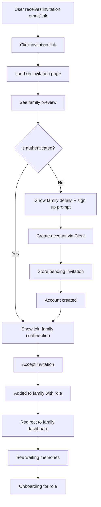
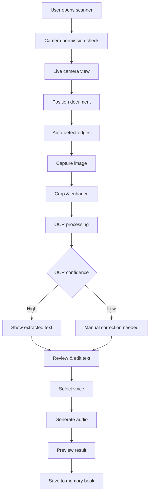
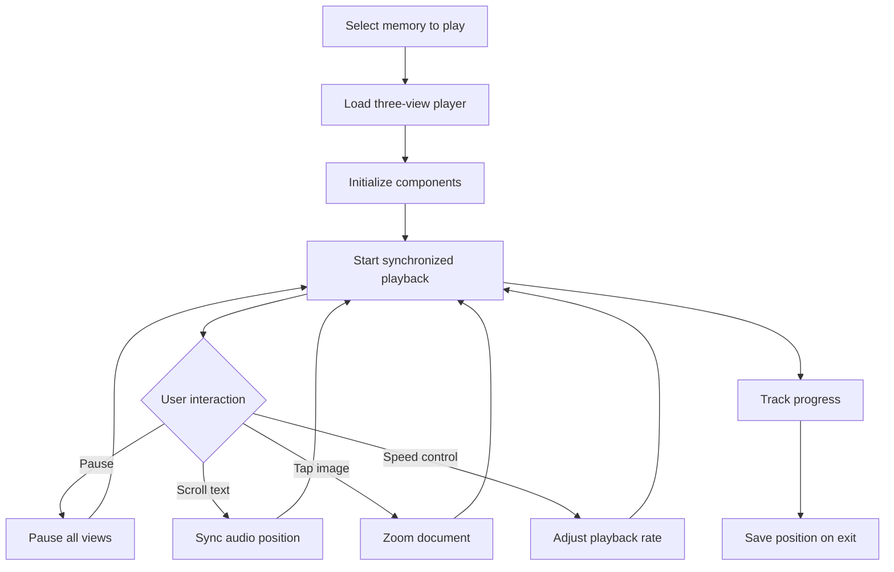
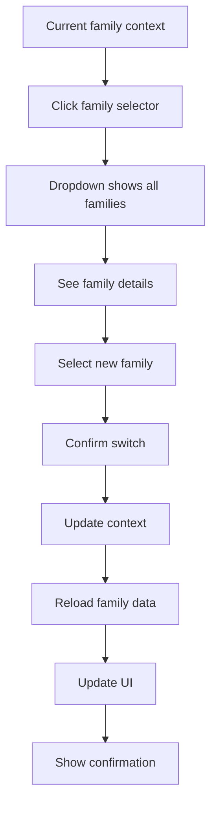
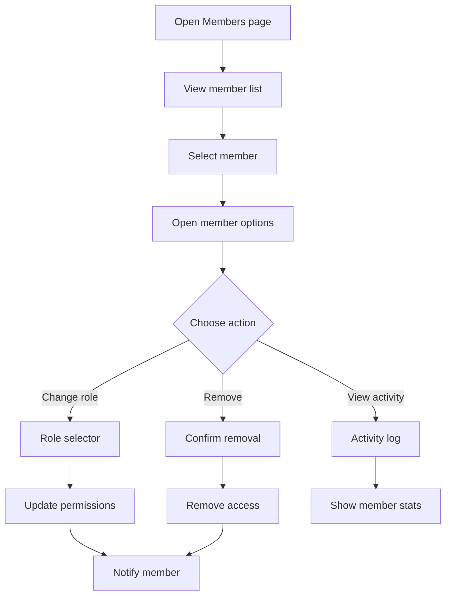
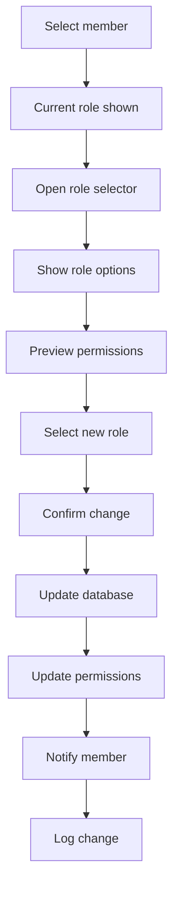
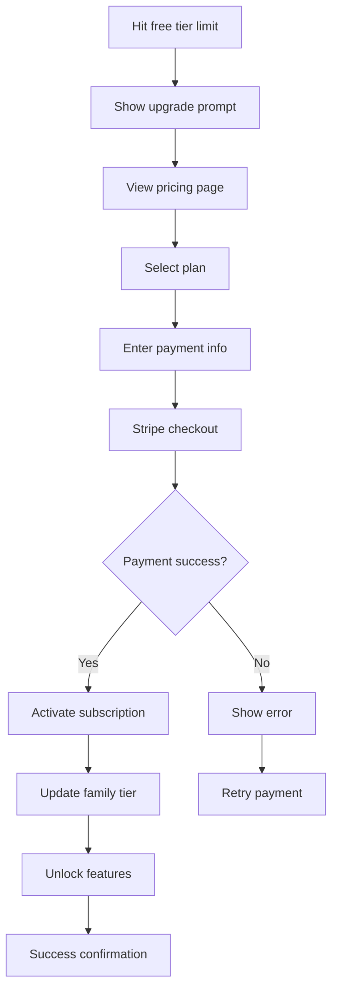

# FamilyTales User Flows Documentation

## Overview

This document details all critical user flows in the FamilyTales application, providing step-by-step descriptions and flow diagrams for each major user journey. These flows guide the implementation of features and ensure consistent user experience across the platform.

## Table of Contents

1. [Onboarding Flows](#1-onboarding-flows)
   - [1.1 Direct Signup](#11-direct-signup)
   - [1.2 Family Invitation Acceptance](#12-family-invitation-acceptance)
   - [1.3 Gift Subscription Activation](#13-gift-subscription-activation)
2. [Core Flows](#2-core-flows)
   - [2.1 Document Scanning and OCR](#21-document-scanning-and-ocr)
   - [2.2 Memory Book Creation](#22-memory-book-creation)
   - [2.3 Family Member Invitation](#23-family-member-invitation)
   - [2.4 Audio Playback with Three-View System](#24-audio-playback-with-three-view-system)
3. [Family Management Flows](#3-family-management-flows)
   - [3.1 Switching Between Families](#31-switching-between-families)
   - [3.2 Managing Family Members](#32-managing-family-members)
   - [3.3 Role Assignment](#33-role-assignment)
4. [Payment Flows](#4-payment-flows)
   - [4.1 Subscription Upgrade](#41-subscription-upgrade)
   - [4.2 Payment Method Update](#42-payment-method-update)
   - [4.3 Gift Purchase](#43-gift-purchase)

---

## 1. Onboarding Flows

### 1.1 Direct Signup

**Goal**: New user discovers FamilyTales and creates their first family account

```mermaid
flowchart TD
    A[User lands on homepage] --> B{Has account?}
    B -->|No| C[Click "Try it now" button]
    C --> D[Camera opens directly]
    D --> E[Guide: Take photo of handwritten document]
    E --> F[User takes photo]
    F --> G[OCR processes in real-time]
    G --> H[Preview audio generated]
    H --> I[Magic moment: Hear letter in natural voice]
    I --> J[Prompt: Create account to save]
    J --> K{Choose auth method}
    K -->|Social| L[Google/Apple/Facebook login]
    K -->|Email| M[Email + password signup]
    L --> N[Account created via Clerk]
    M --> N
    N --> O[Create family group]
    O --> P[Set as Head of Family]
    P --> Q[Save scanned document]
    Q --> R[Onboarding checklist shown]
    R --> S[Success: First memory preserved]
```

**Key Steps**:

1. **Landing Page** (0s)
   - Clear value proposition: "Your family's handwriting, brought to life"
   - "Try with one document free" CTA
   - Social proof indicators

2. **Instant Trial** (10s)
   - Camera permission request with context
   - Visual guide overlay for document positioning
   - Real-time edge detection

3. **OCR Processing** (30s)
   - Loading animation with progress
   - Shows text extraction in real-time
   - Confidence indicators for unclear sections

4. **Audio Preview** (45s)
   - Automatic playback of first paragraph
   - Voice selection options visible
   - "This is your grandmother's letter" messaging

5. **Account Creation** (60s)
   - Clerk modal appears
   - Pre-filled with detected name if available
   - Social login options prominent

6. **Family Setup** (90s)
   - Name your family group
   - Optional: Add family photo
   - Automatic Head of Family assignment

7. **Success State** (120s)
   - Confetti animation
   - "Your first memory is preserved!"
   - Onboarding checklist appears

**Time to Magic Moment**: 45 seconds

### 1.2 Family Invitation Acceptance

**Goal**: Existing family member invites new user to join their family



**Key Steps**:

1. **Invitation Receipt**
   - Email with family name and inviter's name
   - Custom message from inviter
   - Clear "Join Family" CTA

2. **Invitation Landing Page**
   - Family name and photo
   - "Invited by [Name]"
   - Number of memories waiting
   - Preview of recent memories (blurred)

3. **Authentication Check**
   - Seamless redirect if already signed in
   - Otherwise, show sign up/in options
   - Invitation code preserved through auth flow

4. **Account Creation**
   - Simplified Clerk flow
   - Pre-filled family connection
   - Skip family creation step

5. **Invitation Acceptance**
   - Confirmation screen with family details
   - Role assignment (Member by default)
   - Terms acceptance for family data access

6. **Welcome to Family**
   - Animated welcome message
   - Tour of family memories
   - Prompt to add first memory

### 1.3 Gift Subscription Activation

**Goal**: Recipient activates a gifted FamilyTales subscription

```mermaid
flowchart TD
    A[Recipient receives gift email] --> B[Beautiful gift email design]
    B --> C[Click "Activate Your Gift"]
    C --> D[Gift activation page]
    D --> E[See gift details + personal message]
    E --> F{Has account?}
    F -->|Yes| G[Sign in]
    F -->|No| H[Create account]
    G --> I[Link gift to account]
    H --> I
    I --> J[Family setup wizard]
    J --> K[Optional: Schedule setup call]
    K --> L[Gift activated confirmation]
    L --> M[Tutorial: First scan]
    M --> N[Success: Using gifted subscription]
```

**Key Steps**:

1. **Gift Email**
   - Elegant design with gift bow graphic
   - Personal message from gifter
   - Subscription details (tier, duration)
   - One-click activation button

2. **Gift Landing Page**
   - Thank you message
   - What's included in subscription
   - Video preview of features
   - Simple activation flow

3. **Account Setup**
   - Streamlined Clerk signup
   - Pre-applied subscription
   - No payment info required

4. **Family Creation**
   - Guided family setup
   - Suggested family name
   - Option to invite gifter

5. **Setup Support**
   - Optional video call scheduling
   - Screen sharing for assistance
   - Success notification to gifter

---

## 2. Core Flows

### 2.1 Document Scanning and OCR

**Goal**: User scans a physical document and converts it to digital format with audio



**Key Steps**:

1. **Scanner Initialization** (0-5s)
   - Camera permission with explanation
   - Toggle for flash/torch
   - Grid overlay for alignment

2. **Document Capture** (5-15s)
   - Real-time edge detection
   - Stability indicator
   - Auto-capture when stable
   - Manual capture option

3. **Image Enhancement** (15-20s)
   - Auto-crop to document
   - Perspective correction
   - Brightness/contrast optimization
   - Show before/after

4. **OCR Processing** (20-30s)
   - Progress bar with stages
   - Real-time text extraction
   - Confidence highlighting
   - Language detection

5. **Text Review** (30-60s)
   - Side-by-side view (image + text)
   - Inline editing capabilities
   - Unclear word highlighting
   - Formatting preservation

6. **Voice Selection** (60-70s)
   - Preview different voices
   - Speed adjustment
   - Emotion settings
   - Save voice preference

7. **Audio Generation** (70-90s)
   - Processing animation
   - Estimated time remaining
   - Background processing option

8. **Final Review** (90-120s)
   - Play full audio
   - Three-view preview
   - Edit options
   - Save to memory book

### 2.2 Memory Book Creation

**Goal**: User creates a themed collection of related memories

```mermaid
flowchart TD
    A[Click "Create Memory Book"] --> B[Choose creation method]
    B -->|From scratch| C[Empty book wizard]
    B -->|From memories| D[Memory selection]
    C --> E[Set book details]
    D --> F[Select memories]
    F --> E
    E --> G[Choose theme/template]
    G --> H[Set privacy settings]
    H --> I[Memory book created]
    I --> J[Add first memory]
    J --> K[Organize memories]
    K --> L[Create threads]
    L --> M[Add contributors]
    M --> N[Publish book]
```

**Key Steps**:

1. **Creation Method** (0-10s)
   - "Start Fresh" - blank book
   - "From Existing" - select memories
   - "Use Template" - themed templates
   - "Import Collection" - bulk add

2. **Book Configuration** (10-30s)
   - Title (required)
   - Description (optional)
   - Cover image selection
   - Time period setting
   - Category selection

3. **Theme Selection** (30-40s)
   - Visual theme gallery
   - Color scheme options
   - Font selection
   - Layout preferences

4. **Privacy Settings** (40-50s)
   - Family only (default)
   - Specific members
   - Public sharing option
   - Download permissions

5. **Content Addition** (50s+)
   - Drag-drop interface
   - Bulk operations
   - Auto-organization by date
   - Thread creation tools

6. **Thread Management**
   - Link related memories
   - Set playback order
   - Add transitions
   - Create chapters

### 2.3 Family Member Invitation

**Goal**: Family admin invites new members to join the family

```mermaid
flowchart TD
    A[Navigate to Family Settings] --> B[Click "Invite Members"]
    B --> C[Choose invitation method]
    C -->|Email| D[Enter email addresses]
    C -->|Link| E[Generate invite link]
    C -->|QR Code| F[Generate QR code]
    D --> G[Set member roles]
    E --> G
    F --> G
    G --> H[Add personal message]
    H --> I[Set expiration]
    I --> J[Send invitations]
    J --> K[Track invitation status]
    K --> L{Accepted?}
    L -->|Yes| M[Member added]
    L -->|No| N[Send reminder]
```

**Key Steps**:

1. **Access Invitation System** (0-10s)
   - Family settings menu
   - "Invite Members" button
   - Current member count shown
   - Role permission check

2. **Method Selection** (10-20s)
   - Email invite (most common)
   - Shareable link
   - QR code for in-person
   - Bulk CSV import

3. **Recipient Details** (20-40s)
   - Email validation
   - Multiple emails supported
   - Name pre-fill (optional)
   - Relationship label

4. **Role Assignment** (40-50s)
   - Member (default)
   - Admin
   - Viewer only
   - Custom permissions

5. **Personalization** (50-60s)
   - Custom message field
   - Preview of invitation
   - Family photo inclusion
   - Voice message option

6. **Invitation Tracking**
   - Real-time status updates
   - Reminder capabilities
   - Expiration management
   - Revoke options

### 2.4 Audio Playback with Three-View System

**Goal**: User experiences synchronized playback of memory with document image, text, and audio



**Key Components**:

1. **Player Initialization** (0-2s)
   - Load document image
   - Load text with formatting
   - Buffer audio stream
   - Sync timestamps

2. **Three-View Layout**
   - Top: Document image (40%)
   - Middle: Scrolling text (40%)
   - Bottom: Audio controls (20%)
   - Responsive sizing

3. **Playback Features**
   - Play/pause toggle
   - Speed control (0.5x-2x)
   - Skip forward/back 10s
   - Progress scrubber
   - Volume control

4. **Synchronization**
   - Word-level highlighting
   - Auto-scroll text
   - Image pan to active section
   - Smooth transitions

5. **Interactive Features**
   - Tap word to jump
   - Pinch to zoom image
   - Swipe between memories
   - Share timestamp

---

## 3. Family Management Flows

### 3.1 Switching Between Families

**Goal**: User switches context between multiple families they belong to



**Key Steps**:

1. **Family Selector Access** (0-1s)
   - Header dropdown
   - Current family shown
   - Quick switch indicator

2. **Family List Display** (1-2s)
   - All user's families
   - Role badges
   - Member count
   - Last activity

3. **Context Switch** (2-3s)
   - Loading state
   - Cache clear
   - New data fetch
   - Permission update

4. **UI Update** (3-4s)
   - Theme change (if set)
   - Content refresh
   - Navigation update
   - Success message

### 3.2 Managing Family Members

**Goal**: Family admin manages member roles and access



**Management Features**:

1. **Member List View**
   - Profile photos
   - Names and roles
   - Join date
   - Last active
   - Contribution count

2. **Role Management**
   - Current role display
   - Role change dropdown
   - Permission preview
   - Change confirmation

3. **Member Actions**
   - Change role
   - Remove member
   - View activity
   - Send message
   - Transfer ownership

4. **Bulk Operations**
   - Select multiple
   - Bulk role change
   - Bulk remove
   - Export list

### 3.3 Role Assignment

**Goal**: Assign appropriate roles to family members



**Role Types**:

1. **Head of Family**
   - All permissions
   - Billing access
   - Transfer ownership
   - Delete family

2. **Admin**
   - Manage members
   - Manage content
   - View analytics
   - No billing access

3. **Member**
   - View content
   - Upload content
   - Create memory books
   - Share memories

4. **Viewer**
   - View only
   - No upload
   - No sharing
   - Limited access

---

## 4. Payment Flows

### 4.1 Subscription Upgrade

**Goal**: Upgrade from free to paid subscription tier



**Key Steps**:

1. **Upgrade Trigger** (0-5s)
   - Limit reached modal
   - Benefits comparison
   - Special offer (if any)
   - "Upgrade Now" CTA

2. **Pricing Display** (5-15s)
   - Plan comparison table
   - Monthly vs annual toggle
   - Feature highlights
   - FAQ section

3. **Plan Selection** (15-20s)
   - Select tier
   - Billing period choice
   - Promo code field
   - Price calculation

4. **Payment Collection** (20-40s)
   - Stripe Elements form
   - Card details
   - Billing address
   - Save payment method option

5. **Confirmation** (40-50s)
   - Processing animation
   - Success message
   - Receipt email
   - Feature unlock notification

### 4.2 Payment Method Update

**Goal**: Update or change payment method for subscription

```mermaid
flowchart TD
    A[Navigate to Billing] --> B[View current payment]
    B --> C[Click "Update Payment"]
    C --> D[Stripe portal loads]
    D --> E[Enter new card]
    E --> F[Validate card]
    F --> G{Valid?}
    G -->|Yes| H[Save new method]
    G -->|No| I[Show error]
    H --> J[Remove old method]
    J --> K[Update default]
    K --> L[Confirmation]
```

**Update Process**:

1. **Access Billing** (0-5s)
   - Account settings
   - Billing section
   - Current card shown (last 4)
   - Next payment date

2. **Payment Portal** (5-10s)
   - Stripe Customer Portal
   - Secure redirect
   - Current methods list
   - Add new option

3. **New Card Entry** (10-25s)
   - Card number
   - Expiry date
   - CVC
   - ZIP code

4. **Confirmation** (25-30s)
   - Set as default
   - Remove old card option
   - Update confirmation
   - Return to app

### 4.3 Gift Purchase

**Goal**: Purchase a gift subscription for another person

```mermaid
flowchart TD
    A[Click "Gift FamilyTales"] --> B[Select gift plan]
    B --> C[Choose duration]
    C --> D[Enter recipient info]
    D --> E[Add personal message]
    E --> F[Select delivery]
    F --> G[Payment checkout]
    G --> H{Payment success?}
    H -->|Yes| I[Generate gift code]
    H -->|No| J[Retry payment]
    I --> K[Send gift email]
    K --> L[Track activation]
```

**Gift Flow Steps**:

1. **Gift Selection** (0-10s)
   - Gift landing page
   - Plan options
   - Duration (3/6/12 months)
   - Price display

2. **Recipient Details** (10-20s)
   - Recipient name
   - Email address
   - Delivery date option
   - Gift wrap theme

3. **Personalization** (20-30s)
   - Personal message
   - Sender name
   - Card design choice
   - Preview gift email

4. **Delivery Options** (30-35s)
   - Send immediately
   - Schedule date
   - Time zone selection
   - Reminder to recipient

5. **Purchase Completion** (35-50s)
   - Payment via Stripe
   - Order confirmation
   - Gift code generated
   - Tracking link provided

---

## Flow Best Practices

### General Principles

1. **Progressive Disclosure**
   - Show only necessary information at each step
   - Advanced options hidden by default
   - Clear primary actions

2. **Error Handling**
   - Clear error messages
   - Suggested fixes
   - Retry mechanisms
   - Graceful fallbacks

3. **Loading States**
   - Progress indicators
   - Estimated times
   - Cancel options
   - Background processing

4. **Success Feedback**
   - Visual confirmations
   - Next step guidance
   - Achievement unlocks
   - Share options

### Accessibility Considerations

1. **Visual Accessibility**
   - High contrast options
   - Large touch targets
   - Clear typography
   - Screen reader support

2. **Cognitive Accessibility**
   - Simple language
   - Step numbers
   - Progress indicators
   - Help available

3. **Motor Accessibility**
   - Gesture alternatives
   - Keyboard navigation
   - Voice commands
   - Adjustable timeouts

### Performance Optimization

1. **Lazy Loading**
   - Load visible content first
   - Prefetch next likely step
   - Progressive image loading
   - Defer non-critical resources

2. **Caching Strategy**
   - Cache common flows
   - Offline capability
   - Smart sync
   - Version management

3. **Responsive Design**
   - Mobile-first approach
   - Tablet optimizations
   - Desktop enhancements
   - Consistent experience